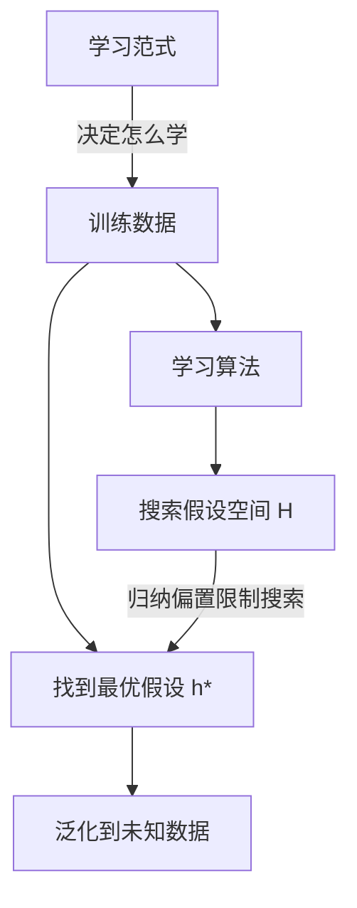

# 第2章 机器学习基础（一）

> 本章从机器学习的核心要素出发，贯穿经典泛化理论（PAC、VC维、Rademacher复杂度），最后探讨深度学习如何打破经典理论的"美好假设"。适合作为从传统机器学习走向深度学习的理论桥梁。

---

## 目录

1. [什么是机器学习](chapter-02.md)
2. [学习的要素——人类 vs. 机器](chapter-02.md)
3. [机器学习的过程](chapter-02.md)
4. [机器学习基本概念详解](chapter-02.md)
5. [机器学习的发展历程](chapter-02.md)
6. [经典泛化理论](chapter-02.md)
7. [深度学习泛化](chapter-02.md)
8. [关键概念速查](chapter-02.md)

---

## 一、什么是机器学习

### 1.1 机器学习是一种通用方法论

!!! abstract "核心认知"
    机器学习是**通用的方法论**——它的适用范围与**数据类型无关**，与**模型类型无关**。无论是图像、文本、语音还是表格数据，无论是线性模型、决策树还是神经网络，ML方法论都一视同仁。

至今不存在一个放之四海皆准的定义。但我们可以从多个视角来理解它。

### 1.2 机器学习的经典定义

!!! quote "**Tom Mitchell 定义 (1997)** —— 机器学习领域最广为引用的定义"
    "A computer program is said to **learn** from experience **E** with respect to some class of tasks **T** and performance measure **P**, if its performance at tasks in T, as measured by P, **improves with experience E**."
    
    翻译：如果一个计算机程序在完成某类任务 T 时的性能（由度量 P 衡量）随着经验 E 的增加而提升，我们就说这个程序在学习。

| 符号 | 含义 | 类比 |
|------|------|------|
| **E** (Experience) | 训练数据、经验 | 做过的模拟题 |
| **T** (Task) | 要解决的任务 | 高考本身 |
| **P** (Performance) | 性能度量指标 | 考试分数 |

### 1.3 机器学习的价值

!!! note "**Bill Gates 的名言**"
    "A breakthrough in machine learning would be worth **ten Microsofts**."
    
    机器学习突破的价值 = 十个微软——足以看出其战略意义。

### 1.4 机器学习在研究什么？

机器学习的研究核心可以归结为两个词：

==**泛化 (Generalization)**== 和 ==**范式 (Paradigm)**==

- **泛化**：模型在未见过的数据上是否能表现良好？这是机器学习的终极问题。
- **范式**：学习的方式是什么？监督？无监督？强化？自监督？

!!! tip "本章整体结构"
    01 [基本概念](chapter-02.md) → 02 [经典泛化理论](chapter-02.md) → 03 [深度学习泛化](chapter-02.md)

### 1.5 大模型时代 vs. 传统ML的区别

| 维度 | 传统机器学习 | 大模型时代 |
|------|-------------|-----------|
| **模型规模** | 小规模，参数量可控 | 海量参数（数十亿至数千亿） |
| **特征工程** | 人工特征提取 | 端到端表征学习 |
| **数据需求** | 少量标注数据即可 | 海量无标注数据预训练 |
| **涌现能力** | 无 | 规模带来涌现能力（如推理、ICL） |
| **泛化理论** | 传统PAC/VC维框架有效 | 经典理论部分失效，需要新解释 |

---

## 二、学习的要素——人类 vs. 机器

!!! info "学习的目的"
    无论是人类还是机器，学习的根本目的都是：**在经验知识的指导下，求解未知的问题**。

### 2.1 五要素对应表（最核心的类比）

| 要素 | 🧑 人类学习比喻 | 🤖 机器学习 | 一句话解释 |
|------|----------------|-------------|-----------|
| ==**经验知识**== | 5年高考3年模拟"刷题" | **训练数据** (Training Data) | 学习的原材料 |
| ==**学习载体**== | 大脑（脑子是个好东西） | **假设类** (Hypothesis Class) | 承载学习能力的空间 |
| ==**常识**== | 尝试摄取知识（知识积累） | **归纳偏置** (Inductive Bias) | 缩小搜索范围的先验 |
| ==**跟谁学**== | 老师授课 vs. 在家自学 | **学习范式** (Learning Paradigm) | 学习的交互方式 |
| ==**学习方法**== | 尖子生的秘籍 | **学习算法** (Learning Algorithm) | 如何从数据中提取模式 |
| ==**学习目标**== | 模拟题少出错、多拿分 | **损失函数最小化** | 优化的方向 |

### 2.2 各要素的深度解读

#### 要素一：经验知识 → 训练数据

人类学习需要经验材料（课本、习题、老师的经验）；机器学习的"经验"就是**训练数据**。

- 人类：反复做"5年高考3年模拟"
- 机器：反复"喂"数据集，让模型从数据模式中学习

#### 要素二：学习载体 → 假设类 (Hypothesis Class)

人类学习需要大脑作为载体；机器学习的"大脑"是**假设类（Hypothesis Class, H）**——所有可能模型的集合。

- 对于线性回归：$H = \{h(x) = w^Tx + b \mid w \in \mathbb{R}^d, b \in \mathbb{R}\}$
- 对于神经网络：所有可能的参数组合构成的函数空间
- 大语言模型以**神经网络**作为假设空间

!!! warning "假设类的规模"
    参数越多，假设空间越大，"大脑"越复杂，但并不总是越好。

#### 要素三：常识 → 归纳偏置 (Inductive Bias)

人类在做题时依靠常识缩小思考范围；机器学习的"常识"就是**归纳偏置**——预先对模型施加的约束，限制对某些假设进行选择。

- 人类：看到数学题先想这是代数还是几何——先验知识引导解题方向
- ML：CNN假设图像具有局部相关性（相邻像素有关）
- ML：RNN假设数据存在时序依赖
- ML：大语言模型常用的归纳偏置是 ==上下文之间存在关联==

!!! tip "归纳偏置的本质"
    归纳偏置是机器学习中"**没有免费午餐定理**"的应对策略——没有先验偏置，所有假设平等，学习无从谈起。

#### 要素四：跟谁学 → 学习范式 (Learning Paradigm)

人类可以选择跟着老师学，也可以自学；机器学习也有不同的"学习方式"：

| 学习范式                        | 人类类比              | 说明           |
| --------------------------- | ----------------- | ------------ |
| **监督学习** (Supervised)       | 老师教：有标准答案的练习题     | 给定输入输出对，学习映射 |
| **无监督学习** (Unsupervised)    | 自学：没有答案，自己找规律     | 无标签数据中挖掘结构   |
| **半监督学习** (Semi-supervised) | 少量老师辅导+大量自学       | 少量标签+大量无标签数据 |
| **强化学习** (Reinforcement)    | 试错中学习（孩子在探索中学习走路） | 通过奖励信号学习策略   |

!!! note "LLM的核心范式"
    大语言模型（LLM）主要采用 **自监督学习 (Self-supervised Learning)**——这是基于**自动构建标签**的监督学习。
    - 例如：掩码语言模型（MLM）——遮盖一部分词，让模型去预测被遮盖的词
    - 标签自动生成，无需人工标注

#### 要素五：学习方法 → 学习算法 (Learning Algorithm)

人类根据自己的特点选择学习方法（尖子生的秘籍）；机器学习的"学习方法"是**学习算法**，用来在假设空间中搜索最优假设。

| 算法类型 | 例子 | 原理 |
|---------|------|------|
| **1阶优化** | 梯度下降 (Gradient Descent) | 利用梯度（一阶导数）信息更新参数 |
| **0阶优化** | 进化算法、随机搜索 | 仅利用函数值，不依赖导数 |

> 梯度下降更新公式：
> $h_{t+1} = h_t - \eta \nabla_h L(h)$
> 其中 $\eta$ 是学习率，$\nabla_h L(h)$ 是损失对参数的梯度。

#### 要素六：学习目标 → 损失函数最小化

人类的目标是模拟题少出错；机器学习的核心目标是最小化**损失函数**。

- 最常见的学习目标：==**经验风险最小化（ERM, Empirical Risk Minimization）**==
- 通俗来说：让模型在训练集上犯的错误尽可能少
- 最常用的损失函数：==**交叉熵 (Cross-Entropy)**==
- 大多数损失函数是错误程度的**代理损失 (Surrogate Loss)**

!!! abstract "交叉熵损失 vs. 0-1损失"
    
    **0-1损失**（理想但不可微）：
    $L(h) = \frac{1}{n}\sum_{i=1}^n \mathbb{I}(\operatorname{sign}(h(x_i)) \neq y_i)$
    
    **交叉熵损失**（可微，用于实际训练）：
    $L(h) = -\frac{1}{n}\sum_{i=1}^n [y_i \log(p(h(x_i))) + (1-y_i) \log(1-p(h(x_i)))]$

---

## 三、机器学习的过程

!!! abstract "一句话总结"
    在某种 **学习范式** 下，基于 **训练数据**（经验），利用 **学习算法**，从受 **归纳偏置** 限制的 **假设类** 中选取出可以达到 **学习目标** 的 **假设**，该假设可以 **泛化** 到未知数据上。

## 三、机器学习的过程

### 3.1 学习过程的流程图



### 3.2 机器学习在语言模型中的实例

以大语言模型为例，整个流程变为：

1. **学习范式**：自监督学习（预测下一个词 / 掩码词预测）
2. **训练数据**：海量文本语料（互联网爬取数据）
3. **学习算法**：梯度下降 + 反向传播
4. **假设类**：Transformer 神经网络（数十亿参数）
5. **归纳偏置**：上下文之间存在关联；注意力机制
6. **学习目标**：最小化交叉熵损失
7. **输出**：一个能端到端生成语言序列概率的模型

> 例如输入"我为什么选这门课"，模型输出：
> - P(因) = 0.666
> - P(为) = 0.333
> - ...

---

## 四、机器学习基本概念详解

### 4.1 训练数据 (Training Data)

!!! note "定义"
    **训练数据（Training Data，记为 S）** 是可用于训练的数据集。训练数据的**数量**和**质量**都会影响机器学习的性能。

#### 数量方面
在一定范围内，训练数据的数量显著影响性能：
- 数据越多 → 模型看到更多模式 → 泛化能力越强
- 但存在边际效应递减

#### 质量方面
- **多样性**：数据是否覆盖了各种可能的场景
- **噪声**：标签是否正确、数据是否干净
- **偏差**：数据是否有系统性偏差（例如全是某一类别的数据）

> 对于语言模型，训练数据可选用公开语料数据。

### 4.2 假设类 (Hypothesis Class)

!!! note "定义"
    **假设类（Hypothesis Class，记为 H）** 是指所有可能机器学习模型的集合，其中的元素称为**假设 (Hypothesis)**。
    
    实践中，通常指定候选模型的参数空间为假设类。

#### 例子：半空间 (Halfspace)
$H = \{x \mapsto \operatorname{sign}(\langle \theta, x \rangle + \beta) : w \in \mathbb{R}^d, \beta \in \mathbb{R}\}$

#### 大模型时代的假设类
当前大语言模型主要选用**神经网络**作为假设空间（Transformer架构），参数量可达数千亿。

!!! warning "假设类的大小与学习难度"
    假设类越大（参数越多）→ 表达能力越强 → 但找到最优假设的难度也越大

### 4.3 归纳偏置 (Inductive Bias)

!!! note "定义"
    **归纳偏置（Inductive Bias）** 限制对某些假设进行选择。它是一种先验知识，告诉算法"应该优先考虑哪类假设"。

#### 不同模型的归纳偏置

| 模型 | 归纳偏置 | 含义 |
|------|---------|------|
| **SVM** | 最大化间隔 | 两类样本尽量分得开 |
| **CNN** | 局部感受野 + 权值共享 | 图像具有局部相关性 |
| **RNN** | 时序依赖 | 前后状态存在关联 |
| **Transformer** | 稀疏注意力 / 上下文关联 | 序列中元素互相影响 |

> 对于语言模型而言，**上下文间存在关联**是最核心的归纳偏置——相邻的词在语义上相关。

### 4.4 学习范式 (Learning Paradigm)

!!! note "广义分类"
    广义的学习范式包括：
    1. **监督学习 (Supervised Learning)**：给定样本及其标签，完成分类/回归任务
    2. **无监督学习 (Unsupervised Learning)**：无标签的自组织学习（如聚类）
    3. **半监督学习 (Semi-supervised Learning)**：少量标签 + 大量无标签数据
    4. **强化学习 (Reinforcement Learning)**：从探索中学习，通过奖励信号驱动

#### LLM的主流范式：自监督学习

大语言模型通常采用**自监督学习 (Self-supervised Learning)** 范式——基于自动构建的标签进行的监督学习。

!!! example "自监督学习的典型方法"
    - **掩码语言模型**（如BERT）：随机遮盖输入中的部分词，让模型预测被遮盖的词
    - **自回归语言模型**（如GPT）：基于上文预测下一个词
    
    两者都不需要人工标注——标签自动从数据中构造。

### 4.5 学习目标——经验风险最小化 (ERM)

!!! note "定义"
    **经验风险最小化（Empirical Risk Minimization, ERM）** 是最为常见的学习目标之一，旨在**最小化模型在训练集上的错误**。

- 例如不带正则项的监督学习方法就是ERM的直接应用
- 不同的学习范式有不同的学习目标
  - 监督学习：最小化分类/回归损失
  - 无监督学习：最小化重构误差（如K-Means最小化相对距离）
  - 强化学习：最大化累积奖励

!!! tip "ERM的局限性"
    ERM只关注训练集上的表现，如果模型过于复杂，容易导致**过拟合**——训练误差很小但泛化误差很大。

### 4.6 损失函数 (Loss Function)

!!! note "定义"
    **损失函数（Loss Function）** 用以衡量模型在对应样本上的错误程度。
    - 大多数损失函数是错误程度的**代理损失 (Surrogate Loss)**
    - 损失函数在训练集上的结果的加权和称为**训练损失 (Training Loss)**

#### 常用损失函数比较

| 损失函数 | 特点 | 可微性 | 用途 |
|---------|------|--------|------|
| **0-1损失** | 直接统计错误个数 | ❌ 不可微 | 理论分析 |
| **Hinge损失** | SVM中使用 | 分段可微 | SVM |
| **交叉熵(Logistic)** | 概率输出，训练稳定 | ✅ 可微 | 分类任务（最常用） |

!!! info "交叉熵为何广泛使用"
    - 可微，适合梯度下降优化
    - 本质是度量预测分布与真实分布的差异
    - 当预测越接近真实标签时，梯度越合理

### 4.7 学习算法 (Learning Algorithm)

!!! note "定义"
    **学习算法**旨在对损失进行优化。其背后的理论基础为**最优化理论**。

#### 一阶优化 (First-order Optimization)

利用梯度（一阶导数）信息更新参数：
$h_{t+1} = h_t - \eta \nabla_h L(h)$

- 梯度下降、SGD、Adam等
- 需要损失函数可微
- 当前深度学习最主流的方法

#### 零阶优化 (Zero-order Optimization)

仅利用函数值，不依赖导数信息：
$h_{t+1} = h_t - \eta \hat{\nabla}_h L(h)$
$\hat{\nabla}_h L(h) = \mathbb{E}_{d \sim s(d)}\left[\frac{L(h + \alpha d) - L(h)}{\alpha} d\right]$

- 进化算法、遗传算法
- 适用于不可微的损失函数
- 收敛较慢

### 4.8 泛化误差 (Generalization Error)

!!! note "核心概念"
    机器学习的目的在于**减小泛化误差**，即**真实误差 (True Error)**。

#### 训练误差 vs. 泛化误差

**训练误差 (Training Error)**——在训练集 S 上的误差：
$L_S(h) \stackrel{def}{=} \frac{|\{i \in [m] : h(x_i) \neq y_i\}|}{m}$

**泛化误差 (Generalization Error)**——在真实数据分布 D 上的误差：
$L_{\mathcal{D}}(h) \stackrel{def}{=} \underset{(x,y) \sim \mathcal{D}}{\mathbb{P}}[h(x) \neq y]$

#### 估计与检验

| 数据集 | 用途 | 要求 |
|--------|------|------|
| **训练集** | 用于训练模型 | — |
| **验证集** | 估计泛化误差、超参选择、模型选择 | 与训练集**独立同分布** |
| **测试集** | 检验泛化误差（最终评测） | 与训练集和验证集**独立同分布** |

---

## 五、机器学习的发展历程

> 从百家争鸣到神经网络一枝独秀，从单一范式到丰富再趋于单一。

### 5.1 三个阶段

| 时代 | 特征 | 主要模型 |
|------|------|---------|
| **统计学习时代** | 基于统计理论，多种模型百花齐放 | 决策树、SVM、概率图模型、隐马尔可夫模型等 |
| **表征学习时代** | 自动学习特征表示，深度学习崛起 | CNN、RNN、全连接网络 |
| **大模型时代** | 规模驱动，自监督预训练 + 微调 | Transformer、GPT、BERT、LLaMA |

### 5.2 假设空间的演变

> 假设空间从百家争鸣到神经网络一枝独秀。

```
树 ──┐
森林 ──┤
概率图 ─┼──→ 神经网络 → Transformer
SVM ──┤
... ──┘
```

### 5.3 学习范式的演变

```
传统监督学习      多标签学习       自监督预训练
传统无监督学习 →  噪声标签学习 →   有监督微调
传统强化学习      对比学习         新型强化学习(RLHF)
                  领域自适应/泛化
```
统计学习时代 → 表征学习时代 → 大模型时代

---

## 六、经典泛化理论

> 经典泛化理论提供了深入理解机器学习的"视角"——为什么模型能泛化？

### 6.1 PAC 学习理论

#### 6.1.1 什么是PAC理论

!!! abstract "**PAC理论 (Probably Approximately Correct)**"
    概率近似正确理论——一个**抽象刻画机器学习能力**的框架。

核心问题只有一个：==**需要多少训练样本，才能保证学到的假设"大概近似正确"？**==

#### 6.1.2 PAC理论的基本概念

| 概念 | 符号 | 含义 |
|------|------|------|
| **概念 (Concept)** | c | 从特征空间 $\mathcal{X}$ 到标记空间 $\mathcal{Y}$ 的映射，决定真实标记 |
| **目标概念** | c | 完全正确的映射（算法追求的终极目标） |
| **概念类** | C | 一些概念构成的集合 |
| **假设 (Hypothesis)** | h | 学习算法输出的"猜测"，不一定等于目标概念 |
| **假设空间** | $\mathcal{H}$ | 所有可能假设的集合 |
| **可分 (Separable)** | $c \in \mathcal{H}$ | 目标概念在假设空间中，存在假设可以完美分割数据 |
| **不可分** | $c \notin \mathcal{H}$ | 假设空间中没有任何假设与目标概念完全一致 |

#### 6.1.3 PAC学习的基本思想

> 希望以**较大的概率**学到（泛化）误差满足预设上限的模型。

**PAC辨识 (Identify)**：给定误差参数 $\epsilon$ 和置信参数 $\delta$，对于所有 $c \in C$ 以及分布 $\mathcal{D}$，若存在学习算法 $\mathcal{A}$，其输出的假设 $h \in \mathcal{H}$ 满足：
$P(E(h) \leq \epsilon) \geq 1 - \delta$
则称学习算法 $\mathcal{A}$ 能从假设空间 $\mathcal{H}$ 中辨识概念类 C。

#### 6.1.4 PAC可学习 (PAC Learnable)

> 进一步考虑了训练数据量的要求。

令 m 表示从分布 $\mathcal{D}$ 中 **独立同分布 (i.i.d.)** 采样得到的数据个数。对于所有分布 $\mathcal{D}$，若存在学习算法 $\mathcal{A}$ 和多项式函数 poly($\cdot, \cdot, \cdot, \cdot$)，使得对于任何：
$m \geq poly(1/\epsilon, 1/\delta, size(x), size(c))$
$\mathcal{A}$ 能从假设空间 $\mathcal{H}$ 中辨识概念类 C，则称**概念类 C 对假设空间 $\mathcal{H}$ 而言是PAC可学习的**。

- **样本复杂度**：满足上述条件的**最小 m**。

#### 6.1.5 高效PAC可学习

若学习算法 $\mathcal{A}$ 使概念类 C 为PAC可学习的，且 $\mathcal{A}$ 的运行时间也是多项式函数 $\text{poly}(1/\epsilon, 1/\delta, \text{size}(x), \text{size}(c))$，则称**概念类 C 是高效PAC可学习的**，且 $\mathcal{A}$ 为PAC学习算法。

> 若假设学习算法处理每个样本的时间为常数，则其时间复杂度等价于样本复杂度。

#### 6.1.6 不可分情形与不可知PAC学习

当目标概念 $c \notin \mathcal{H}$，即假设空间不如目标概念丰富时，算法无法学到它的 $\epsilon$ 近似。

**不可知PAC可学习 (Agnostic PAC Learnable)**：对于所有分布 $\mathcal{D}$，若存在算法 $\mathcal{A}$ 和多项式函数，使得 $\mathcal{A}$ 能从 $\mathcal{H}$ 中输出满足下式的假设 h：
$P\left(E(h) - \min_{h' \in \mathcal{H}} E(h') \leq \epsilon\right) \geq 1 - \delta$
则称假设空间 $\mathcal{H}$ 是**不可知PAC可学习的**。

#### 6.1.7 PAC学习案例：轴平行矩形

> 一个经典的PAC可学习性证明案例。

考虑 $\mathbb{R}$^2 上的**轴平行矩形 (Axis-Parallel Rectangle)**——边与坐标轴平行的矩形区域。
- 矩形内的点标签为 +1，矩形外的点标签为 -1
- 目标概念 c 是某个特定的未知矩形
- 概念类：$\mathbb{R}$^2 上所有轴平行矩形的集合

**学习算法**：对于训练集 D，输出一个**包含了 D 中所有正例的最小轴平行矩形 R^D**。

!!! info "PAC可学习证明"
    
    1. 令 $P(R) > \epsilon$（目标矩形概率质量大于 $\epsilon$）
    2. 沿 R 的四条边定义4个小矩形区域 $r_1, r_2, r_3, r_4$，每个区域概率质量均为 $\epsilon/4$
    
    3. 若 $R^D$ 与所有 $r_i$ 都相交，则：
       $E(R^D) = P(R - R^D) \leq P(r_1 \cup r_2 \cup r_3 \cup r_4) = \epsilon$
    
    4. 反之，若 $E(R^D) > \epsilon$，则 $R^D$ 至少与某个 $r_i$ 不相交：
       $P(E(R^D) > \epsilon) \leq 4(1 - \epsilon/4)^m \leq 4e^{-m\epsilon/4}$
    
    5. 因此：
       $P(E(R^D) \leq \epsilon) \geq 1 - 4e^{-m\epsilon/4}$
    
    6. 令 $m \geq \frac{4}{\epsilon}\ln\frac{4}{\delta}$，则：
       $P(E(R^D) \leq \epsilon) \geq 1 - \delta$
    
    **结论：轴平行矩形是PAC可学习的**，样本复杂度为 $O(\frac{1}{\epsilon}\ln\frac{1}{\delta})$。

### 6.2 假设空间的复杂度度量

> 根据PAC学习理论，假设空间 $\mathcal{H}$ 越复杂，找到目标概念的难度就越大。

| 假设空间类型     | 复杂度度量                                   | 优点         | 缺点           |
| ---------- | --------------------------------------- | ---------- | ------------ |
| **有限假设空间** | 包含的假设数目$\mathcal{H}$                    | 直观、简单      | 仅适用于有限空间     |
| **无限假设空间** | **VC维** (Vapnik-Chervonenkis Dimension) | 计算简单、通用    | 未考虑数据特点，相对粗糙 |
| **无限假设空间** | **Rademacher复杂度**                       | 结合数据特点，更准确 | 计算困难         |


### 6.3 VC维 (Vapnik-Chervonenkis Dimension)

> 度量假设空间**复杂度**的核心指标。

#### 6.3.1 核心定义

**限制 (Restriction)**：$\mathcal{H}$ 在数据集 D 上的限制是指从 D 到 $\{-1, +1\}^{|D|}$ 的一族映射：
$\mathcal{H}_{|D} = \{(h(x_1), h(x_2), \dots, h(x_m)) \mid h \in \mathcal{H}\}$

**增长函数 (Growth Function)**：假设空间 $\mathcal{H}$ 对 m 个数据所能赋予标记的最大可能结果数：
$\Pi_{\mathcal{H}}(m) = \max_{|D| = m} |\mathcal{H}_{|D}|$

**打散 (Shattering)**：如果 $\mathcal{H}$ 能实现数据集 D 上所有可能的标记结果，即 $|\mathcal{H}_{|D}| = 2^m$，则称 D 能被假设空间 $\mathcal{H}$ **打散**。

!!! note "**VC维定义**"
    假设空间 $\mathcal{H}$ 的 **VC维** 是能被 $\mathcal{H}$ 打散的**最大样本集的大小**：
    $\operatorname{VC}(\mathcal{H}) = \max\{m : \Pi_{\mathcal{H}}(m) = 2^m\}$
    
    - VC维 = d 等价于：存在大小为 d 的样本集能被 $\mathcal{H}$ 打散，**且**任意大小为 d+1 的样本集都不能被打散
    - VC维的定义**与数据分布无关**
    - 对于有限假设空间：$\operatorname{VC}(\mathcal{H}) \leq \log_2 |\mathcal{H}|$

#### 6.3.2 VC维的意义

| VC维 | 含义 | 对泛化的影响 |
|------|------|-------------|
| **越大** | 假设类表达能力越强 | 泛化保证越弱（需要更多样本） |
| **越小** | 假设类表达能力越弱 | 泛化保证越强（但可能欠拟合） |

==**VC维给出了样本复杂度的理论上界**==

#### 6.3.3 线性分类器的VC维

对于二分类问题，**齐次线性超平面**（过原点）的假设空间：
$\{h(x) = \operatorname{sign}(w^T x)\}$

- $\mathbb{R}$^d 中齐次线性超平面的VC维 == d
- $\mathbb{R}$^d 中一般线性超平面（含偏置项 b）的VC维 == d+1

!!! note "证明思路"
    **打散下界**：$\mathbb{R}$^d 中 d 个单位向量 $e_1, \dots, e_d$ 可以被打散。对任意标记 $y_1,\dots,y_d$，取 $w_y = (y_1,\dots,y_d)$ 即可。
    
    **打散上界**：$\mathbb{R}$^d 中任意 d+1 个向量必存在线性相关关系，无法被打散。

#### 6.3.4 神经网络的VC维

记 N 为网络的参数量，其VC维上界为 $O(N \log N)$。

!!! warning "神经网络的VC维巨大"
    一个普通CNN的参数量可达数百万到数十亿，意味着VC维极高。根据经典理论，这应该导致极差的泛化——但实际中深度学习泛化很好，这就是**经典理论的第一个裂缝**。

### 6.4 Rademacher复杂度

#### 6.4.1 动机

VC维与数据分布无关，这是一个优点也是一个缺点——它忽略了对泛化至关重要的数据信息。Rademacher复杂度弥补了这一缺陷。

**核心思想**：引入Rademacher随机变量 $\sigma_i$（以0.5概率取值-1或+1），衡量假设空间在**随机噪声**下的拟合能力。

如果假设空间能很好地拟合随机噪声 → Rademacher复杂度高 → 泛化能力差。

#### 6.4.2 定义

**经验Rademacher复杂度**：对于实值函数空间 $\mathcal{F}: \mathcal{X} \mapsto \mathbb{R}$，关于数据集 D 的Rademacher复杂度为：
$\widehat{\mathfrak{R}}_D(\mathcal{F}) = \mathbb{E}_\sigma\left[\sup_{f \in \mathcal{F}} \frac{1}{m} \sum_{i=1}^m \sigma_i f(x_i)\right]$

**期望Rademacher复杂度**：考虑 D 的随机性：
$\mathfrak{R}_m(\mathcal{F}) = \mathbb{E}_{D \sim \mathcal{D}^m}[\widehat{\mathfrak{R}}_D(\mathcal{F})]$

#### 6.4.3 线性超平面的Rademacher复杂度

假设数据分布满足 $\|x\| \leq r$，则超平面族 $\mathcal{F} = \{x \mapsto w^T x : \|w\| \leq \Lambda\}$ 满足：
$\widehat{\mathfrak{R}}_D(\mathcal{F}) \leq \sqrt{\frac{r^2 \Lambda^2}{m}}$

> 这个界**反映了数据相关特性**（r 是数据范数的上界），而VC维是独立于数据的。

### 6.5 泛化误差界

#### 6.5.1 有限可分假设空间的泛化界

> 目标概念 $c \in \mathcal{H}$ 且 $\mathcal{H}$ 有上界。

当数据集 D 的大小满足 $m \geq \frac{1}{\epsilon}\ln\frac{|\mathcal{H}|}{\delta}$ 时，学习算法只需输出**经验误差为0**的假设 $h \in \mathcal{H}$ 即可满足：
$P(E(h) \leq \epsilon) \geq 1 - \delta$

!!! tip "解析"
    - 假设空间越大 $\uparrow$ → 泛化上界越大 $\uparrow$
    - 数据集越大 $\uparrow$ → 泛化上界越小 $\downarrow$
    - 收敛速率：$O(1/m)$

#### 6.5.2 有限不可分假设空间的泛化界

> $\mathcal{H}$ 有上界但目标概念 c $\notin$ $\mathcal{H}$。

对大小为 m 的数据集 D：
$P\left(|E(h) - \hat{E}(h)| \leq \sqrt{\frac{1}{2m}\ln\frac{2|\mathcal{H}|}{\delta}}, \forall h \in \mathcal{H}\right) \geq 1 - \delta$

> 与可分情况相比，收敛速率从 $O(1/m)$ 降低至 $O(1/\sqrt{m})$——需要**更大的数据集**才能用经验误差估计泛化误差。

#### 6.5.3 无限假设空间的泛化界（基于VC维）

若假设空间 $\mathcal{H}$ 的VC维为 k，当 m > k 时：
$P\left(|E(h) - \hat{E}(h)| \leq \sqrt{\frac{8k\ln\frac{2em}{k} + 8\ln\frac{4}{\delta}}{m}}, \forall h \in \mathcal{H}\right) \geq 1 - \delta$

- 收敛速率：$O\left(\sqrt{\frac{\ln(m/k)}{m/k}}\right)$
- 比有限不可分情况的 $O(1/\sqrt{m})$ 还要慢——VC维影响了收敛速度

#### 6.5.4 无限假设空间的泛化界（基于Rademacher复杂度）

对于实值函数空间 $\mathcal{F}: \mathcal{X} \mapsto [0,1]$，大小为 m 的数据集 D：
$\mathbb{E}[f(h)] \leq \frac{1}{m}\sum_{i=1}^m f(h(x_i)) + 2\mathfrak{R}_m(\mathcal{F}) + \sqrt{\frac{\ln(1/\delta)}{2m}}$

以线性超平面为例：$\mathfrak{R}_D(\mathcal{F}) \leq \sqrt{r^2\Lambda^2/m}$ → 收敛速率为 $O(1/\sqrt{m})$

### 6.6 经验风险最小化原则 (ERM)

!!! abstract "ERM的核心思想"
    经验风险最小化（ERM）为找到具有理想泛化误差的假设提供了一种**统一范式**。

学习算法 $\mathcal{A}$ 输出假设空间 $\mathcal{H}$ 中具有**最小经验误差**的假设 $h^*$：
$h^* \in \underset{h \in \mathcal{H}}{\operatorname{argmin}} \hat{E}(h)$

令 g 表示 $\mathcal{H}$ 中具有最小泛化误差的假设：
$g \in \underset{h \in \mathcal{H}}{\operatorname{argmin}} E(h)$

基于Hoeffding不等式和VC维泛化界，可以证明：以至少 $1-\delta$ 的概率，
$E(h^*) - E(g) \leq \epsilon$

这表明：**ERM原则找到的假设以大概率是具有最小泛化误差假设的 $\epsilon$ 近似。**

### 6.7 过拟合与欠拟合

> 一个好的学习算法应该能**降低训练误差**，并且同时**缩小训练误差与泛化误差的差距**，尽管后者无法直接计算。

#### 欠拟合 (Underfitting)
- **模型不能在训练集上获得足够低的误差**
- 原因：模型容量不足，无法捕捉数据模式

#### 过拟合 (Overfitting)
- **训练误差很小，但是泛化误差（测试误差）很大**
- 原因：模型记住了训练数据的噪声而忽略了真实模式

#### 容量 (Capacity) 的权衡

在1维回归问题中，在 $f(x) = wx + b$ 基础上引入高阶特征：
$f(x) = b + \sum_{i=1}^k w_i x^i$

- k 越小 → 欠拟合风险大
- k 越大 → 过拟合风险大

!!! tip "**奥卡姆剃刀原则**"
    在同样能够解释已知观测现象的假设中，我们应该挑选"最简单"的那一个。

#### 容量与误差的典型关系

```
误差
  ↑
  │      ┌─── 泛化误差
  │     ╱
  │    ╱    ─── 训练误差
  │   ╱
  │  ╱
  │ ╱
  │╱
  └──────────────────→ 容量
    欠拟合区  最优容量  过拟合区
```

- 容量过小 → 两者都高（欠拟合）
- 容量最优 → 两者都低（理想情况）
- 容量过大 → 训练误差很低，但泛化误差上升（过拟合）

---
## 七、深度学习泛化——打破经典理论的美好假设

### 7.1 经典理论建立在i.i.d.假设上

经典泛化理论（PAC、VC维、Rademacher）都建立在 **独立同分布 (i.i.d.)** 假设上：
- 数据之间相互独立
- 训练数据和测试数据来自同一分布

### 7.2 深度学习对经典理论的挑战

!!! danger "经典理论的三大假设被打破"

| 经典假设 | 深度学习的现实 | 影响 |
|---------|---------------|------|
| **数据独立** | 数据存在**时序依赖**（如NLP中的上下文） | i.i.d.假设不成立 |
| **同分布** | 存在**分布偏移**（训练/测试分布不同） | 经典泛化界不再保证 |
| **模型参数 < 样本量** | **过参数化**（参数量远超样本量，泛化却很好） | VC维理论无法解释 |

 最具冲击力的实验——拟合随机标签

!!! quote "Zhang et al. (ICLR 2017) — "Understanding deep learning requires rethinking generalization""
    
    当使用**完全随机生成的标签**替换CIFAR-10或ImageNet的真实标签时，诸如Inception或AlexNet等模型**依然能通过SGD达到接近0%的训练误差**。

- 模型能完美记住随机噪声 → VC维巨大 → 经典理论预测泛化会极差
- 但实际中这些模型在真实数据上泛化良好
- 核心矛盾：如果假设空间能"打散"随机标签，Rademacher复杂度接近1 → 泛化界毫无意义

!!! failure "**传统理论失效！**"

### 7.3 双重下降现象 (Double Descent)

> 经典理论预测：模型复杂度增加 → 测试误差先下降后上升（U型曲线）
> 深度学习的实际表现：**测试误差先下降、再上升、随后在进入过参数化区域后再次下降**

```
测试误差
  ↑
  │   ╲
  │    ╲  ──────────── 经典区域
  │     ╲          ╱
  │      ╲   ╱
  │       ╲╱
  │        ╱╲         ╲  现代深度学习区域
  │       ╱  ╲         ╲
  │      ╱    ╲         ╲
  └─────────────────────────→ 模型复杂度
        临界点       过参数化区域
```

| 区域 | 行为 | 解释 |
|------|------|------|
| **经典区域** | 先下降后上升（U型） | 偏差-方差权衡主导 |
| **临界点** | 正好能拟合所有数据（插值阈值） | 最坏泛化 |
| **过参数化区域** | **再次下降** | 良性过拟合、隐式正则化 |

> 深度神经网络在函数空间中表现出一种内在的"奥卡姆剃刀"效应——即使参数很多，网络也倾向于表达那些**简单的函数**。

### 7.4 深度学习中的归纳偏置

> 模型之所以不产生过拟合，还因为其架构本身内置了极强的**归纳偏置**，这些偏置在参数海洋中划定了合理的搜索范围。

 CNN vs. Transformer —— 两种不同的归纳偏置哲学

| 维度 | CNN | Transformer |
|------|-----|-------------|
| **核心假设** | 图像的**空间平稳性和局部相关性** | 几乎没有**硬编码的空间偏置** |
| **感受野** | 局部感受野（固定大小卷积核） | 全局自注意力（可捕获长程依赖） |
| **平移不变性** | ✅ 权值共享 → 平移不变性 | ❌ 无硬编码平移不变性 |
| **偏向性质** | **强局部性偏置** | **弱全局性偏置** |
| **小数据表现** | 好（先验约束强） | 差（缺乏先验，严重过拟合） |
| **大数据表现** | 不如Transformer | **超强**（微弱偏置释放数据潜力） |
| **预训练后** | — | 从海量数据中学到更优的归纳偏置，展现更强稳健性 |

!!! example "CNN vs. Transformer 的核心区别"
    
    **CNN**：设计者预先定义了"图像中相邻像素有关"的偏置，极大地缩小了假设空间，在小数据上表现优异。
    
    **Transformer**：几乎没有硬编码的空间偏置，依赖自注意力机制学习依赖关系。虽然在小数据上容易过拟合，但在超大规模数据下，这种**微弱的归纳偏置**反而释放了模型捕获复杂模式的潜力。

### 7.5 深度学习泛化的几个关键视角

| 视角 | 核心观点 |
|------|---------|
| **隐式正则化** | SGD本身趋向于找到"简单"的解（而不是任意复杂函数） |
| **模型容量的有效性** | 虽然参数量巨大，但网络的有效自由度远低于参数数量 |
| **数据分布结构** | 真实数据（如图像、文本）具有高度结构化特征，不是随机噪声 |
| **双重下降** | 过参数化后的泛化改善揭示了经典理论之外的新规律 |
| **归纳偏置** | 网络架构本身带来了强有力的先验约束 |

### 7.6 VC维与Rademacher复杂度对大语言模型的启发意义

> 经典理论虽被挑战，但其思维框架对LLM的**架构设计、预训练、后训练**仍具有重要指导意义。

| 方面 | 理论支撑 | 实践含义 |
|------|---------|---------|
| **架构设计** | VC维 $\approx O(N \log N)$ | MoE通过激活部分参数控制有效VC维；LayerNorm规整假设空间 |
| **预训练** | Rademacher复杂度约束 | 海量数据将高复杂度模型约束到低有效复杂度空间 |
| **后训练(SFT/RLHF)** | Rademacher复杂度控制 | LoRA冻结主干更新低秩矩阵，维持低复杂度；RLHF通过偏好对齐缩小假设空间 |
| **模型规模与数据量** | VC维上界 | 模型规模与预训练数据量需同步增长 |

---

## 八、关键概念速查

| 概念 | 一句话总结 |
|------|-----------|
| ==**ERM**== | 最小化训练集上的平均损失——最基础的学习目标 |
| ==**PAC**== | 概率近似正确——回答"需要多少数据才能学得够好"的理论框架 |
| ==**VC维**== | 假设类复杂度的度量——越大表达能力越强，但需要更多数据 |
| ==**Rademacher复杂度**== | 结合数据分布的复杂度度量——值越高，泛化越差 |
| ==**归纳偏置**== | 模型对某些假设的偏好，限制搜索空间的先验知识 |
| ==**泛化**== | 在未见过数据上的表现能力——机器学习的最终目标 |
| ==**过参数化**== | 参数远多于样本，但仍能泛化良好——经典理论无法解释的现象 |
| ==**双重下降**== | 测试误差随模型复杂度增加"降-升-再降" |
| ==**隐式正则化**== | SGD/Optimizer自身带来的"偏好简单解"的倾向 |
| ==**奥卡姆剃刀**== | 在同样好地解释观测的假设中，选最简单的那个 |

---

!!! abstract "本章小结"
    本章构成了深度学习的理论基石。从机器学习的五要素出发，我们理解了学习问题的一般框架；通过经典泛化理论（PAC、VC维、Rademacher），我们掌握了分析学习算法能力的理论工具；最后，深度学习对经典理论的挑战揭示了**理论发展的动态性**——经典理论在深度学习时代仍然提供思维框架，但需要新的视角来理解过参数化、隐式正则化等新现象。这是后续章节深入研究深度学习和扩展模型的重要基础。

---

**参考**：Zhang et al. "Understanding deep learning requires rethinking generalization." ICLR 2017.
