# 第七章 深度视觉模型（二）—— 目标检测与图像分割

!!! quote "核心跨越"
---

> 从分类到检测——不仅能识别"**什么**"（分类），还能定位"**在哪里**"（位置），再到"**每个像素属于什么**"（分割）。

---

## 一、目标检测（Object Detection）概述

### 1.1 任务演进：从分类到检测到分割

计算机视觉领域的任务演化是一个不断"**细化粒度**"的过程：

| 任务等级 | 名称                                         | 输出粒度              | 示例                           |
| :--: | ------------------------------------------ | ----------------- | ---------------------------- |
|  1   | ==图像分类（Classification）==                   | 整张图像 → 1 个类别标签    | `"CAT"`                      |
|  2   | ==分类 + 定位（Classification + Localization）== | 1 个类别 + 1 个边界框    | `"CAT"` + (x, y, w, h)       |
|  3   | ==目标检测（Object Detection）==                 | 多个类别 + 多个边界框      | `"DOG"`×3 + `"CAT"`×1 + 各自坐标 |
|  4   | ==语义分割（Semantic Segmentation）==            | 每个像素 → 类别（不区分个体）  | 所有"猫"像素标为一类                  |
|  5   | ==实例分割（Instance Segmentation）==            | 每个像素 → 类别 + 实例 ID | 猫 A vs 猫 B 的像素分开标记           |

!!! info "任务难度递增"
    从分类到实例分割，任务难度和信息量逐级递增。目标检测是**计算机视觉中承上启下的核心任务**——它既需要全局理解能力（知道图中有什么物体），又需要空间定位能力（知道物体在哪儿）。

### 1.2 目标检测的广阔应用

!!! tip "为什么目标检测如此重要？"
    几乎任何需要"理解图像内容"的现实场景都离不开目标检测。

| 应用领域 | 具体场景 | 检测对象 |
|----------|----------|----------|
| ==自动驾驶== | 识别行人、车辆、交通标志、车道线 | 行人类、车辆类、交通标志类 |
| ==安防监控== | 异常行为检测、入侵检测、人流统计 | 人物、车辆、可疑物品 |
| ==医疗影像== | CT/MRI/X 光中的病灶检测 | 肿瘤、结节、骨折区域 |
| ==工业质检== | 产品表面缺陷检测、装配完整性检查 | 划痕、缺损、异物 |
| ==遥感分析== | 卫星图目标检测 | 建筑物、船只、农田、军事目标 |
| ==零售管理== | 货架商品识别、自动结账 | 各类商品 SKU |
| ==人脸检测== | 手机相机中的人脸框 | 人脸（人脸检测是目标检测的特例） |

!!! note
    人脸检测（Face Detection）是目标检测的一个重要子领域。现代手机相机中的人脸框实时显示，背后就是一个高效的目标检测模型在运行。

### 1.3 核心输出要素

目标检测模型的输出可以分解为两个核心部分：

1. **类别信息（Classification）**：每个检测到的物体属于哪个类别（如猫、狗、车...）
2. **位置信息（Localization）**：用一个**边界框（Bounding Box）** 来精确描述物体的空间位置

**边界框的表示方式：**

Bounding Box = (x, y, w, h)

| 参数 | 含义 | 说明 |
|------|------|------|
| x | 边界框中心点的横坐标 | 或左上角横坐标（取决于约定） |
| y | 边界框中心点的纵坐标 | 或左上角纵坐标（取决于约定） |
| w | 边界框的宽度 | 像素值 |
| h | 边界框的高度 | 像素值 |

!!! note "坐标约定"
    常见的有两种坐标体系：
    - **中心点法**：$(x_\text{center}, y_\text{center}, w, h)$ —— YOLO 系列使用
    - **角点法**：$(x_\text{tl}, y_\text{tl}, x_\text{br}, y_\text{br})$ —— 即 (左上 x, 左上 y, 右下 x, 右下 y)，Fast R-CNN 使用

---

## 二、单目标检测（Single Object Detection）

### 2.1 问题定义

图像中**只存在一个目标对象**时，我们需要同时输出它的类别和位置。

!!! example
    假设一张图里只有一只猫，我们需要输出：`"CAT"` + `(x, y, w, h)`
    这里没有"有多少个物体"的歧义——因为只有**一个**。

### 2.2 网络架构：共享特征 + 双头结构

单目标检测的核心思路是**在共享特征之上，分出两个并行分支**：

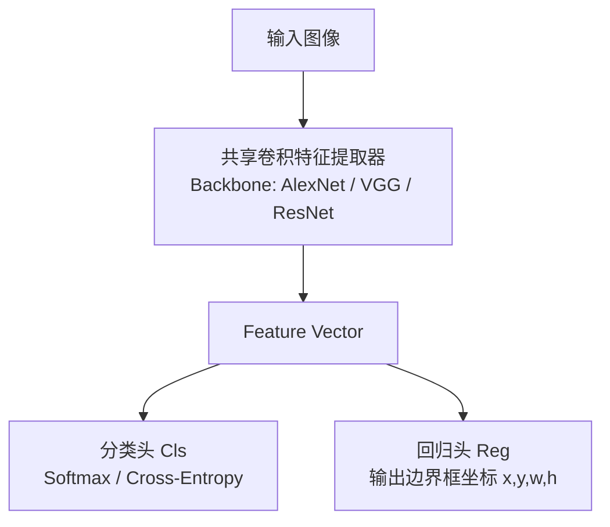

#### 各组件详解

| 组件 | 说明 |
|------|------|
| **共享卷积特征提取器（Backbone）** | 通常使用在 ImageNet 上预训练的分类网络（如 AlexNet、VGG16）。去掉最后的全连接分类层，保留卷积部分作为特征提取器。输出是一个固定长度的特征向量。 |
| **分类头（Classification Head）** | 将特征向量映射到 (K+1) 个类别得分（K 个物体类别 + 1 个背景类）。使用 **Softmax** 输出概率分布，损失函数为 **Cross-Entropy Loss**。 |
| **回归头（Regression Head）** | 将特征向量映射到 4 个数值：(x, y, w, h)。这 4 个值直接表示边界框坐标。损失函数使用 **L2 Loss**（均方误差）。 |

### 2.3 多任务损失函数（Multi-Task Loss）

!!! note "核心公式"
    $$
    \mathcal{L} = \mathcal{L}_{cls} + \lambda \cdot \mathcal{L}_{reg}
    $$
    
    其中 $\lambda$ 是**平衡超参数**，控制分类和定位任务的相对重要性。

#### 分类损失详解

对于分类任务，使用 **Softmax Cross-Entropy Loss**：

$$
\mathcal{L}_{cls} = -\sum_{i=1}^{K+1} y_i \log(\hat{y}_i)
$$

其中：
- $y_i$ ：真实标签的 one-hot 编码（$y_i$ = 1 当 i 为正确类别，否则为 0）
- $\hat{y}_i$ ：模型预测的第 i 类概率（经过 Softmax）
- $K+1$ ：类别数（含背景类）

#### 定位损失详解

对于回归任务，使用 **L2 Loss**（均方误差）：
$$
\mathcal{L}_{reg} = \sum_{j \in \{x,y,w,h\}} (t_j - \hat{t}_j)^2
$$

其中：
- $t_j$ ：真实的边界框坐标
- $\hat{t}_j$ ：模型预测的边界框坐标

!!! warning "L2 Loss 的问题"
    L2 Loss 对大误差非常敏感（平方放大），导致对异常值（outlier）很脆弱。后来的方法（如 Fast R-CNN）改用了 **Smooth L1 Loss**：
    $$
    Smooth_{L1}(x) = \begin{cases}
    0.5x^2 & if  |x| < 1 \\
    |x| - 0.5 & otherwise
    \end{cases}
    $$
    Smooth L1 在误差大时梯度饱和，训练更稳定。

#### λ 超参数的取值

| λ 值 | 效果 |
|------|------|
| λ 太小（如 0.1） | 模型更关注分类精度，边界框可能不准 |
| λ 太大（如 10） | 模型更关注定位精度，类别可能分错 |
| λ = 1 | 同等权重，简单但通常不是最优 |

!!! tip
    实践中，$\lambda$ 通常通过交叉验证或网格搜索确定。Fast R-CNN 论文中使用的 $\lambda$ = 1。

---

## 三、多目标检测（Multi-Object Detection）—— 核心挑战

### 3.1 为什么多目标检测如此困难？

!!! danger "根本矛盾"
    **深度学习模型期望固定维度的输入输出，而不同图像中的目标数量是可变的。**

来看具体的数据例子：

| 图像内容 | 需要的输出数量 | 说明 |
|----------|:------------:|------|
| 1 只猫 | 4 个输出 | 1 个框 × 4 坐标 |
| 3 只狗 + 1 只猫 | 16 个输出 | 4 个框 × 4 坐标 |
| 繁忙街景（数十人、车） | 上百个输出 | 数量无法提前确定 |

**为什么不能简单用全连接层输出可变数量？**
- 全连接层的权重矩阵维度是**固定的**——一旦训练完成，输入和输出的神经元数量就锁死了
- 一个输出 4 维的网络只能检测 1 个目标；如果要检测最多 10 个目标，输出层就得有 40 个神经元——但这意味着**必须提前知道最大目标数量**

### 3.2 朴素方案：滑动窗口 + CNN（Sliding Window + CNN）

这是人们想到的最直观方案——既然我们不知道目标在哪儿，那就**遍历所有可能的位置和尺寸**。

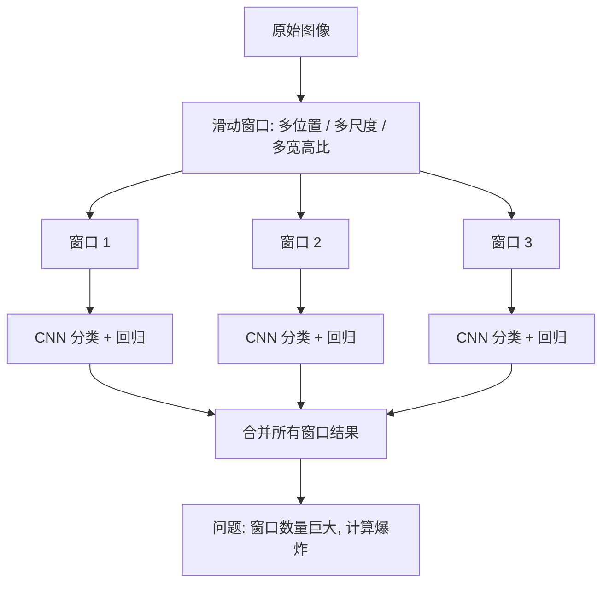

**滑动窗口策略的三大维度：**

| 维度 | 描述 | 典型取值 |
|------|------|----------|
| **位置** | 窗口在图像上的偏移步长 | stride = 32 像素 |
| **尺度** | 窗口的大小 | 从 32×32 到整张图像 |
| **宽高比** | 窗口的形状 | 1:1, 1:2, 2:1, 3:4, 4:3 等 |

!!! failure "致命问题：计算爆炸"
    对一张 $224 \times 224$ 的图像，即使只考虑少量尺度和宽高比，产生的窗口数量也在 **数十万到数百万**级别。对每个窗口都运行一次完整的 CNN，计算成本是天文数字！
    
    例如：
    - 步长 32，尺度 4 种，宽高比 3 种
    - 窗口数量 ≈ $(224/32)^2 \times 4 \times 3 \approx 588$ 个
    - 如果窗口更密集（步长 16），窗口数量上升到约 2352 个
    - 每个窗口前向传播 ~1ms → 一张图需要 2.3 秒
    - VOC 数据集有 ~20K 张图 → 13 小时的纯前向时间
    - 而且这还没考虑训练！

!!! quote "一句话总结"
    滑动窗口本质上是**暴力搜索**，在位置和尺度的组合空间中指数级爆炸，完全不可行。

### 3.3 解决方案：区域提议（Region Proposals）

#### 核心思想

与其用"所有窗口"暴力穷举，不如用更聪明的方法先找出**可能包含物体的候选区域**，然后再对这些少量候选区域做精细分类和定位。

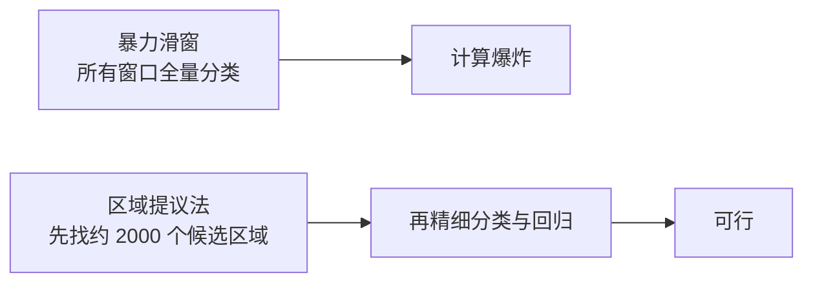

!!! success "区域提议的关键洞察"
    虽然我们不知道物体究竟是什么，但我们可以快速判断"这片区域**可能**有物体"——基于颜色连续性、纹理一致性等低级视觉线索。这些线索的计算比 CNN 分类要快得多。

### 3.4 Selective Search（选择性搜索）

!!! info "Selective Search 是 R-CNN 论文中使用的经典区域提议算法。"
    发布时间：2012 年（IJCV）
    核心论文：*"Selective Search for Object Recognition"* by Uijlings et al.

#### 算法流程

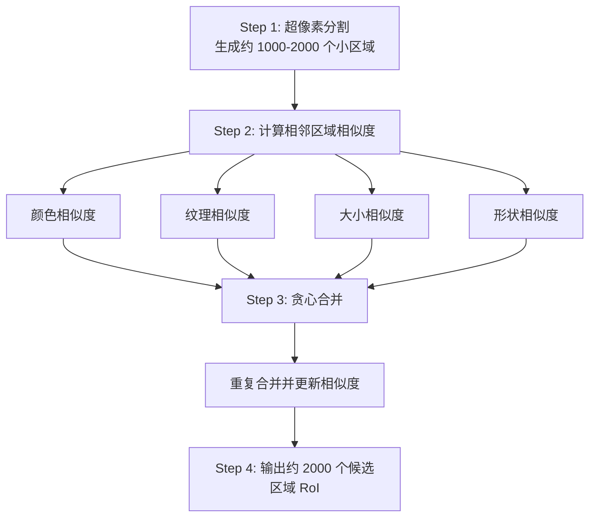

**四种相似度度量：**

| 相似度类型 | 计算方式 | 作用 |
|------------|----------|------|
| ==颜色相似度== | 计算区域的颜色直方图（HSV 空间），用直方图交并比度量 | 确保颜色接近的区域合并 |
| ==纹理相似度== | 使用 SIFT 或 Gaussian 滤波器提取局部纹理特征，比较直方图 | 确保纹理相似的区域合并 |
| ==大小相似度== | 小区域优先合并，避免大区域吞并所有小区域 | 使提议在不同尺度上均匀分布 |
| ==形状相似度== | 衡量两个区域是否形状互补（如填满凹陷） | 使得提议能完整覆盖物体 |

!!! tip "Selective Search 的亮点"
    - **类无关（Class-agnostic）**：不需要知道物体是什么类别，所以可以作为任何检测任务的前置模块
    - **速度快**：每张图仅需约 0.2-0.5 秒（远快于滑动窗口的分钟级）
    - **高召回**：在标准数据集上，2000 个提议可以达到 ~98% 的召回率（物体被某个提议覆盖）

---

## 四、R-CNN（Region-based CNN）

> R-CNN = Regions with CNN features
> 发布时间：2014 年（CVPR）
> 论文：*"Rich feature hierarchies for accurate object detection and semantic segmentation"*

### 4.1 R-CNN 的历史地位

!!! quote "R-CNN 是深度学习目标检测的**开山之作**"
    它首次证明：**CNN 不仅可以做图像分类，在经过适当的改造后，也可以做精确的目标检测。**
    
    尽管在今天看来 R-CNN 已经非常缓慢和复杂，但它的**架构范式**——区域提议 → 特征提取 → 分类 + 回归——奠定了整个两阶段检测家族的基础。

### 4.2 完整流程（5 步走）

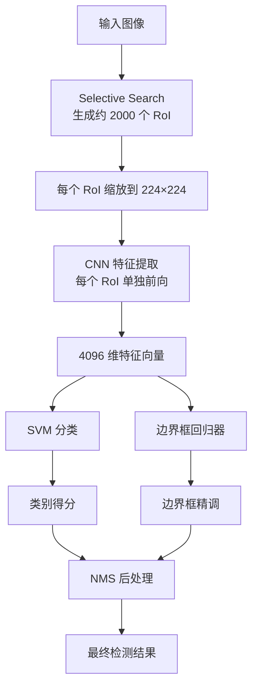

**详细分步解释：**

#### Step 1：区域提议生成

对输入图像运行 **Selective Search**，生成约 **2000 个候选区域（RoI, Region of Interest）**。

- 这些 RoI 形状不规则、大小各异
- 它们"覆盖"了图像中所有可能包含物体的区域
- 虽然存在大量冗余（同一个物体会被多个 RoI 覆盖），但保证了极高的召回率

#### Step 2：RoI 缩放到固定尺寸

每个 RoI 被**缩放到 224×224 像素**的固定尺寸。

!!! question "为什么需要缩放？"
    CNN 的全连接层要求输入特征向量具有**固定长度**。因此，所有 RoI 必须统一尺寸。

#### Step 3：CNN 特征提取

每个缩放后的 RoI 独立通过一个**预训练的 CNN**（如 AlexNet），提取出一个 **4096 维的特征向量**。

!!! warning "效率瓶颈"
    2000 个 RoI → 2000 次 CNN 前向传播！
    且这些 RoI 之间存在大量重叠，但 CNN 完全不知道——它反复计算了相同的图像区域。这是 R-CNN 最大的效率瓶颈。

#### Step 4：SVM 分类

对每个 RoI 的特征向量，使用一个**二分类线性 SVM** 来判定它是否属于某个类别。

- 每个类别训练一个独立的 SVM 分类器（即"猫"SVM、"狗"SVM、"车"SVM...）
- SVM 输出一个得分，表示该 RoI 包含该类物体的可能性

!!! note "为什么用 SVM 而不是 Softmax？"
    R-CNN 论文中实验发现，对每个类别单独训练 SVM 比直接在网络末尾加 Softmax 效果更好。原因可能是：
    - SVM 的铰链损失（Hinge Loss）对"难分样本"（hard negatives）更鲁棒
    - 预训练 CNN + SVM 的"解耦训练"方式，让 SVM 可以在更专业的特征空间中学习决策边界
    
    但后续方法（Fast R-CNN 开始）证明了端到端的 Softmax 同样优秀，且更简洁。

#### Step 5：边界框回归精调（Bounding Box Regression）

对每个分类为"包含物体"的 RoI，额外训练一个**线性回归器**，预测从当前 RoI 到真实边界框的**修正量**。

!!! note "核心思想"
    Selective Search 给出的 RoI 虽然覆盖了物体，但**通常不够精确**——可能框偏了、框大了或框小了。边界框回归器的任务就是**微调这些边界框**，使其更贴近真实物体。

### 4.3 边界框回归详解

#### 修正量定义

不直接预测绝对坐标，而是预测 **4 个修正参数**：


(dx, dy, dw, dh)


其中：
- dx：中心点 x 的**偏移量**（归一化）
- dy：中心点 y 的**偏移量**（归一化）
- dw：宽度的**缩放因子**（对数空间）
- dh：高度的**缩放因子**（对数空间）

#### 修正公式

给定 RoI 的提议框 P = (P_x, P_y, P_w, P_h) 和预测的修正量 (dx, dy, dw, dh)，修正后的边界框 G' 为：

$$
\begin{aligned}
G'_x &= P_w \cdot dx + P_x \\
G'_y &= P_h \cdot dy + P_y \\
G'_w &= P_w \cdot \exp(dw) \\
G'_h &= P_h \cdot \exp(dh)
\end{aligned}
$$

**为什么用 $\exp$ 来处理宽高？**
- 宽度和高度必须为正数
- $\exp$ 确保输出始终大于 0，且允许在 log 空间进行线性回归（更符合数据的分布特性）

#### 真实修正量的计算

训练时，我们需要知道"真实"的修正量是多少（从提议框 P 到真实框 G 的映射）：

$$
\begin{aligned}
dx^* &= (G_x - P_x) / P_w \\
dy^* &= (G_y - P_y) / P_h \\
dw^* &= \log(G_w / P_w) \\
dh^* &= \log(G_h / P_h)
\end{aligned}
$$

回归器的训练目标就是让 (dx, dy, dw, dh) 尽可能接近 ($dx^*, dy^*, dw^*, dh^*$)，使用 L2 Loss。

### 4.4 训练流程（三阶段）

R-CNN 的训练过程异常复杂，分为三个独立阶段：

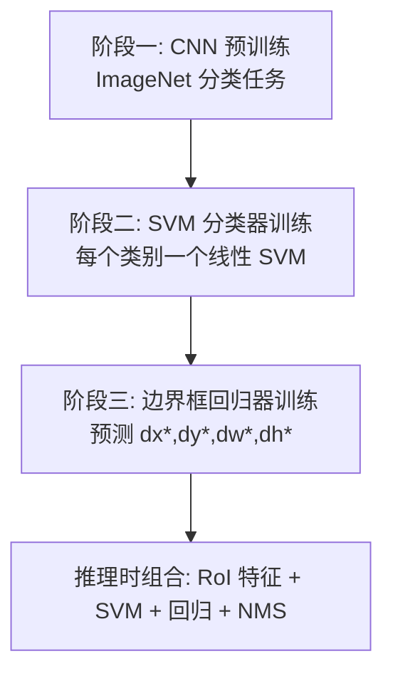

### 4.5 推理流程（测试阶段）

```text
R-CNN 推理流程：
1. 输入图像 → Selective Search → 约 2000 个 RoI
2. 每个 RoI → warp 到 224×224 → CNN 前向 → 4096 维特征
3. 每个 RoI 特征 → 所有类别的 SVM 分类器 → 得分向量
4. 对每个类别，对高分 RoI 应用边界框回归修正
5. 应用 NMS（非极大值抑制）消除冗余检测框
6. 输出最终检测结果：类别 + 边界框坐标
```

#### 非极大值抑制（NMS, Non-Maximum Suppression）

!!! tip "NMS 的核心作用"
    多个 RoI 可能同时检测到同一个物体（且经过回归后边界框高度重叠）。NMS 的作用是**只保留最可能的一个**，抑制多余的检测框。

**NMS 算法流程：**

```text
NMS 输入：所有检测框（类别得分 + 坐标）
NMS 输出：去冗余后的检测框列表

1. 按类别得分从高到低排序
2. 选择当前最高分框并保留
3. 删除与该框 IoU 大于阈值的低分框
4. 在剩余框中重复 2-3 步
5. 输出保留下来的检测框
```

### 4.6 R-CNN 的效率瓶颈总结

| 问题 | 具体表现 | 严重程度 |
|------|----------|:--------:|
| ==重复前向== | 2000 个 RoI 独立通过 CNN，大量重叠区域被重复计算 | 🔴🔴🔴🔴🔴 |
| ==多阶段训练== | CNN 预训练 → SVM 训练 → 回归器训练，流程割裂、调参复杂 | 🔴🔴🔴🔴 |
| ==磁盘存储== | 每个 RoI 的 4096 维特征需要存储到磁盘，占用巨大空间 | 🔴🔴🔴 |
| ==速度慢== | 每张图测试时间 ~47 秒（AlexNet 在 GPU 上），完全无法实时 | 🔴🔴🔴🔴🔴 |
| ==选择性搜索固定== | Selective Search 作为一个固定模块，无法参与网络训练（不能端到端优化） | 🔴🔴🔴 |

!!! danger "R-CNN 无法实时的根本原因"
    一张图 ~47 秒意味着：
    - 处理 1 分钟的视频（~1800 帧）需要 **~23.5 小时**
    - 自动驾车场景：汽车每 0.1 秒移动几米，47 秒的处理延迟根本无法接受！
    
    这也直接推动了后续方法（Fast R-CNN、Faster R-CNN）的发展。

---

## 五、后续方法演进：两阶段检测家族

### 5.1 Fast R-CNN（2015）

> 论文：*"Fast R-CNN"* by Ross Girshick
> 核心创新：**RoI Pooling** + **共享卷积特征**

#### 解决的核心问题

R-CNN 的 2000 次 CNN 前向完全可以合并为**一次**——因为 RoI 之间大量重叠，所有 RoI 都来自同一张图！

#### 网络架构

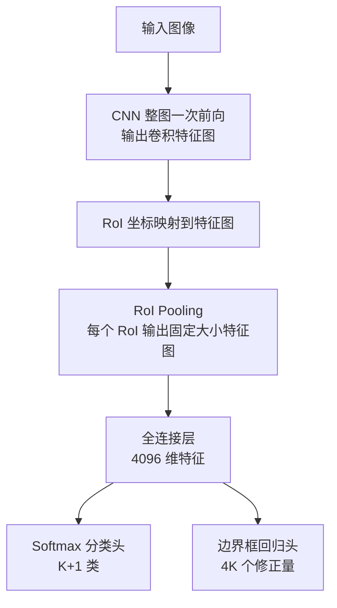

#### RoI Pooling 详解

!!! info "RoI Pooling 是 Fast R-CNN 最核心的创新"

```text
RoI Pooling 步骤：
1. 将 RoI 从图像坐标系映射到特征图坐标系
2. 将任意大小 RoI 划分为固定网格（如 7×7）
3. 对每个网格 bin 做 max pooling
4. 得到固定大小的 RoI 特征图，供全连接检测头使用
```

**RoI Pooling 的关键特性：**

| 特性 | 说明 |
|------|------|
| ==任意输入尺寸→固定输出== | 不管 RoI 大小如何，RoI Pooling 总能输出固定大小的特征图 |
| ==特征共享== | 整张图只做一次 CNN 前向，所有 RoI 共享同一个特征图 |
| ==可微分== | 梯度可以回传到 CNN 部分，实现**端到端训练** |

#### 性能提升

| 指标 | R-CNN | Fast R-CNN | 速度提升 |
|------|:-----:|:----------:|:--------:|
| 测试时间/图 | ~47s | ~3s | **~15 倍** |
| 训练时间 | 多阶段，极慢 | 端到端单阶段 | **~9 倍** |
| mAP (VOC 2007) | 66.0% | 70.0% | +4% |

### 5.2 Faster R-CNN（2015）

> 论文：*"Faster R-CNN: Towards Real-Time Object Detection with Region Proposal Networks"*
> 核心创新：**RPN（Region Proposal Network）**——用网络学习区域提议！

#### 解决的核心问题

Fast R-CNN 仍然依赖 **Selective Search**（CPU 上的非深度学习算法）来生成 RoI。Selective Search 成为新的瓶颈——它无法利用 GPU，也无法参与端到端优化。

#### 网络架构

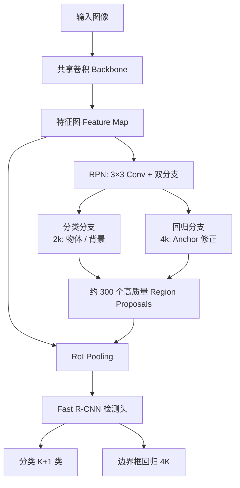

#### Anchor Boxes（锚点框 / 先验框）

!!! note "Anchor 是 RPN 的基石"

RPN 在特征图上的**每个位置**预定义一组**不同尺度和宽高比的边界框**，这些预定义的框称为 **Anchor Boxes**（锚点框/先验框）。

**Anchor 的设计：**

| Anchor 设计维度 | 常见设置 | 说明 |
|---|---|---|
| 尺度 | 128、256、512 | 对应小、中、大目标 |
| 宽高比 | 1:1、1:2、2:1 | 覆盖不同形状目标 |
| 每个特征图位置 | 3 尺度 × 3 宽高比 = 9 个 Anchor | RPN 对每个 Anchor 做物体/背景分类与框回归 |

**Anchor 相关数据：**

| 特征图尺寸 | 特征图位置数 | 每个位置 Anchor 数 | Anchor 总数 |
|:----------:|:----------:|:-----------------:|:----------:|
| 39×39 (VGG16 对 600×600 图) | 1521 | 9 | **~13,689** |
| 25×25 | 625 | 9 | **~5,625** |

!!! note "并非所有 Anchor 都用于训练"
    13,000+ 个 Anchor 中，只有约 256 个（正样本 128 + 负样本 128）被选入一个 mini-batch 进行训练。其余 Anchor 不参与损失计算。

#### RPN 的训练

**正样本 Anchor 的定义：**
- 与某个 Ground Truth 框的 IoU > **0.7**
- 或与某个 GT 框的 IoU 最大（确保每个 GT 至少对应一个正 Anchor）

**负样本 Anchor 的定义：**
- 与所有 GT 的 IoU < **0.3**

**忽略的 Anchor：**
- 0.3 ≤ IoU ≤ 0.7（模棱两可的区域，不参与训练）

**RPN 的损失函数（同样是多任务损失）：**

$$
$\mathcal{L} _{RPN} = \frac{1}{N_{cls}} \sum_i$ $\mathcal{L} _{cls}(p_i, p_i^*) + \lambda \frac{1}{N_{reg}} \sum_i p_i^* \cdot$ $\mathcal{L}$_{reg}(t_i, t_i^*)
$$

其中：
- $p_i$ ：Anchor i 包含物体的概率预测
- $p_i^*$ ：真实标签（1=物体，0=背景）
- $t_i$ ：预测的边界框修正量
- $t_i^*$ ：真实的边界框修正量
- $p_i^* \cdot \mathcal{L}_{\text{reg}}$ ：只有正样本参与回归损失的计算

#### 性能提升

| 指标 | Fast R-CNN | Faster R-CNN | 速度提升 |
|------|:----------:|:----------:|:--------:|
| 测试时间/图 | ~3s (Selective Search + CNN) | ~0.2s (RPN + CNN) | **~15 倍** |
| 区域提议 | Selective Search (CPU, 非可学习) | RPN (GPU, 可学习) | 端到端 |
| mAP (VOC 2007) | 70.0% | 73.2% | +3.2% |

!!! success "Faster R-CNN 的里程碑意义"
    1. **实现了真正的端到端检测**：区域提议、特征提取、分类、回归全部在一个网络中完成
    2. **RPN 几乎是零成本**：RPN 非常轻量（仅几个卷积层），几乎不增加计算开销
    3. **达到了接近实时的速度**：0.2s/图 ≈ 5 FPS，已接近实时应用的边界

### 5.3 两阶段与单阶段方法对比

在 Faster R-CNN 之后，目标检测领域分化出两大流派：

#### 两阶段方法（Two-Stage）

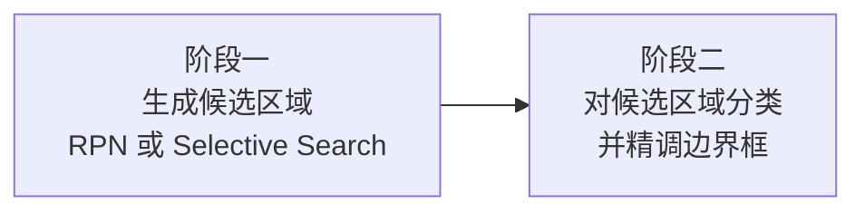

**代表方法：** R-CNN → Fast R-CNN → Faster R-CNN → Mask R-CNN

| 优点 | 缺点 |
|------|------|
| 精度高（尤其对小物体） | 速度较慢 |
| 两个阶段可以分别优化 | 结构复杂 |
| 容易扩展到实例分割 | 训练/推理步骤多 |

#### 单阶段方法（One-Stage）

!!! note
    单阶段检测器直接在一组预定义的 Anchor 或网格上同时预测类别与边界框，省去了显式的候选区域提取阶段。

**代表方法：** YOLO 系列、SSD、RetinaNet

| 优点 | 缺点 |
|------|------|
| 速度极快（实时 ~30-100+ FPS） | 对小物体检测精度较低 |
| 结构简洁，端到端 | 正负样本极度不平衡 |
| 适合移动端/嵌入式部署 | 密集 Anchor 设计需要调参 |

!!! tip "如何选择？"
    - **追求精度优先**（如医疗影像、安防取证）→ 两阶段（Faster R-CNN 系列）
    - **追求速度优先**（如自动驾驶、手机相机）→ 单阶段（YOLO、SSD）

---

## 六、单阶段方法详解

### 6.1 YOLO（You Only Look Once）

> 论文：*"You Only Look Once: Unified, Real-Time Object Detection"* (2016, CVPR)
> 核心思想：**将检测视为回归问题，一次前向直接输出所有检测结果**

#### YOLO 的核心设计

YOLO 将输入图像划分为 **S × S 的网格**，每个网格负责检测**中心落在该网格内的物体**。

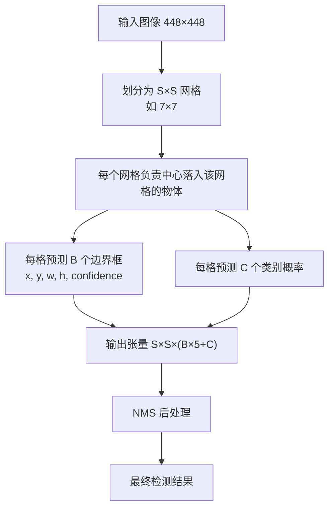

**YOLO 输出的张量结构：**

| YOLO 输出组成 | 含义 |
|---|---|
| $S\times S$ | 网格数量 |
| $B\times 5$ | 每个网格预测 $B$ 个框，每个框含 $x,y,w,h,confidence$ |
| $C$ | 类别概率 |
| 总输出 | $S\times S\times(B\times 5+C)$ |

| 参数              | 说明                         |
| --------------- | -------------------------- |
| B               | 每个网格预测的边界框数量（YOLOv1 中 B=2） |
| C               | 类别总数                       |
| (x, y)          | 边界框中心坐标（相对网格归一化到 [0,1]）    |
| (w, h)          | 边界框宽高（相对整图归一化到 [0,1]）      |
| confidence      | 该框包含物体的置信度 × IoU 预测        |
| $P(\text{cat})$ | 该网格包含猫的概率                  |

#### YOLO 的损失函数

YOLO 的损失函数精心设计了不同部分的权重：

$$
\begin{aligned}
\mathcal{L} = &\lambda_{coord} \sum_{i=0}^{S^2} \sum_{j=0}^B \mathbb{1}_{ij}^{obj} \left[ (x_i - \hat{x}_i)^2 + (y_i - \hat{y}_i)^2 \right] \\
&+ \lambda_{coord} \sum_{i=0}^{S^2} \sum_{j=0}^B \mathbb{1}_{ij}^{obj} \left[ (\sqrt{w_i} - \sqrt{\hat{w}_i})^2 + (\sqrt{h_i} - \sqrt{\hat{h}_i})^2 \right] \\
&+ \sum_{i=0}^{S^2} \sum_{j=0}^B \mathbb{1}_{ij}^{obj} (C_i - \hat{C}_i)^2 \\
&+ \lambda_{noobj} \sum_{i=0}^{S^2} \sum_{j=0}^B \mathbb{1}_{ij}^{noobj} (C_i - \hat{C}_i)^2 \\
&+ \sum_{i=0}^{S^2} \mathbb{1}_{i}^{obj} \sum_{c \in classes} (p_i(c) - \hat{p}_i(c))^2
\end{aligned}
$$

**损失分解：**

| 项          | 含义                     |         权重 ($\lambda$)         |
| ---------- | ---------------------- | :----------------------------: |
| 定位损失（坐标）   | 正样本框的中心点误差             |  $\lambda_{\text{coord}} = 5$  |
| 定位损失（宽高）   | 正样本框的宽高误差（用平方根缩小大框的影响） |  $\lambda_{\text{coord}} = 5$  |
| 置信度损失（正样本） | 正样本框的置信度误差             |              $1$               |
| 置信度损失（负样本） | 负样本框的置信度误差             | $\lambda_{\text{noobj}} = 0.5$ |
| 分类损失       | 正样本网格的类别预测误差           |              $1$               |

!!! tip "设计洞察"
    - $\lambda_{\text{coord}} = 5$：定位的重要性高于分类——框不准比类别分错"后果更严重"
    - $\lambda_{\text{noobj}} = 0.5$：多数网格不包含物体，降低它们的权重以防止"压倒性多数"的负样本主导训练
    - 宽高用平方根：对大框和小框的误差做尺度归一化——同样 10 像素的误差对小框影响更大

#### YOLO 版本的演进

| 版本 | 年份 | 核心改进 | 速度 / 精度 |
|:----:|:----:|----------|:----------:|
| **YOLOv1** | 2016 | 开山之作，网格回归 | 45 FPS, mAP 63.4 |
| **YOLOv2** | 2017 | Batch Norm, Anchor, Darknet-19 | 67 FPS, mAP 76.8 |
| **YOLOv3** | 2018 | 多尺度预测, Darknet-53, 更丰富特征 | 51 FPS, mAP 79.3 |
| **YOLOv4** | 2020 | CSPNet, PANet, Mosaic Augmentation | 65 FPS, mAP 83.0 |
| **YOLOv5** | 2020 | 改进架构, Ultralytics 实现 | 更快更优 |
| **YOLOv8** | 2023 | Anchor-Free, 集成实例分割 | 最先进 |

!!! info "YOLO 的影响"
    YOLO 开创了"单次检测"的范式，将目标检测的速度推向了 **实时** 级别。在 YOLOv3 之后，YOLO 系列成为工业界最广泛使用的目标检测框架。

### 6.2 SSD（Single Shot MultiBox Detector）

> 论文：*"SSD: Single Shot MultiBox Detector"* (2016, ECCV)
> 核心创新：**多尺度特征图预测**

#### SSD 的核心设计

SSD 在不同层级（不同分辨率）的特征图上分别进行检测：

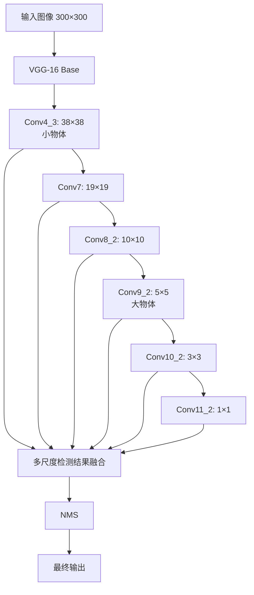

!!! tip "SSD 的核心洞察"
    不同层的特征图具有不同的**感受野（Receptive Field）**：
    - **浅层特征图**（如 38×38）：感受野小，**擅长检测小物体**
    - **深层特征图**（如 5×5）：感受野大，**擅长检测大物体**
    
    利用多尺度特征图，SSD 能更好地检测不同尺寸的物体。

#### SSD vs YOLO 对比

| 特性 | YOLOv1 | SSD |
|------|:------:|:---:|
| 网格/Anchor | S×S 网格, B 个框 | 多尺度特征图, 每个位置多种 Anchor |
| 多尺度预测 | ❌ 仅单尺度 | ✅ 6 个特征层 |
| 小物体性能 | 差 | 较好 |
| 速度 | 45 FPS | 46 FPS (SSD300) |
| mAP (VOC 2007) | 63.4% | 77.2% (SSD300) |

### 6.3 RetinaNet 与 Focal Loss

> 论文：*"Focal Loss for Dense Object Detection"* (2017, ICCV)
> 核心创新：**Focal Loss**——解决单阶段检测的**正负样本极端不平衡**

#### 问题背景

单阶段检测器（YOLO、SSD）生成大量密集的 Anchor（~100K 个），其中只有极少数包含物体（正样本），绝大多数是背景（负样本）。**极度不平衡**导致训练不稳定、模型偏向预测背景。

#### Focal Loss 公式

标准交叉熵损失：
$$
CE(p_t) = -\log(p_t)
$$

Focal Loss：
$$
FL(p_t) = -\alpha_t (1-p_t)^\gamma \log(p_t)
$$

其中：
- $p_t$ ：模型对正确类别的预测概率
- $\alpha_t$ ：类别权重（平衡正负样本）
- $\gamma$ ：聚焦参数（调节"难分样本"的权重）

**Focal Loss 的效果：**

|  $p_t$（预测置信度）   | $(1-p_t)^\gamma（\gamma=2）$ | 效果           |
| :-------------: | :------------------------: | ------------ |
|  0.9（易分类的正样本）   |            0.01            | 损失大幅降低（≈忽略）  |
|    0.5（模棱两可）    |            0.25            | 损失适度降低       |
| 0.1（难分的正样本/误分类） |            0.81            | 损失几乎不变（专注学习） |

!!! note "Focal Loss 的贡献"
    Focal Loss 让单阶段检测器首次在精度上**匹敌两阶段检测器**，同时保持实时速度。RetinaNet（Focal Loss + FPN）达到了 COCO mAP 39.1，超过了当时的两阶段方法。

---

## 七、目标检测核心技术专题

### 7.1 IoU（Intersection over Union）

> IoU 是评价检测框与真实框重叠程度的核心指标。

**计算公式：**

$$
$IoU = \frac{Area of Overlap}{Area of Union} = \frac{$预测框 ∩ 真实框}{预测框 ∪ 真实框}
$$

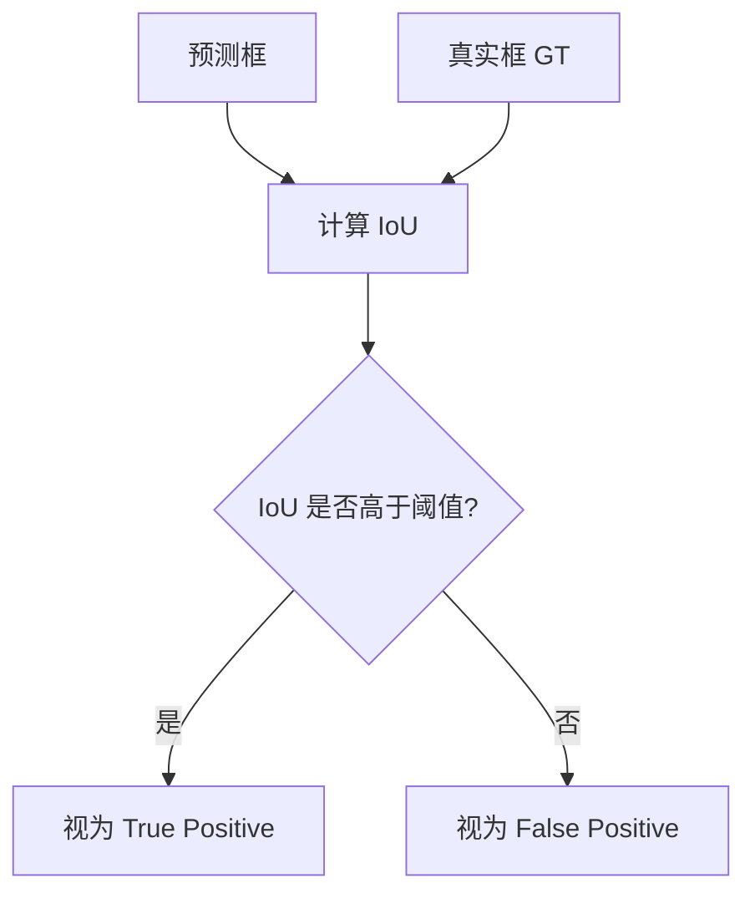

**IoU 值的含义：**

| IoU 值 | 评价 | 说明 |
|:------:|:----:|------|
| 1.0 | 完美 | 预测框与真实框完全重合 |
| 0.7 - 0.9 | 优秀 | 检测框精准贴合物体 |
| 0.5 - 0.7 | 可接受 | 检测框覆盖了物体（常用阈值） |
| 0.3 - 0.5 | 较差 | 覆盖不完全 |
| < 0.3 | 失败 | 基本没有覆盖目标 |

!!! note "IoU 的用途"
    1. **训练阶段**：决定哪些 Anchor 是正样本/负样本（如 IoU > 0.7 为正样本）
    2. **评估阶段**：判断检测是否正确（如 mAP 中，IoU > 0.5 算正确检测）
    3. **NMS 阶段**：根据 IoU 去除重叠框
    4. **衡量指标**：mAP@0.5, mAP@0.75 等

### 7.2 mAP（mean Average Precision）

> mAP 是目标检测领域**最核心的评价指标**。

**计算流程：**

```text
AP / mAP 计算流程：
1. 按置信度对所有检测框降序排序
2. 逐个判断 TP / FP，并累计 Precision 与 Recall
3. 绘制 PR 曲线（Precision-Recall Curve）
4. 计算 PR 曲线下的面积，得到 AP
5. 对所有类别的 AP 求平均，得到 mAP
```

**关键概念：**

| 指标 | 公式 | 含义 |
|------|------|------|
| Precision | TP / (TP + FP) | 检测结果中有多少是正确的 |
| Recall | TP / (TP + FN) | 所有真实物体中有多少被检测到了 |
| TP | IoU > 阈值的检测框 | 正确检测 |
| FP | IoU ≤ 阈值的检测框 / 多余重复框 | 误检 |
| FN | 未被检测到的真实物体 | 漏检 |

**不同 mAP 变体：**

| 指标             | 说明                                    |
| -------------- | ------------------------------------- |
| mAP@0.5        | IoU 阈值为 0.5 时的 mAP（PASCAL VOC 标准）     |
| mAP@0.75       | IoU 阈值为 0.75（更严格的精度要求）                |
| mAP@[0.5:0.95] | IoU 从 0.5 到 0.95，步长 0.05，取平均（COCO 标准） |
| mAP_small      | 仅计算小物体的 mAP（面积 < 32²）                 |
| mAP_medium     | 仅计算中等物体的 mAP（32² < 面积 < 96²）          |
| mAP_large      | 仅计算大物体的 mAP（面积 > 96²）                 |

!!! tip "COCO mAP（mAP@[0.5:0.95]）是目前最权威的目标检测评价指标"
    它对边界框精度要求更高（要求在 IoU=0.75 时也能保持高精度），并且能反映模型在不同物体尺寸上的表现。

### 7.3 NMS（Non-Maximum Suppression）

> 已在上文 4.5 节详细解释，此处补充 NMS 的变体。

**NMS 变体对比：**

| 方法 | 策略 | 特点 |
|------|------|------|
| **贪婪 NMS（Greedy NMS）** | 删除所有与最高分框 IoU > 阈值的框 | 简单，但可能误删相邻物体 |
| **Soft NMS** | 将 IoU 大的框的得分乘以衰减函数，而非直接删除 | 保留更多候选，缓解相邻物体的误删 |
| **Adaptive NMS** | 根据目标密度自适应调整 NMS 阈值 | 对密集场景（如人群）更友好 |

**Soft NMS 衰减函数的两种形式：**

线性衰减：
$$
s_i = s_i \cdot (1 - \operatorname{IoU}(M, b_i))
$$

高斯衰减：
$$
s_i = s_i \cdot \exp\left(-\frac{\operatorname{IoU}(M, b_i)^2}{\sigma}\right)
$$

## 7.4 数据增强（Data Augmentation）在目标检测中的特殊处理

!!! warning "检测任务的数据增强需要同时变换图像和边界框坐标！"

**常见数据增强方法：**

| 方法 | 对图像的操作 | 对边界框的操作 |
|------|-------------|----------------|
| **水平翻转** | 左右翻转 | $x \to W - x$ |
| **随机裁剪** | 裁剪子图 | 裁剪掉超出子图的框部分；过滤面积过小的框 |
| **颜色抖动** | 调整亮度/对比度/饱和度 | 不变 |
| **Mosaic（YOLOv4）** | 拼接 4 张图 | 框坐标按拼接位置移动 |
| **MixUp** | 两张图加权叠加 | 合并两图的边界框 |
| **随机缩放** | 缩放图像 | 框坐标按缩放比例调整 |

!!! tip "Mosaic Augmentation（YOLOv4 提出的重要增强）"
    将 4 张训练图像随机裁剪后拼接成一张新图。这种增强方式可以：
    - 丰富小物体的训练样本（每张子图中物体的相对尺寸变小）
    - 强制模型学习不同上下文中的物体
    - 大幅提升小物体检测性能

---

## 八、图像分割（Image Segmentation）

### 8.1 分割任务概览

目标检测回答了"**什么在哪儿**"，而图像分割进一步回答了"**每个像素是什么**"。

| 任务 | 粒度 | 输出形式 | 示例 |
|:----:|:----:|----------|------|
| **图像分类** | 图像级 | 1 个标签 | `"有一辆车"` |
| **目标检测** | 物体级 | 多个边界框+类别 | `"车在 (x,y,w,h)"` |
| ==语义分割== | 像素级 | 每个像素一个类别 | `"这些像素是车，那些是路"` |
| ==实例分割== | 像素+实例级 | 每个像素一个类别+实例ID | `"车 A 的像素，车 B 的像素"` |
| ==全景分割== | 像素+实例+背景 | 语义+实例 | `"这堆像素是车A，那堆是天空"` |

**三类分割对比：**

| 分割任务 | 是否区分类别 | 是否区分个体 | 输出示例 |
|---|---:|---:|---|
| 语义分割 | ✅ | ❌ | 所有“人”像素同属一类，所有“车”像素同属一类 |
| 实例分割 | ✅ | ✅ | 人1 / 人2 / 车1 / 车2 分别有独立 mask |
| 全景分割 | ✅ | ✅（物体类） | 同时分割背景类（天空、道路）与物体实例（车1、人2） |

### 8.2 FCN（Fully Convolutional Network）

> 论文：*"Fully Convolutional Networks for Semantic Segmentation"* (2015, CVPR)
> 核心创新：**将分类 CNN 改造为像素级预测的分割网络**

#### 核心思想

FCN 的核心洞察是：分类网络最后的**全连接层**可以被替换为**卷积层**，从而输出空间维度（而非 1D 类别得分）。这使得网络能接受任意尺寸的输入，并输出同样尺寸的像素级预测。

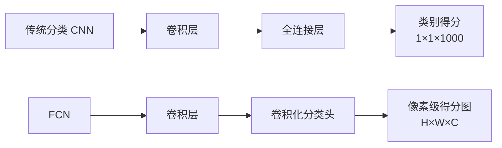

#### FCN 编码器-解码器架构

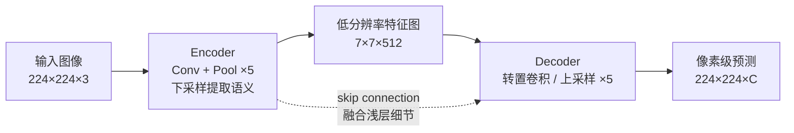

#### 转置卷积（Transposed Convolution）

> 也叫反卷积（Deconvolution），但严格说是转置卷积（Transposed Convolution）

**转置卷积的工作原理：**

| 操作 | 输入输出关系 | 作用 |
|---|---|---|
| 标准卷积 | 多个输入元素 → 1 个输出元素 | 下采样 / 提取局部特征 |
| 转置卷积 | 1 个输入元素 → 多个输出元素 | 可学习上采样 / 恢复分辨率 |
| 双线性插值 | 固定规则上采样 | 简单、无参数、较平滑 |

| 上采样方法 | 说明 | 特点 |
|------------|------|------|
| **转置卷积** | 可学习的上采样（有参数） | 效果好，但可能产生"棋盘伪影" |
| **双线性插值** | 固定公式上采样（无参数） | 简单快速，不产生伪影 |
| **上池化（Unpooling）** | 记录最大池化的位置，反向映射 | 保留空间结构 |

#### 跳跃连接（Skip Connections）

!!! note "跳跃连接是 FCN 的关键设计"

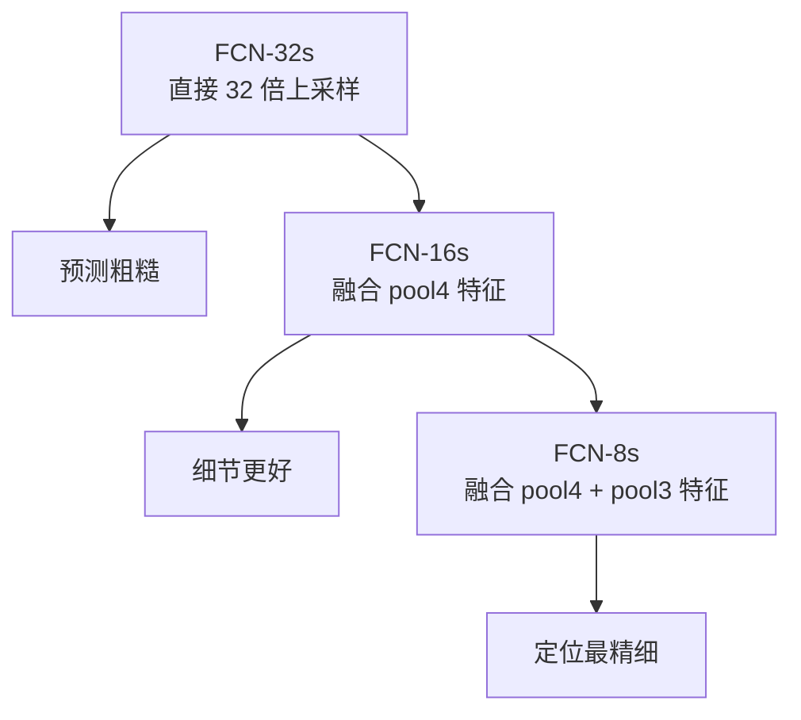

**为什么需要跳跃连接？**

| 特征层级 | 分辨率 | 语义信息 | 空间细节 | 需要跳跃连接? |
|:--------:|:------:|:--------:|:--------:|:------------:|
| 浅层 (pool3) | 高 (28×28) | 弱（边缘、纹理） | 丰富 | ✅ 提供精确边界 |
| 中层 (pool4) | 中 (14×14) | 中（部件、形状） | 中 | ✅ 提供物体结构 |
| 深层 (pool5) | 低 (7×7) | 强（语义类别） | 少 | —— |

!!! quote "跳跃连接的哲学"
    浅层特征知道"精细的边界在哪里"，深层特征知道"那是什么物体"——跳跃连接让两者各取所长。

#### FCN 的局限性

| 局限 | 原因 | 后续改进 |
|------|------|----------|
| 分割结果较粗糙 | 32 倍下采样丢失太多细节 | 跳跃连接（FCN-8s）、膨胀卷积（DeepLab） |
| 缺乏空间一致性 | 逐像素独立预测，不考虑像素间关系 | CRF 后处理（DeepLab v1/v2） |
| 对大物体分割好、小物体差 | 下采样导致小物体特征消失 | 多尺度特征（FPN、DeepLab ASPP） |
| 全局上下文不足 | 感受野有限 | 自注意力（Non-local, Transformer） |

### 8.3 语义分割的代表方法演进

| 方法 | 年份 | 核心创新 | 主要贡献 |
|:----:|:----:|----------|----------|
| **FCN** | 2015 | 全卷积化、跳跃连接 | 开山之作，奠定编码-解码范式 |
| **U-Net** | 2015 | 对称编码-解码、大量跳跃连接 | 医学分割经典，小样本有效 |
| **DeepLab v1** | 2015 | 膨胀卷积（Dilated Conv）+ CRF | 扩大感受野不损失分辨率 |
| **DeepLab v2** | 2017 | ASPP（Atrous Spatial Pyramid Pooling） | 多尺度上下文融合 |
| **PSPNet** | 2017 | 金字塔池化模块（PPM） | 全局上下文信息 |
| **DeepLab v3+** | 2018 | DeepLab v3 + 解码器 | 性能与速度平衡 |
| **Mask R-CNN** | 2017 | 在 Faster R-CNN 上加分割分支 | 实例分割开山之作 |
| **YOLACT** | 2019 | 轻量级实例分割 | 实时实例分割 |
| **SAM** | 2023 | 基础分割模型，提示驱动 | 通用分割能力 |

### 8.4 U-Net：医学分割的经典架构

> 论文：*"U-Net: Convolutional Networks for Biomedical Image Segmentation"* (2015)

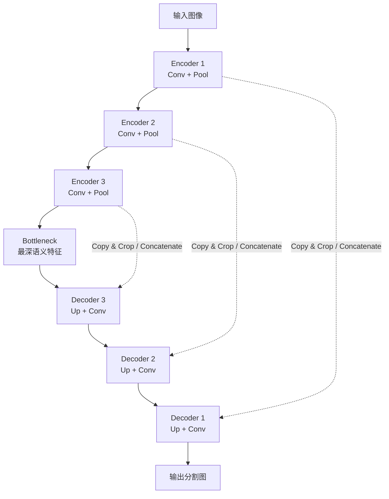

**U-Net 的设计特色：**

| 特色 | 说明 |
|------|------|
| **对称结构** | 编码器和解码器完全对称，形似"U"形 |
| **大量跳跃连接** | 浅层特征直接拼接到对应深度的解码器层（而非相加） |
| **拼接（Concatenate）** | FCN 用加法，U-Net 用通道拼接——保留更多空间信息 |
| **小样本高效** | 医学图像标注困难，U-Net 能用少量样本达到优秀效果 |

### 8.5 DeepLab 系列：膨胀卷积与 ASPP

#### 膨胀卷积（Dilated / Atrous Convolution）

> 核心思想：在不增加参数量的情况下，**指数级扩大感受野**

| 卷积类型 | 膨胀率 | 有效感受野 | 说明 |
|---|---:|---:|---|
| 标准 3×3 卷积 | 1 | 3×3 | 连续采样 9 个位置 |
| 膨胀卷积 3×3 | 2 | 5×5 | 采样点之间插入空洞，参数量仍为 9 |
| 膨胀卷积 3×3 | 3 | 7×7 | 更大上下文，不降低分辨率 |

| 膨胀率（Dilation Rate） | 感受野 | 参数量 | 输出分辨率 |
|:----------------------:|:------:|:------:|:----------:|
| 1（标准卷积） | 3×3 | 9 | 不变 |
| 2 | 5×5 | 9 | 不变 |
| 3 | 7×7 | 9 | 不变 |
| 6 | 13×13 | 9 | 不变 |

!!! success "膨胀卷积的优势"
    标准 CNN 通过池化/步长卷积扩大感受野，但会降低特征图分辨率。膨胀卷积可以在**不降分辨率的前提下**指数级扩大感受野。这对密集预测任务（分割）至关重要。

#### ASPP（Atrous Spatial Pyramid Pooling）

> 多尺度并行膨胀卷积，融合不同感受野的上下文信息

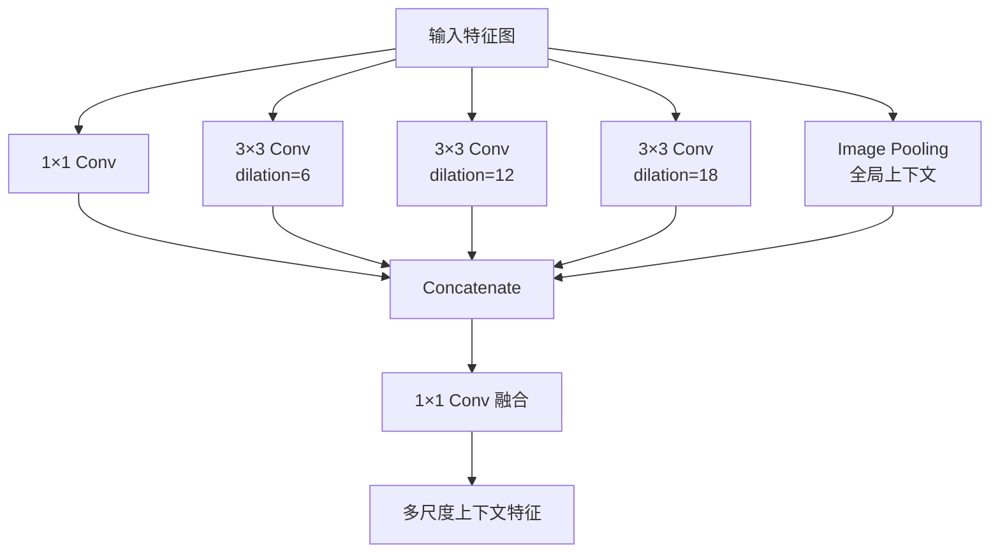

| ASPP 分支 | 作用 |
|-----------|------|
| **1×1 Conv** | 捕获局部细节 |
| **3×3, dilation=6** | 捕获近邻上下文 |
| **3×3, dilation=12** | 捕获中等范围上下文 |
| **3×3, dilation=18** | 捕获大范围上下文 |
| **全局平均池化** | 捕获整图级全局上下文 |

### 8.6 实例分割：Mask R-CNN

> 论文：*"Mask R-CNN"* (2017, ICCV best paper)
> 核心创新：**在 Faster R-CNN 上添加分割分支**

#### RoI Align（Mask R-CNN 的关键改进）

!!! note "RoI Align 解决了 RoI Pooling 的量化误差问题"

**RoI Pooling 的问题（两次量化误差）：**

| RoI Pooling 的量化位置 | 问题 |
|---|---|
| 图像坐标 → 特征图坐标 | 例如 $293.3/16=18.33$ 被取整为 18，产生空间误差 |
| RoI 区域 → 固定网格 | 例如 $18/7=2.57$ 再次取整，误差继续累积 |
| 对分割任务的影响 | mask 是像素级预测，对空间对齐非常敏感 |

**RoI Align 的解决方案——双线性插值：**

| RoI Align 思路 | 说明 |
|---|---|
| 不做量化取整 | 保留浮点坐标，例如 $(18.33,10.67)$ |
| 双线性插值 | 用四个邻近像素 $a,b,c,d$ 的加权平均得到该位置特征 |
| 结果 | 显著减少空间错位，提高 Mask R-CNN 的分割质量 |

!!! success "RoI Align 的影响"
    这个"小"改进对分割任务至关重要——像素级预测对空间精度极为敏感。RoI Align 使得 Mask R-CNN 能生成高质量的逐像素掩膜。

#### Mask R-CNN 的多任务损失


$$
\mathcal{L} = \mathcal{L}_{\text{RPN}} + \mathcal{L}_{\text{Fast R-CNN}} + \mathcal{L}_{\text{mask}}
$$


其中 $\mathcal{L}_{\text{mask}}$ 是分割掩膜的损失，使用 **逐像素 Sigmoid 二值交叉熵**：

- 每个 RoI 经过 RoI Align 后，通过一个卷积分支
- 输出 K 个 $m \times m$ 的二值掩膜（每个类别一个）
- 对每个类别独立使用 Sigmoid + Binary Cross-Entropy
- 最终只使用**真实类别对应**的掩膜损失（避免类间竞争）

---

## 九、深度视觉模型总结

## 9.1 完整脉络图

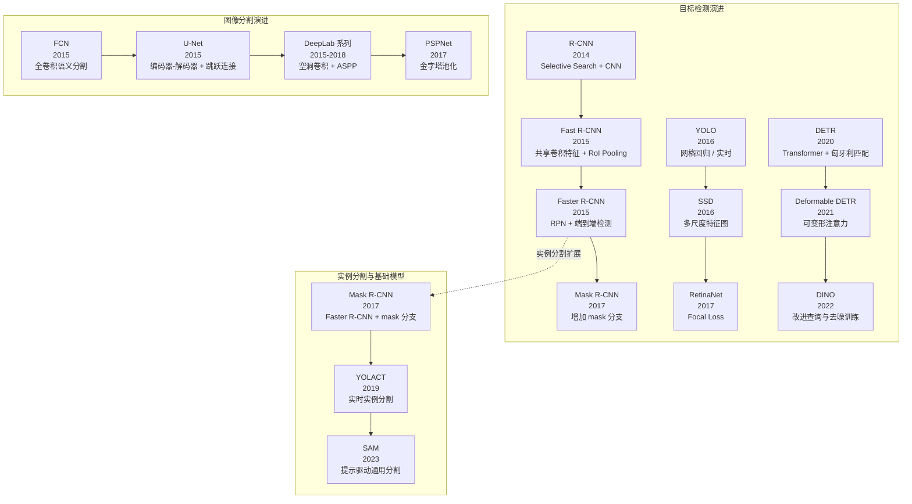

## 9.2 关键技术对比表

| 技术 | 提出时间 | 核心贡献 | 是否端到端 | 速度 | 适用场景 |
|:----:|:--------:|----------|:---------:|:----:|----------|
| **Selective Search** | 2012 | 基于图像分割的快速区域提议 | ❌ | 0.2s/图 | 区域提议 |
| **R-CNN** | 2014 | 区域提议 + CNN 做检测 | ❌ | ~47s/图 | 精度优先 |
| **Fast R-CNN** | 2015 | RoI Pooling，共享特征 | 部分 | ~3s/图 | 精度优先 |
| **Faster R-CNN** | 2015 | RPN，端到端 | ✅ | ~0.2s/图 | 精度优先 |
| **YOLO** | 2016 | 网格回归，实时检测 | ✅ | ~45 FPS | 实时应用 |
| **SSD** | 2016 | 多尺度特征图检测 | ✅ | ~46 FPS | 实时应用 |
| **RetinaNet** | 2017 | Focal Loss | ✅ | ~5 FPS | 精度+平衡 |
| **FCN** | 2015 | 全卷积化分割 | ✅ | — | 语义分割 |
| **Mask R-CNN** | 2017 | 检测+分割统一 | ✅ | ~5 FPS | 实例分割 |
| **DETR** | 2020 | Transformer + 匈牙利匹配 | ✅ | ~10 FPS | 无 Anchor 范式 |
| **SAM** | 2023 | 提示驱动通用分割 | ✅ | 变 | 通用分割 |

## 9.3 关键公式速查表

| 概念 | 公式 | 说明 |
|------|------|------|
| **检测总损失** | $\mathcal{L} = \mathcal{L}_{\text{cls}} + \lambda \mathcal{L}_{\text{reg}}$ | 多任务联合训练 |
| **分类损失（Softmax）** | $\mathcal{L}_{\text{cls}} = -\sum y_i \log(\hat{y}_i)$ | 交叉熵 |
| **定位损失（L2）** | $\mathcal{L}_{\text{reg}} = \sum (t_j - \hat{t}_j)^2$ | 均方误差 |
| **Smooth L1 Loss** | $\operatorname{SL1}(x)=\begin{cases}0.5x^2,& \lvert x\rvert<1\\ \lvert x\rvert-0.5,& \text{otherwise}\end{cases}$ | 鲁棒的回归损失 |
| **IoU** | 预测框∩真实框 / 预测框∪真实框 | 重叠度指标 |
| **mAP** | $\frac{1}{C}\sum_{c=1}^C \text{AP}_c$ | 平均检测精度 |
| **Focal Loss** | $\operatorname{FL}(p_t) = -\alpha_t (1-p_t)^\gamma \log(p_t)$ | 解决类别不平衡 |
| **边界框修正** | $G' = P + \text{regression}(dx, dy, dw, dh)$ | 利用 exp 保证正数 |

## 9.4 学习路线建议

!!! tip "从入门到精通的目标检测学习路线"

| 阶段 | 学习内容 | 目标 |
|:----:|----------|------|
| 🟢 **基础** | R-CNN → Fast R-CNN → Faster R-CNN | 理解两阶段检测的范式演进 |
| 🟡 **进阶** | YOLO → SSD → RetinaNet | 理解单阶段检测与 Focal Loss |
| 🔵 **现代** | DETR → Deformable DETR → DINO | 理解 Transformer 在检测中的应用 |
| 🟣 **分割** | FCN → U-Net → DeepLab → Mask R-CNN | 理解像素级预测 |
| 🔴 **实践** | MMDetection / Detectron2 / Ultralytics | 掌握主流检测框架的使用 |

---

!!! info "相关章节"
    - 第 5-6 章：深度视觉模型（一）—— CNN 基础与经典架构
    - 第 8 章：序列模型（RNN / LSTM / Transformer）
    - 第 9 章：生成模型（GAN / VAE / Diffusion）
