# 第十一章 大语言模型架构与训练

> Encoder-only、Encoder-Decoder、Decoder-only——三种架构的演进与对比
---

### 1.大语言模型的三种架构
Transformer灵活的并行架构为训练数据和参数的扩展提供了模型基础，推动了本轮大语言模型的发展。
>[! info] 基于transformer的三种架构
>1. Encoder-only架构：代表模型为BERT、RoBERTa等，包含输入编码部分，特征编码部分以及任务处理部分。
>2. Encoder-Decoder架构：代表模型为T5、BART等，采用注意力机制来实现两者之间的交互，完整的架构包括输入编码，特征编码，输出编码，特征解码及输出生成五个部分。
>3. Decoder-only架构：代表模型为GPT系列、LLaMA系列等，包含输入编码，特征解码及输出生成部分，省略了每个解码模块中的交叉注意力子模块。

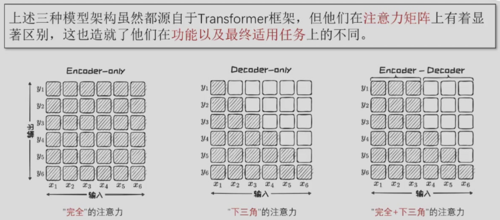
- Encoder-only架构中的双向注意力机制允许模型充分考虑序列中的前后文信息，捕捉丰富的语义和依赖关系。但由于缺少解码器组件，无法直接输出序列。
- Encoder-Decoder架构通过添加解码器来基于编码器输出的上下文表示逐步生成输出序列。但解码器的加入也造成训练和推理的成本增加。
- Decoder-only架构在大规模与预训练数据的加持下能够生成高质量、连贯的文本。但是缺乏解码器提供的双向上下文信息，这一架构在理解复杂输入数据时存在一定的局限性。
#### 1.1基于Encoder-only架构的大语言模型
BERT模型的结构与Transformer中的编码器几乎一致，只是规模不同。BERT模型共有-Base和-Large两个版本。
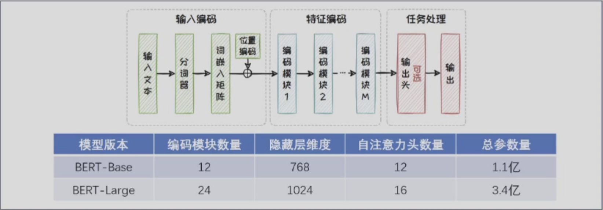
BERT开创性地提出掩码语言建模（Masked Language Model，MLM）和下文预测（Next Sentence Prediction，NSP）两种任务来学习生成上下文嵌入。

为了解决BERT训练不充分的问题，RoBERTa在BERT的基础上使用更大的数据集、更长的训练时间、更细致的学习任务和超参数调整，来优化与训练过程。其在模型结构上与BERT基本一致，都是由多个编码模块堆叠而成的。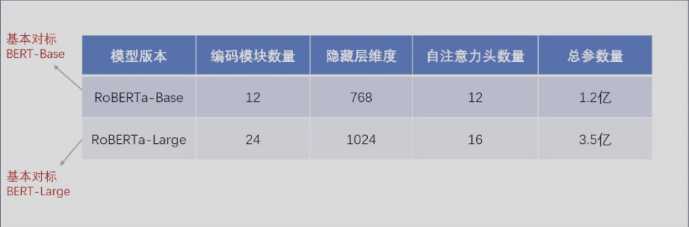
RoBERTa移除了BERT中的下文预测任务，并将掩码语言建模任务强化为动态掩码语言建模，从而增加模型训练的多样性，帮助模型学习到更丰富的上下文信息。其在很多自然语言处理任务中都取得了非常好的效果，如文本分类、情感分析、问答系统等，具有更高的性能和更好的泛化能力，但同样，RoBERTa也存在一些问题，例如训练成本高。

为了提高训练和推理效率，Google团队提出了更加轻量化的ALBERT模型，其模型结构基本不变，但其独有的参数因子分解和跨层参数共享显著降低了模型参数量。对于Encoder-only架构的模型而言，参数主要来源于词嵌入矩阵以及Encoder块，前者参数量约占整体参数量的20%，后者约占80%。
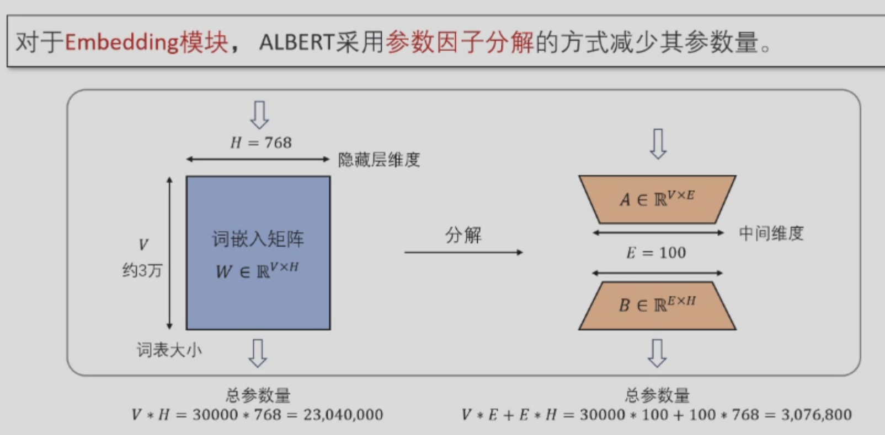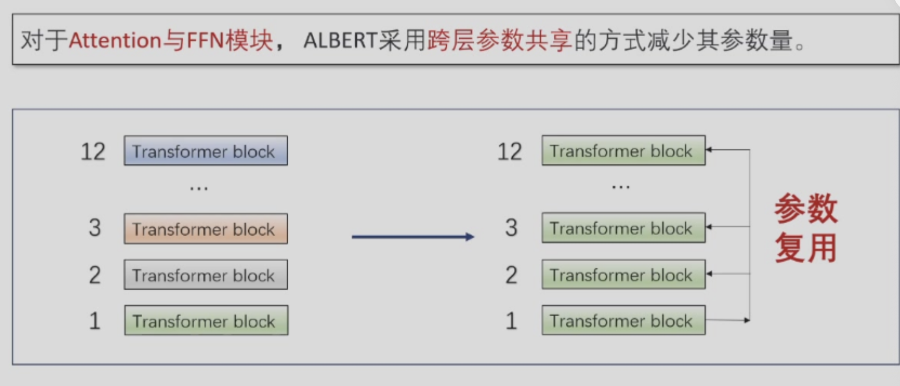
ALBERT采用了和BERT完全相同的数据集，但在预训练任务上，ALBERT保留了BERT的掩码语言建模任务，而将下文预测任务替换为句序预测。对比其他BERT系列模型，参数量更小，训练速度快，但在一些任务上的表现不如BERT。
- Encoder-only架构的优势：得益于双向编码模型中的全面注意力机制，在需要深度理解能力的任务中展现出了卓越的能力。
- 但由于没有寻求参数量的图突破，且只专注于判别任务，难以应对生成式任务。因此在生成式人工智能中可以发挥的作用相对有限。
#### 1.2基于Encoder- Decoder架构的大语言模型
其在原先的Encoder-only架构的基础上添加一个Decoder组件，使其能够生成连贯的输出。从而缓解了Encoder-only架构在生成式任务上的局限性。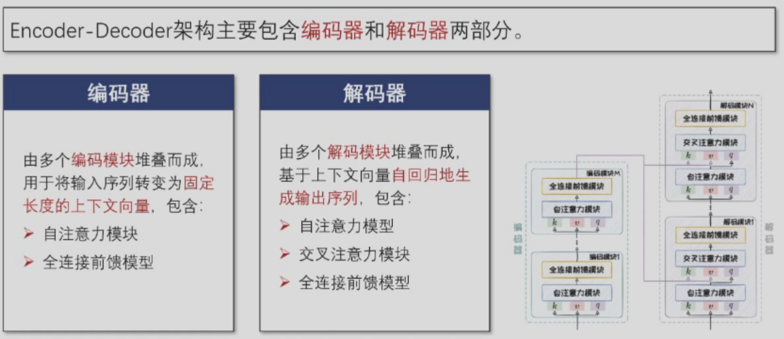
!!! tip "完整的Encoder-Decoder架构中共包含三种注意力模块"
    1.自注意力模块（编码器）：编码器内部的完全注意力。
    2.交叉注意力模块：解码器对编码器的完全注意力。
    3.自注意力模块（解码器）：解码器内部的下三角注意力。

在自注意力机制和交叉注意力机制的共同作用下，Encoder- Decoder架构不仅能够深入理解输入序列，还能够根据不同任务的需求灵活生成长度适宜的输出序列。

BART是由Meta AI研究院在2019年提出的Encoder-Decoder架构模型，旨在通过多样化的预训练任务来提升模型在文本生成任务和文本理解任务上的表现。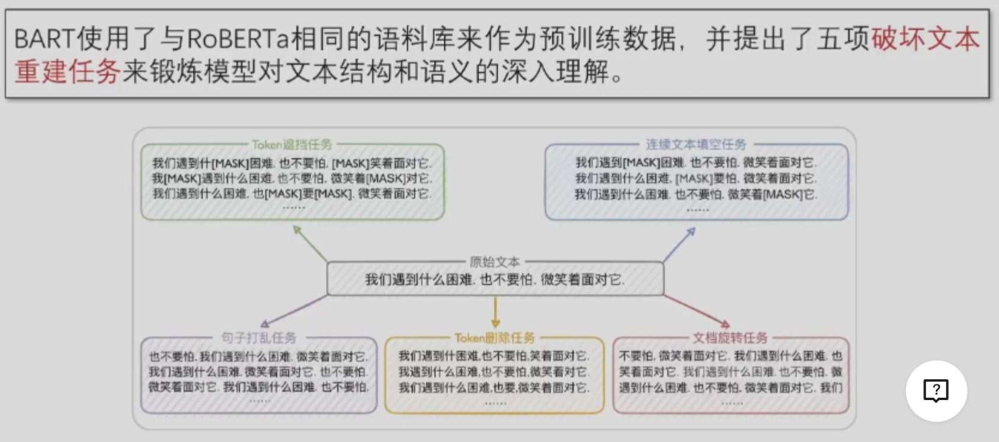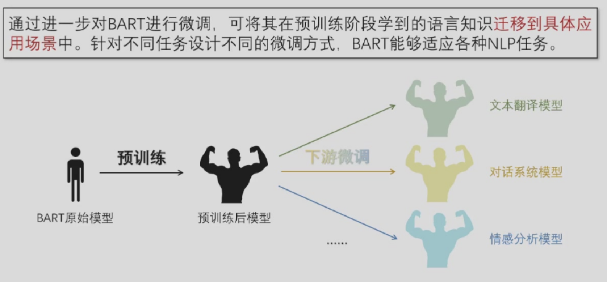

同年，Google探索了T5(Text-to-Text Transfer Transformer)范式，其通过构造合理的输入前缀，实现了各种NLP任务的大一统。

Google Research团队对大规模网页数据集Common Crawl进行清洗和过滤，生成了大小约750GB的C4数据集（Colossal Clean Crawled Corpus）。在C4数据集上，T5提出了Span Corruption作为预训练任务，每次选择连续的几个Token作为小段（span）进行掩码，让模型以完形填空的形式来复原。

T5可在模型架构不改变的情况下，利用Prompt工程技术直接适配到多种下游任务。

较于BERT中的Token级别掩码，Span级别掩码能覆盖短句或子句此类有完整意义的语义单元，使模型能捕捉更深层次的句子结构和上下文之间的复杂依赖关系。
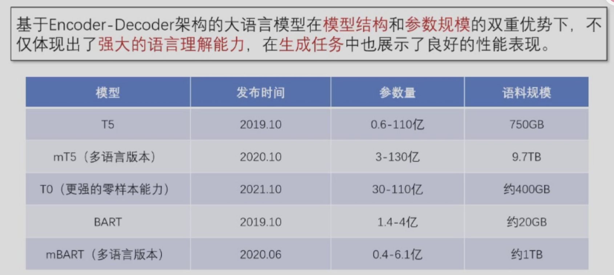
#### 1.3基于Decoder-only架构的大语言模型
在开放式生成任务中，输入序列通常较为简单或者不明确。因此像Encoder- Decoder那样维持一个完整的编码器来处理这些输入并不是必要的。

Decoder-only架构去除了Transformer中的编码器部分，其简化的架构设计和强大的可扩展性，使得Decoder-only架构被广泛应用于大语言模型。
- 去除了解码器部分后，模型变得更加轻量化，从而在一定程度上提高了模型的训练和推理速度。
- 更为简单的模型架构也为其带来了更强大的扩展性，更容易通过堆叠参数量来提升生成质量和能力。
最流行的是OpenAI提出的GPT系列模型和Meta提出的LLaMA系列模型等。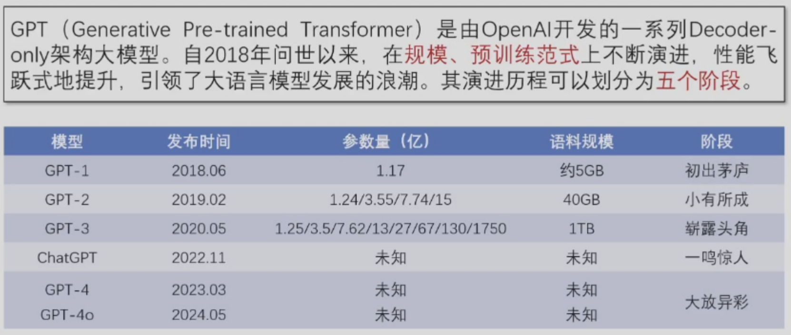
1. Transformer的出现解决了原先困扰OpenAI团队很久的长距离依赖问题。与Bert同年，提出了第一代GPT模型，被称为GPT-1。其在结构上与BERT-Base高度类似，本质区别在于BERT-Base中的自注意力模块是双向的自注意力机制，而GPT-1中则是带有掩码的单向自注意力机制。
2. GPT-2沿用了下一词预测任务，但提升了预训练数据的数量和质量。其采用了全新的WebText数据集，包含40GB经过筛选和清洗的网络文本。完成了预训练之后，在某些任务上可以不进行微调直接推理，大大增加了处理下游任务时的灵活性。
3. GPT-3在前两代的基础上，显著增加了模型规模，参数量最高达到1750亿。庞大的参数量使其能够捕获更加细微和复杂的语言模式，显著提升了文本生成能力。其涌现出了良好的上下文学习（In-Context Learning，ICL）能力，仅通过输入文本中的任务描述和少量示例，便能够快速适应不同的应用场景。在GPT-3的基础上，OpenAI推出了一系列衍生模型，包括Codex、WebGPT等，其中最具有启发意义的是具有良好指令跟随能力的InstructGPT模型。其通过引入人类反馈强化学习（RLHF）来提升模型对用户指令的响应能力。OpenAI随后推出了聊天机器人，称为ChatGPT，标志着一种新的服务模式LLMaaS（LLM as a Service）的出现。
4. GPT-4能更好地理解复杂语境、生成连贯文本。此外，GPT-4还引入了对图文双模态的支持，扩展了其在图像描述和视觉问答等领域的应用。

LLaMA（LLM Meta AI）是由Meta AI开发的一系列大语言模型，其模型权重在非商业许可证下开放，推动了大语言模型的共创和知识分享。

GPT系列的升级主线聚焦于模型规模与预训练预料的同步提升，而LLaMA则在模型规模上保持相对稳定，更专注于提升与训练数据的规模与质量。
1. 在Chinchilla扩展法则“小规模+大数据”的指引下，Meta AI于2023年2月推出了最早版本的模型，旨在以大模型的优质数据训练相对较少的模型。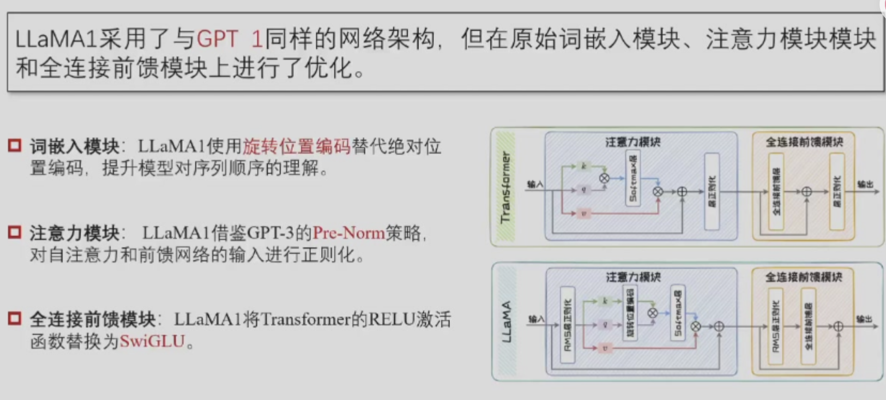
2. 2023年7月Meta AI进一步优化和扩充了训练数据，发布了第二代模型LLmMA2。除了数据量的扩大，LLaMA2还引入了RLHF训练范式，并在其基础上结合了拒绝采样来进一步提升模型性能。其还额外引入了分组查询注意力（Grouped Query Attention，GQA）来提升计算效率。
3. 2024年4月，Meta AI推出LLaMA3。其训练数据规模高达上一代的七倍，且多样性更高，覆盖范围更广。最终即使是80亿参数版本也展示了超越第二代最强版本的性能。随后7月推出的3.1版本更是将模型规模扩大到了4050亿。
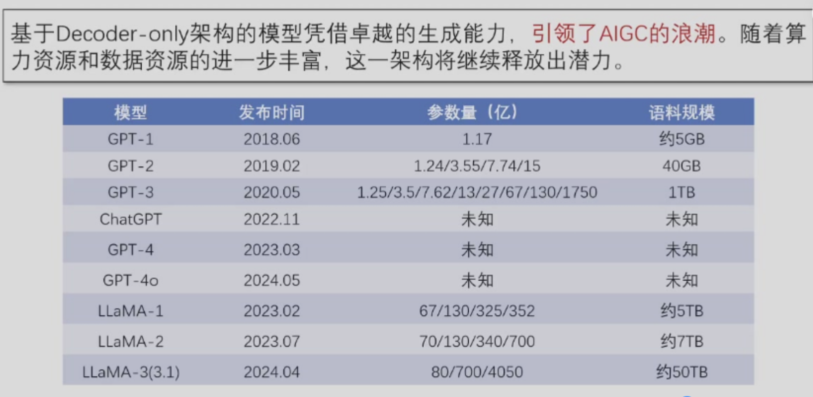
### 2.大语言模型的后训练
会接龙不等于会说话，只接受过接龙训练的模型容易产生复读机效应。可以通过指令微调让大模型学会说话。指令微调就是构造说话秘籍然后对大模型进行监督学习。

会说话不等于说好话，指令微调后的大模型仍可能不符合人类意图或价值观，可能产生社会伦理风险，甚至带来X-Risk。需要人类进行价值对齐，减低风险。

**人工智能3H原则：Honest、Harmless、Helpful**

**对齐**
1. 人类对不同的答案给出标注，训练奖励模型，蒸馏人类价值观打造价值判官。
2. 通过强化学习将人类价值偏好注入。ChatGPT强化学习中需要用到批判模型、奖励模型。

System2思维过程涉及缜密的逻辑，需要一条串联中间推理步骤的思维链。给出推理的中间步骤，可进一步提升System2思维。模型System2思维能力有限，自行思考能力有限。给出思维链参考示例，引导大模型思考。但参考示例难构建，是否可以把System2思维过程学习到模型内部，诱导大模型尽量多的输出思考过程，用强化学习把思维链刻进大模型的骨子里。

DeepSeek R1的强化学习方法GRPO，不做批判思维，直接干中学，成为System2思维的王者，甚至闪现Aha Moment

### 3.参数高效微调(PEFT)
由于全量监督微调需要更新所有模型参数，当面对拥有庞大参数量的大模型时，全量监督微调会消耗大量存储和计算资源。

参数高效微调（Parameter-Efficient Fine-Tuning，PEFT）避免更新全部参数，在保证微调性能的同时，减少更新的参数数量和计算开销。主要有以下三个优势：
1. 计算效率高：减少了需要更新的参数数量，显著减少了训练时的计算资源。
2. 存储效率高：仅需要保留部分微调参数，显著降低了微调模型的存储空间，尤其适用于存储受限的设备。
3. 适应性强：保证微调性能不受影响，且使模型可以快速适应不同任务，具有很好的灵活性。
主流的PERT方法可以分三类：参数附加方法、参数选择方法、低秩适配方法
#### 3.1 参数附加方法
增加并训练新的附加参数或模块对大语言模型进行微调。参数附加方法按照附加位置可以分为三类：加在输入、加在模型以及加在输出。

1. **加在输入**方法将额外参数附加到模型的输入嵌入（Embedding）中，其中最经典的方法是Prompt-tuning。这些额外参数通常称之为软提示。不同于手工编写的硬提示，软提示会在训练过程中被动态调整，其本质是可训练的、连续的嵌入。其引入软提示作为模型输入的一部分，与实际的文本数据一起被送入模型。在微调过程中，仅软提示的参数会被更新。
2. 

#### 3.3 低秩适配方法
通过低秩矩阵近似原始权重更新矩阵，并仅微调低秩矩阵，以大幅降低模型参数量。
- 本征维度假设：在预训练语言模型微调时，仅在一个低维子空间中进行参数更新，也能实现与完整参数更新类似的性能。
- 本征维度：可以使模型达到预期效果的最小参数子空间的维度。
- 本征维度计算方法：通过逐渐增加子空间的维度，并确定模型性能达到预设阈值（如达到基线性能的90%）时的维度，来测量这一数值。

低秩适配（Low-rank Adaptation，LoRA）将d$\times$k参数更新矩阵低秩分解为一个r$\times$k的矩阵和一个d$\times$r的矩阵（r<<min(d,k))，冻结原模型参数，仅微调这两个小矩阵。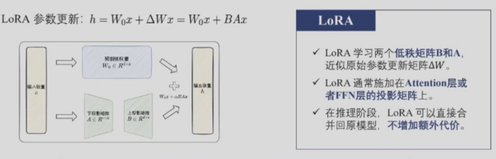
LoRA的性能受多种因素的影响，主要包括权重初始化、秩以及施加位置。
- 权重初始化：通常将投影矩阵B用0初始化，投影矩阵A用高斯分布初始化。
-
