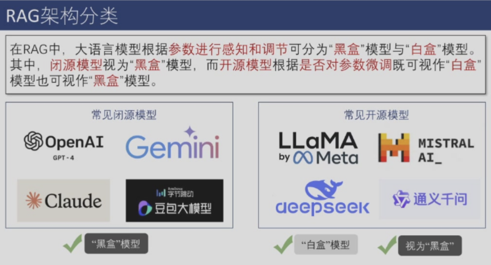
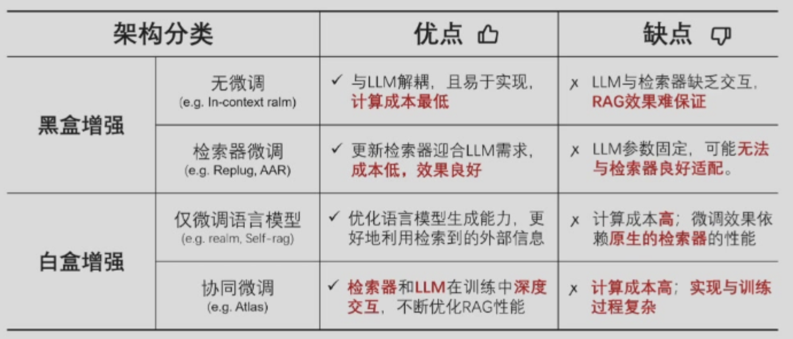
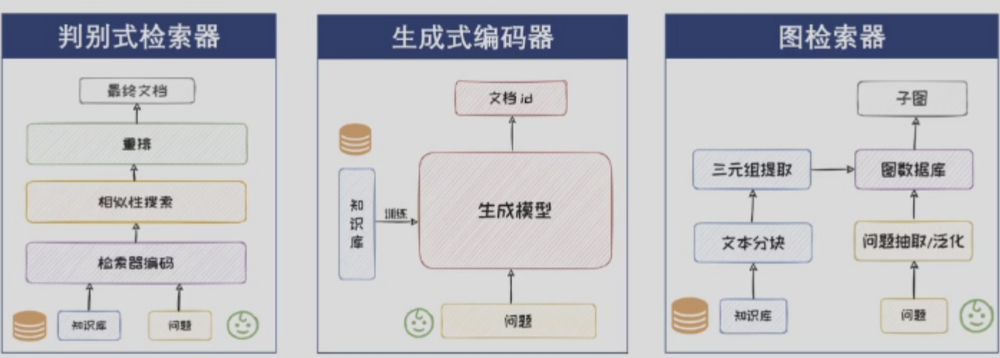
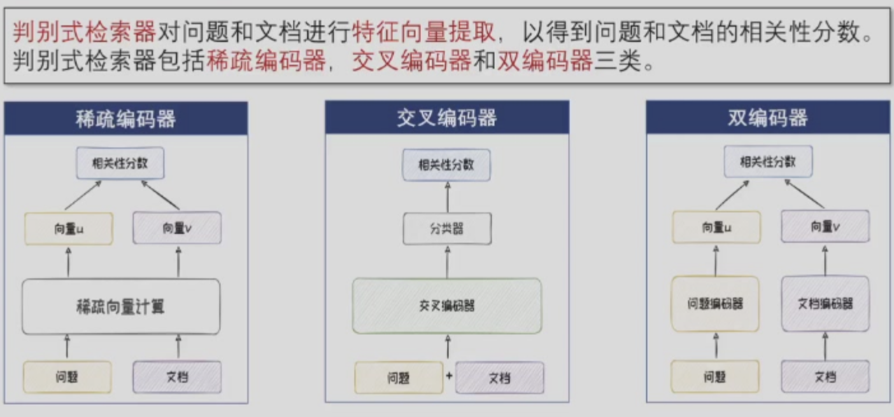
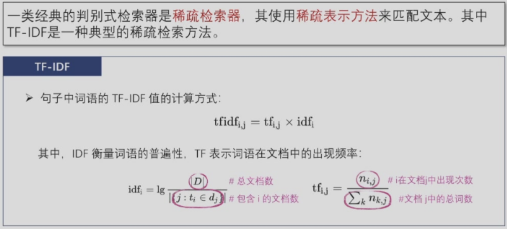
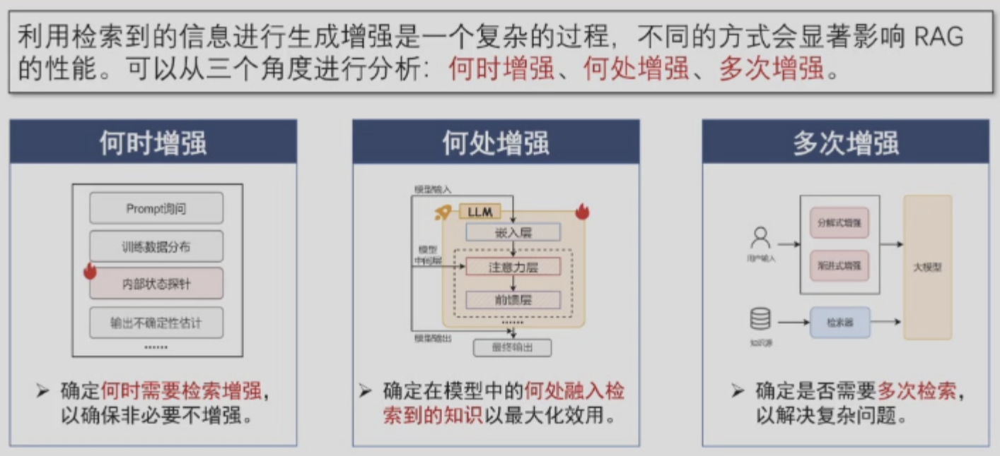
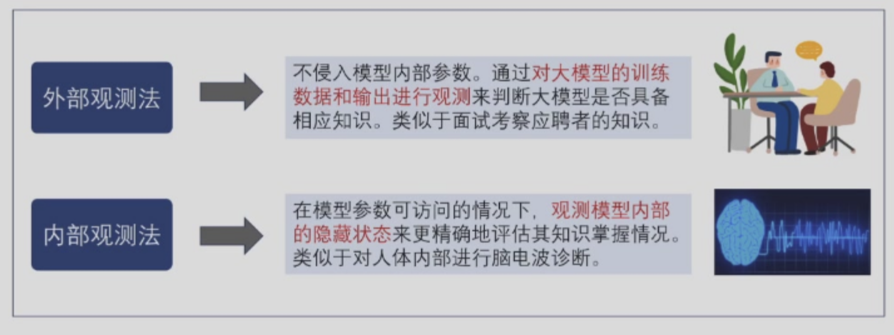

# 第十二章 检索增强生成

> 从外部数据库检索相关信息来辅助改善大语言模型生成质量——RAG 的完整技术栈
---

LLMs生成的内容可能存在幻觉现象：生成内容看似合理但实际上逻辑混乱或与事实相悖。幻觉现象可能直接来源于训练数据中的知识错误，也可能源于训练出的模型本身对知识的掌握不足。
训练数据：
1. 知识过时
2. 知识边界
3. 知识偏差
4. 对齐不当
模型本身：
5. 知识长尾
6. 曝光偏差
7. 解码偏差
RAG（Retrieval-Augmented Generation），即检索增强生成，是一种从外部数据库中检索相关信息来辅助改善大语言模型生成质量的系统。一个基本的RAG框架主要包含知识检索和生成增强两大模块。
!!! tip "常用的检索方法"
    1. 基于关键词匹配的稀疏检索算法
    2. 基于神经网络的稠密检索算法
### 1 RAG架构

从是否对大语言模型进行的参数进行更新的角度出发，RAG架构可分为两大类：黑盒增强架构和白盒增强架构。

黑盒增强架构可根据是否对检索器进行微调分为两类：无微调和检索器微调。
白盒增强架构也可根据是否对检索器进行微调分为两类：仅微调大语言模型和检索器与大语言模型协同微调（简称协同微调）。

检索器和大语言模型在RAG过程中参数不更新，二者直接组合使用来完成生成任务。代表性方法是In-Context RALM。其直接将检索器检索到的文档前置到输入问题前作为上下文。

### 2 知识检索
如何检索出相关信息来辅助改善大模型生成质量的系统。通常包括知识库构建、查询构建、文本检索和检索结果重排四部分。

1. 数据采集与预处理：为构建知识库提供原材料。数据采集从不同渠道整合、转换多元数据资源，将其转换为统一的文档对象。例如维基百科语料库，采集内容不仅包括正文，还包括一系列元信息，如标题、目录、分类等；预处理的数据清洗清除文本中的干扰元素，文本分块将大块本切割成较小单元。文本分块方法包括固定大小分块和基于内容的分块两种方法。知识库增强是通过改进和丰富知识库的内容和结构，为查询提供抓手，包括查询生成和标题生成两种方法。
2. 查询构建：扩展和丰富用户查询的语义和内容，提高检索结果的准确性和全面性，钩出相应内容。增强方法可分为语义增强（同义改写、多视角分解）与内容增强（背景文档生成）。
3. 文本检索：给定知识库和用户查询，文本检索旨在找到知识库中与用户查询相关的知识文本，检索效率增强旨在解决检索时遇到的性能瓶颈问题。优化检索过程，提升检索的质量和效率，对改善RAG的性能具有重要意义。常见的文本检索器分为判别式检索器、生成式检索器和图检索器。

### 3 生成增强

1.外部增强
可以通过判断大语言模型是否具有相关内部知识来判断其是否需要增强。
外部观测法：
1. 通过prompt直接询问对是否具备内部知识进行预测。
2. 通过观察训练数据预测模型的内部知识水平。
3. 无法观察训练数据时，可以通过构造伪训练数据来拟合训练数据的相关情况。
4. 通过设定流行度阈值来
