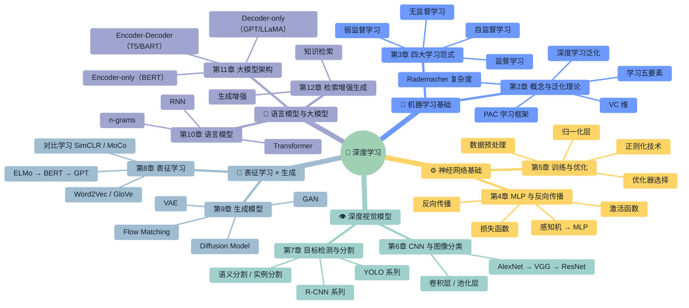
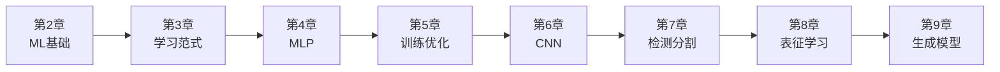
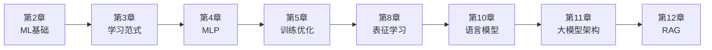

# 🧠 深度学习 · 课程地图

> 毛玉仁 · 王文冠 ｜ 共 11 章 ｜ 点击任意节点跳转笔记

---

## 知识全景（思维导图）

---

## 章节速览

| # | 章节 | 核心主题 | 讲师 | 前置依赖 |
|:--:|------|----------|:--:|----------|
| 2 | [[第2章]] | 机器学习基本概念、经典泛化理论（PAC/VC维/Rademacher） | 毛玉仁 | — |
| 3 | [[第3章]] | 监督/无监督/弱监督/自监督四大学习范式 | 毛玉仁 | 第2章 |
| 4 | [[第4章]] | 多层感知机、激活函数、损失函数、反向传播 | — | 第2-3章 |
| 5 | [[第5章]] | 数据准备→训练→评估全流程、归一化、正则化 | 王文冠 | 第4章 |
| 6 | [[第6章]] | 卷积神经网络原理、经典CNN架构、图像分类 | — | 第4-5章 |
| 7 | [[第7章]] | 目标检测（R-CNN/YOLO）、图像分割 | — | 第6章 |
| 8 | [[第8章]] | 自监督表征学习、NLP词嵌入、对比学习 | 王文冠 | 第3章 |
| 9 | [[第9章]] | VAE → GAN → Diffusion → Flow Matching 四代生成模型 | 王文冠 | 第4-5章 |
| 10 | [[第10章]] | n-grams语言模型、RNN、Transformer基础 | — | 第4章 |
| 11 | [[第11章]] | BERT/GPT/LLaMA架构、PEFT微调、Chinchilla法则 | — | 第10章 |
| 12 | [[第12章]] | RAG架构、知识检索、生成增强技术 | — | 第10-11章 |

---

## 学习路线

### 🛤️ 路线一：计算机视觉方向

### 🛤️ 路线二：自然语言处理方向

### 🛤️ 路线三：快速入门（最少前置）

> [!tip] 适合想快速建立全局认知的读者
> [[第2章]] → [[第4章]] → [[第6章]] → [[第10章]] → [[第12章]]

---

## 核心概念跨章索引

> 同一个概念在不同章节中反复出现、层层深入。这里是关键概念的分布地图。

| 概念 | 章节分布 | 说明 |
|------|----------|------|
| **梯度下降** | [[第2章#七、深度学习泛化\|§2.7]] · [[第4章#三、梯度下降\|§4.3]] · [[第5章#四、优化器\|§5.4]] | 从理论到优化器选型 |
| **损失函数** | [[第2章#二、学习的要素\|§2.2]] · [[第4章#二、损失函数\|§4.2]] · [[第5章#二、损失函数设计\|§5.2]] | 从定义到工程实践 |
| **过拟合与正则化** | [[第2章#六、经典泛化理论\|§2.6]] · [[第5章#五、正则化\|§5.5]] | 从理论到技术方案 |
| **激活函数** | [[第4章#一、从神经元到感知机\|§4.1]] | Sigmoid/Tanh/ReLU/GELU |
| **卷积** | [[第6章#二、卷积层\|§6.2]] | 局部连接、权重共享 |
| **注意力机制** | [[第8章#BERT\|§8.x]] · [[第10章#Transformer\|§10.2]] · [[第11章#1、三种架构\|§11.1]] | 从NLP表征到LLM核心 |
| **Transformer** | [[第10章#2、RNN与Transformer\|§10.2]] · [[第11章#1、三种架构\|§11.1]] | 从基础架构到大模型 |
| **自监督学习** | [[第3章#四、自监督学习\|§3.4]] · [[第8章]] | 从范式定义到具体实现 |
| **生成模型** | [[第9章]] | VAE/GAN/Diffusion/Flow Matching |
| **模型评估** | [[第2章#二、学习的要素\|§2.2]] · [[第5章#六、模型评估\|§5.6]] · [[第10章#3、采样与评测\|§10.3]] | 从理论到困惑度PPL |

---

## 讲师分工

| 讲师 | 负责章节 | 内容侧重 |
|------|----------|----------|
| **毛玉仁** | 第2章、第3章 | 机器学习理论基础 |
| **王文冠** | 第5章、第8章、第9章 | 神经网络训练、表征学习、生成模型 |
| **课件内容** | 第4章、第6章、第7章、第10-12章 | 从MLP到RAG的完整技术栈 |

---

## 图像资源索引

| 主题 | 图片数量 | 文件夹 |
|------|:-------:|--------|
| ML基础 | 5 | `images/ML基础-*` |
| 表征学习 | 8 | `images/表征学习-*` |
| 生成模型 | 13 | `images/生成模型-*` |
| 语言模型 | 10 | `images/语言模型-*` |
| 大模型架构 | 12 | `images/大模型架构-*` |
| RAG | 6 | `images/RAG-*` |

---

> [!abstract] 使用建议
> 1. **首次学习**：按章节顺序阅读（2→3→4→5→6→7→8→9→10→11→12）
> 2. **考前复习**：从上方「核心概念跨章索引」定位薄弱点
> 3. **研究参考**：按「学习路线」选择与你方向相关的内容深挖
> 4. **查漏补缺**：打开 Obsidian **关系图谱**，在 DL 文件夹范围内查看笔记间的链接网络
