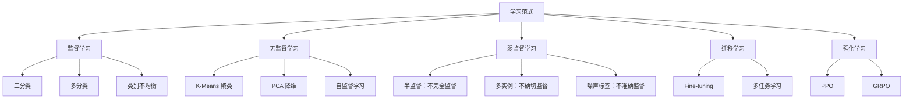

# 第三章 机器学习基础（二）

> 本章主线：从**监督学习**出发，理解机器学习范式如何从统计学习时代的“拟合标签”，发展到表征学习时代的“学习表示”，再到大模型时代的“预训练 + 对齐 + 强化学习”。

---

## 0. 本章知识地图



---

## 一、学习范式与机器学习发展历程

### 1.1 什么是学习范式？

**学习范式**指模型从数据与反馈中获得能力的基本方式。课件先用人的学习做类比：

| 人的学习方式 | 对应机器学习思想 | 关键反馈 |
|---|---|---|
| 自然选择：筛选“天分” | 模型结构、归纳偏置、初始化 | 是否具备可学习性 |
| 错题改正：进行“教育” | 监督学习 | 标签误差 |
| 奖励引导：提升“阅历” | 强化学习 | 奖励信号 |

> [!note] 直观理解
> 监督学习像“老师批改作业”；无监督学习像“自己观察世界结构”；强化学习像“在环境中试错并获得奖励”。

### 1.2 机器学习范式演进

课件给出的演进链可以概括为：


### 1.3 三个时代

| 时代 | 核心特征 | 典型方法 | 学习范式特点 |
|---|---|---|---|
| 统计学习时代 | 手工特征 + 多样假设空间 | SVM、决策树、概率图、HMM、核方法 | 以监督学习为中心 |
| 表征学习时代 | 神经网络自动学习特征 | CNN、RNN、AutoEncoder、对比学习 | 监督、无监督、自监督并行 |
| 大模型时代 | 预训练 + 微调 + 对齐 | Transformer、LLM、RLHF、GRPO | 自监督预训练成为主流，强化学习用于对齐 |

> [!tip] 本章的真正重点
> 不是罗列所有算法，而是理解：**标签从强到弱、反馈从明确到间接、模型从任务专用到通用预训练**的变化。

---

## 二、监督学习 (Supervised Learning)

### 2.1 基本定义

监督学习的数据样本同时包含**特征**与**标签**：

$$
D = \{(x_i, y_i)\}_{i=1}^{m}, \quad x_i \in \mathcal{X},\; y_i \in \mathcal{Y}
$$

目标是学习映射：

$$
f: \mathcal{X} \to \mathcal{Y}
$$

使模型对未见样本也能预测正确标签。

| 任务 | 标签空间 | 例子 |
|---|---|---|
| 二分类 | $y \in \{-1,+1\}$ 或 $\{0,1\}$ | 猫狗分类、垃圾邮件检测 |
| 多分类 | $y \in \{1,2,\ldots,k\}$ | MNIST、CIFAR-10 |
| 回归 | $y \in \mathbb{R}$ | 房价、温度、销量预测 |
| 检测 | 位置 + 类别 | 人脸检测、目标检测 |

---

### 2.2 二分类：线性分类器

二分类问题：

$$
D = \{(x_i,y_i)\}_{i=1}^{m},\quad x_i \in \mathbb{R}^d,\quad y_i \in \{-1,+1\}
$$

线性分类器用一个超平面划分空间：

$$
H = \{x \in \mathbb{R}^d : w^\top x + b = 0\}
$$

预测规则：

$$
\hat{y} = \operatorname{sign}(w^\top x + b)
$$

点到超平面的距离：

$$
\operatorname{dist}(x,H) = \frac{|w^\top x + b|}{\|w\|}
$$

> [!important] 分类置信度
> $|w^\top x+b|$ 越大，样本离决策边界越远，模型越“自信”。靠近超平面的样本通常更难分类。

#### 0-1 损失

$$
\ell_{0/1}(x,y) = \mathbb{I}\big(y(w^\top x+b) \le 0\big)
$$

0-1 损失直接统计是否分类错误，但它不可导、难优化。因此实际常用可导的替代损失，例如逻辑损失、hinge loss 等。

---

### 2.3 二分类：逻辑回归 (Logistic Regression)

逻辑回归把线性打分转化为概率。对于 $y \in \{-1,+1\}$：

$$
p(y \mid x) = \frac{1}{1+\exp\big(-y(w^\top x+b)\big)}
$$

若记 $z=w^\top x+b$，则 sigmoid 函数为：

$$
\sigma(z)=\frac{1}{1+e^{-z}}
$$

| $z$ | $\sigma(z)$ | 解释 |
|---:|---:|---|
| $z \ll 0$ | 接近 0 | 预测负类 |
| $z=0$ | 0.5 | 最不确定，位于决策边界 |
| $z \gg 0$ | 接近 1 | 预测正类 |

数据集联合概率：

$$
p(\{y_i\}\mid \{x_i\};w,b)=\prod_{i=1}^{m}\frac{1}{1+\exp\big(-y_i(w^\top x_i+b)\big)}
$$

最大化对数似然等价于最小化逻辑损失：

$$
\mathcal{L}_{\text{LR}}(w,b)=\sum_{i=1}^{m}\log\left(1+\exp\big(-y_i(w^\top x_i+b)\big)\right)
$$

> [!summary] 逻辑回归的意义
> 逻辑回归不是“只能做线性分类”的简单模型，而是把线性分类与概率解释连接起来，是理解 Softmax、交叉熵、神经网络分类头的基础。

---

### 2.4 多分类：Softmax 回归

多分类问题：

$$
D=\{(x_i,y_i)\}_{i=1}^{m},\quad x_i\in\mathbb{R}^d,\quad y_i\in\{1,2,\ldots,k\}
$$

为每个类别 $c$ 维护一个线性打分函数：

$$
s_c(x)=w_c^\top x+b_c
$$

直接对每个类别用 sigmoid 会导致概率和不一定为 1，因此使用 Softmax：

$$
p(y=c\mid x)=\frac{\exp(w_c^\top x+b_c)}{\sum_{c'=1}^{k}\exp(w_{c'}^\top x+b_{c'})}
$$

多分类对数似然：

$$
\log p(\{y_i\}\mid\{x_i\};W,b)=\sum_{i=1}^{m}\sum_{c=1}^{k}\mathbb{I}(y_i=c)\log p(y_i=c\mid x_i;W,b)
$$

单样本多分类逻辑损失：

$$
\ell_{\text{softmax}}(x,y)=-\log\frac{\exp(w_y^\top x+b_y)}{\sum_{c=1}^{k}\exp(w_c^\top x+b_c)}
$$

也可以写为：

$$
\ell_{\text{softmax}}(x,y)=\log\left(1+\sum_{c\ne y}\exp\big((w_c-w_y)^\top x+b_c-b_y\big)\right)
$$

当 $k=2$ 时，多分类 Softmax 与二分类逻辑回归等价。

---

### 2.5 从多分类到二分类

有时我们会把多分类拆成多个二分类问题。

| 方法 | 做法 | 优点 | 缺点 |
|---|---|---|---|
| One-vs-Rest (OvR) | 训练 $k$ 个分类器：第 $c$ 类 vs 其它类 | 简单，模型数量少 | 每个二分类器都可能类别不均衡 |
| One-vs-One (OvO) | 训练 $\binom{k}{2}$ 个分类器：两两类别 PK | 单个分类器任务简单 | 分类器数量多，投票复杂 |

---

### 2.6 类别不均衡与罕见类

类别不均衡指不同类别样本数量差异很大。例如医疗诊断、欺诈检测、故障检测中，正类往往非常少。

> [!danger] 问题
> 如果 99% 样本都是负类，模型只预测“负类”也能有 99% 准确率，但它完全没有识别罕见正类的能力。

#### 方法一：样本重加权

给少数类更高权重：

$$
\mathcal{L}=\sum_{i=1}^{m}\alpha_{y_i}\,\ell(f(x_i),y_i)
$$

常见做法：令类别权重与类别频率成反比。

#### 方法二：重采样

| 方法 | 做法 | 风险 |
|---|---|---|
| 过采样 | 复制少数类样本 | 过拟合少数类 |
| 欠采样 | 删除多数类样本 | 丢失多数类信息 |
| 混合采样 | 过采样 + 欠采样 | 需要调参 |

#### 方法三：SMOTE

SMOTE 通过在少数类样本之间插值生成新样本：

$$
x_{\text{new}} = x_i + \lambda(x_j-x_i),\quad \lambda\sim U(0,1)
$$

> [!tip] 评价指标也要更换
> 类别不均衡时不要只看 Accuracy，应重点看 Precision、Recall、F1、AUC、PR-AUC 等指标。

---

## 三、无监督学习 (Unsupervised Learning)

### 3.1 基本定义

无监督学习的数据只有特征，没有人工标签：

$$
D=\{x_i\}_{i=1}^{m}
$$

目标是发现数据本身的结构，例如聚类、降维、密度估计、表征学习。

| 任务 | 目标 | 典型算法 |
|---|---|---|
| 聚类 | 发现自然分组 | K-Means、层次聚类、GMM |
| 降维 | 压缩特征并保留信息 | PCA、t-SNE、UMAP、AutoEncoder |
| 自监督 | 从数据自身构造监督信号 | 对比学习、Next-token Prediction |

> [!note] 无监督学习的“主观性”
> 没有标签时，“正确结构”并不唯一。同一批杯子可以按颜色聚类，也可以按大小、材质、有无把手聚类。

---

### 3.2 K-Means 聚类

给定数据集 $\mathcal{X}$，希望划分为 $k$ 个簇：

$$
C_1,C_2,\ldots,C_k
$$

每个簇的质心：

$$
\mu_i(C_i)=\frac{1}{|C_i|}\sum_{x\in C_i}x
$$

K-Means 最小化簇内平方距离：

$$
G_{\text{k-means}}((\mathcal{X},d),(C_1,\ldots,C_k))=\sum_{i=1}^{k}\sum_{x\in C_i}d(x,\mu_i(C_i))^2
$$

#### 算法流程

```text
Input: 数据集 X，聚类数 k
Initialize: 随机选择 k 个初始质心 μ1, ..., μk
Repeat until convergence:
    1. 分配：每个样本分配到最近质心
    2. 更新：重新计算每个簇的质心
Output: k 个簇与对应质心
```

#### 为什么每一步都不会增加损失？

1. **分配步骤**：固定质心，把点分给最近的质心，簇内距离不会变大。
2. **更新步骤**：固定簇成员，均值是使平方误差最小的质心。
3. 因此 K-Means 的损失单调不增，最终收敛到一个局部最优。

> [!warning] K-Means 的局限
> - 需要预先指定 $k$
> - 对初始化敏感
> - 偏好球形、大小相近的簇
> - 对异常值敏感

![[images/ML基础-KMeans聚类算法.png]]

---

### 3.3 PCA：主成分分析

PCA 的目标是在降维时尽量保留数据方差信息。它寻找一组新的正交坐标轴，使数据在前几个方向上的方差最大。

#### 坐标变换视角

任意向量可以表示为标准基底的线性组合：

$$
x=x^{(1)}e_1+x^{(2)}e_2+\cdots+x^{(d)}e_d
$$

PCA 不是改变数据本身，而是寻找更合适的基底：

$$
y=(w_1^\top x,w_2^\top x,\ldots,w_d^\top x)
$$

其中 $w_1,w_2,\ldots,w_d$ 是新的正交坐标轴。

#### 一维 PCA 推导

中心化样本后，设协方差矩阵为：

$$
C=\frac{1}{m}\sum_{i=1}^{m}(x_i-\bar{x})(x_i-\bar{x})^\top
$$

目标：找到单位向量 $w$，使投影方差最大：

$$
\max_{\|w\|=1} w^\top Cw
$$

使用拉格朗日乘子：

$$
\mathcal{L}(w,\lambda)=w^\top Cw-\lambda(w^\top w-1)
$$

求导得到：

$$
Cw=\lambda w
$$

> [!important] PCA 核心结论
> PCA 的主方向是协方差矩阵的特征向量；投影方差等于对应特征值。第一主成分就是最大特征值对应的特征向量。

#### k 维 PCA

$$
\begin{aligned}
\max_{W\in\mathbb{R}^{d\times k}} \quad & \operatorname{trace}(W^\top C W) \\
\text{s.t.}\quad & W^\top W=I
\end{aligned}
$$

解为：

$$
W=[w_1,w_2,\ldots,w_k]
$$

其中 $w_i$ 是协方差矩阵 $C$ 的第 $i$ 大特征值对应的特征向量。

信息保留比例：

$$
\text{保留信息比例}=\frac{\sum_{i=1}^{k}\lambda_i}{\sum_{i=1}^{d}\lambda_i}
$$

![[images/ML基础-PCA主成分分析-1.png]]

---

### 3.4 自监督学习 (Self-supervised Learning)

自监督学习是深度学习时代最重要的无监督学习方法。它不依赖人工标签，而是从数据本身构造“伪监督信号”。

| 方法 | 伪任务 | 学到的能力 |
|---|---|---|
| 图像旋转预测 | 预测图片旋转角度 | 图像结构理解 |
| 遮挡恢复 | 预测被遮挡部分 | 上下文建模 |
| 对比学习 | 拉近正样本，推远负样本 | 表征空间结构 |
| Next-token Prediction | 预测下一个 token | 语言建模与生成 |

#### 对比学习

核心思想：

- 同一对象的不同增强视图应相似
- 不同对象的表示应远离

典型 InfoNCE 损失：

$$
\mathcal{L}_{\text{contrastive}}(f;\tau,M)=\mathbb{E}\left[-\log\frac{\exp(f(x)^\top f(y)/\tau)}{\exp(f(x)^\top f(y)/\tau)+\sum_i\exp(f(x_i^-)^\top f(y)/\tau)}\right]
$$

其中：

| 符号 | 含义 |
|---|---|
| $(x,y)$ | 正样本对 |
| $x_i^-$ | 负样本 |
| $f(\cdot)$ | 编码器 |
| $\tau$ | 温度系数，控制分布尖锐程度 |

#### Next-token Prediction

大语言模型的核心预训练目标：给定前文，预测下一个 token。

$$
p(x_1,x_2,\ldots,x_T)=\prod_{t=1}^{T}p(x_t\mid x_{<t})
$$

训练目标：

$$
\mathcal{L}_{\text{NTP}}=-\sum_{t=1}^{T}\log p_\theta(x_t\mid x_{<t})
$$

> [!summary] 自监督为何重要
> 它把“海量无标签数据”转化为可训练信号，是大模型预训练的基础。

---

## 四、弱监督学习 (Weak Supervision)

课件将弱监督分为三种情况：

| 类型 | 英文 | 问题 | 对应方法 |
|---|---|---|---|
| 不完全监督 | Incomplete Supervision | 只有少量样本有标签 | 半监督学习、主动学习 |
| 不确切监督 | Inexact Supervision | 只有粗粒度标签 | 多实例学习 |
| 不准确监督 | Inaccurate Supervision | 标签可能错误 | 噪声标签学习 |

---

### 4.1 半监督学习：不完全监督

实践中，标签数据昂贵，但无标签数据很多。半监督学习利用少量有标签数据与大量无标签数据共同训练。

#### 伪标签 (Pseudo-labeling)

流程：

1. 用有标签集合 $L$ 训练初始模型。
2. 用模型给无标签集合 $U$ 预测标签。
3. 选择高置信度预测作为伪标签。
4. 把伪标签样本加入训练集继续训练。


> [!warning] 伪标签风险
> 如果初始模型错误且过于自信，会把错误标签不断强化，形成 confirmation bias。

#### 主动学习 (Active Learning)

主动学习关注：在标注预算有限时，应该挑哪些样本请人标注？

常用策略：

| 策略 | 核心思想 |
|---|---|
| 不确定性采样 | 标注模型最不确定的样本 |
| 边界采样 | 标注离决策边界最近的样本 |
| 期望误差缩小 | 标注预计最能降低整体误差的样本 |

对于线性分类器，离超平面越近越不确定：

$$
\frac{|w^\top x+b|}{\|w\|}
$$

---

### 4.2 多实例学习：不确切监督

多实例学习 (Multiple Instance Learning, MIL) 中，训练数据按 **bag** 组织。只有 bag 有标签，bag 内 instance 没有标签。

经典假设：

| Bag 标签 | Instance 情况 |
|---|---|
| 正 bag | 至少包含一个正 instance |
| 负 bag | 所有 instance 都是负 |

> [!example] 例子
> 医学图像中，一整张切片被标为“阳性”，但具体哪个区域病变未知。模型只能从 bag 级标签中推断 instance 级结构。

---

### 4.3 噪声标签学习：不准确监督

噪声标签来自人工误标、众包质量不稳定、专家分歧、自动标注错误等。

解决方向：

| 方向 | 做法 |
|---|---|
| 鲁棒模型结构 | 减少对错误标签的记忆 |
| 鲁棒损失函数 | 使用对噪声不敏感的损失 |
| 样本选择 | 过滤或降低可疑样本权重 |
| 正则化 | 防止模型过度自信地拟合噪声 |
| 噪声适应层 | 显式建模真实标签到噪声标签的转移 |

#### 噪声适应层

设真实标签为 $y$，观测到的噪声标签为 $\tilde{y}$，可以学习一个标签转移矩阵：

$$
T_{ij}=p(\tilde{y}=j\mid y=i)
$$

模型先预测真实标签分布 $p(y\mid x)$，再通过 $T$ 得到噪声标签分布：

$$
p(\tilde{y}\mid x)=\sum_y p(\tilde{y}\mid y)p(y\mid x)
$$

#### “自信”惩罚项 (Confidence Penalty)

为了避免模型对噪声标签过度自信，可以在损失中加入熵正则：

$$
\mathcal{L}(\theta)=-\sum\log p_\theta(y\mid x)-\beta H(p_\theta(y\mid x))
$$

其中：

$$
H(p_\theta(y\mid x))=-\sum_i p_\theta(y_i\mid x)\log p_\theta(y_i\mid x)
$$

熵越大，预测分布越不尖锐；惩罚过度自信有助于缓解噪声标签过拟合。

#### 对称损失与噪声容忍

若损失函数满足对称性：

$$
\sum_{j=1}^{c}\mathcal{L}(f(x),j)=C,\quad \forall x\in\mathcal{X},\forall f
$$

且均匀标签噪声率小于 $(c-1)/c$，则该损失在理论上具有一定噪声容忍性。

---

## 五、迁移学习 (Transfer Learning)

### 5.1 定义

给定源域 $D_S$、源任务 $T_S$，以及目标域 $D_T$、目标任务 $T_T$，迁移学习希望利用源域/源任务知识提升目标域/目标任务效果：

$$
D_S\ne D_T \quad \text{or} \quad T_S\ne T_T
$$

> [!note] 核心问题
> 如何把已经学到的知识迁移到新任务，而不是每次都从零开始？

### 5.2 按标签关系分类

| 源数据 | 目标数据 | 方法例子 |
|---|---|---|
| 有标签 | 有标签 | 微调、多任务学习 |
| 有标签 | 无标签 | 域适应、零样本学习 |
| 无标签 | 有标签 | 自监督预训练 + 目标任务微调 |
| 无标签 | 无标签 | 自聚类、自监督表征学习 |

### 5.3 微调 (Fine-tuning)

预训练模型参数为 $\theta_S$，目标任务初始化为：

$$
\theta_{T,0}=\theta_S
$$

然后在目标数据 $D_T$ 上继续优化：

$$
\theta_{T,t+1}=\theta_{T,t}-\eta_t\nabla_\theta\mathcal{L}(\theta_{T,t},D_T)
$$

实践技巧：

- 使用较小学习率 $\eta_t$
- 底层通用特征可冻结或使用更小学习率
- 顶层任务相关参数可使用更大学习率
- 最后一层常重新初始化
- 数据少时注意过拟合

### 5.4 多任务学习 (Multi-task Learning, MTL)

多任务学习同时训练多个相关任务，通过共享表示提升泛化能力。

$$
\min_\theta \sum_{i=1}^{n}\mathcal{L}_i(\theta,D_i)
$$

| 共享方式 | 特点 |
|---|---|
| 硬共享 | 多任务共享底层网络，各自有任务头 |
| 软共享 | 每个任务有独立参数，但加入参数相似性约束 |

> [!warning] 迁移学习 vs 多任务学习
> 迁移学习通常强调“源任务到目标任务”；多任务学习强调“多个任务同时训练”。两者相关但不完全相同。

---

## 六、强化学习简介：PPO 与 GRPO

本章最后用 PPO 与 GRPO 连接到大模型对齐与推理模型训练。

### 6.1 PPO (Proximal Policy Optimization)

PPO 的核心是限制新旧策略差异，避免策略更新过大。

策略比率：

$$
r_t(\theta)=\frac{\pi_\theta(a_t\mid s_t)}{\pi_{\theta_{\text{old}}}(a_t\mid s_t)}
$$

裁剪目标：

$$
L^{\text{CLIP}}(\theta)=\mathbb{E}_t\left[\min\left(r_t(\theta)\hat{A}_t,\operatorname{clip}(r_t(\theta),1-\epsilon,1+\epsilon)\hat{A}_t\right)\right]
$$

其中 $\hat{A}_t$ 是优势函数，表示当前动作比预期好多少。

在大模型 RLHF 中，奖励常包含：

$$
R_{\text{total}}=R_{\text{score}}-\beta\,\operatorname{KL}(\pi_\theta\|\pi_{\text{ref}})
$$

> [!tip] KL 约束的作用
> 防止模型为了追求奖励而偏离参考模型太远，降低 reward hacking 风险。

### 6.2 GRPO (Group Relative Policy Optimization)

GRPO 是 PPO 的一种变体，常用于推理模型训练。它不再依赖单独 Critic 网络，而是对同一 prompt 采样一组回答，并用组内相对奖励估计优势。

设同一问题生成 $G$ 个回答，奖励为 $r_1,\ldots,r_G$，组内标准化优势：

$$
\hat{A}_i=\tilde{r}_i=\frac{r_i-\operatorname{mean}(r)}{\operatorname{std}(r)}
$$

GRPO 的直观目标：

$$
J_{\text{GRPO}}(\theta)=\sum_{i=1}^{G}\sum_{t=1}^{|a_i|}\left\{\min\left(r_{i,t}(\theta)\hat{A}_i,\operatorname{clip}(r_{i,t}(\theta),1-\epsilon,1+\epsilon)\hat{A}_i\right)-\beta D_{KL}(\pi_\theta\|\pi_{\text{ref}})\right\}
$$

其中：

$$
r_{i,t}(\theta)=\frac{\pi_\theta(a_{i,t}\mid s,a_{i,<t})}{\pi_{\theta_{\text{old}}}(a_{i,t}\mid s,a_{i,<t})}
$$

| 方法 | 价值估计 | 训练特点 |
|---|---|---|
| PPO | 依赖 Critic / Value model | 稳定但复杂 |
| GRPO | 组内相对奖励 | 更适合同题多答案比较，减少 Critic 依赖 |

> [!summary] PPO/GRPO 与大模型
> SFT 让模型“会回答”，奖励模型让模型“知道什么回答更好”，PPO/GRPO 让模型根据奖励信号调整生成策略。

---

## 七、本章总结

### 7.1 一句话总览

| 范式 | 一句话 |
|---|---|
| 监督学习 | 用标签教模型建立 $x\to y$ 映射 |
| 无监督学习 | 不用标签，发现数据自身结构 |
| 自监督学习 | 从数据自身构造监督信号，是大模型预训练基础 |
| 弱监督学习 | 标签少、粗、错时如何学习 |
| 迁移学习 | 把已有任务/领域知识迁移到新任务 |
| 强化学习 | 用奖励信号优化行为策略 |

### 7.2 核心公式速查

| 主题 | 公式 |
|---|---|
| 线性分类器 | $\hat{y}=\operatorname{sign}(w^\top x+b)$ |
| 点到超平面距离 | $\frac{\lvert w^\top x+b\rvert}{\lVert w\rVert}$ |
| 逻辑回归 | $p(y\mid x)=\frac{1}{1+\exp(-y(w^\top x+b))}$ |
| Softmax | $p(y=c\mid x)=\frac{e^{w_c^\top x+b_c}}{\sum_{c'}e^{w_{c'}^\top x+b_{c'}}}$ |
| K-Means | $\sum_i\sum_{x\in C_i}d(x,\mu_i)^2$ |
| PCA | $Cw=\lambda w$ |
| InfoNCE | $-\log\frac{\exp(s^+/\tau)}{\exp(s^+/\tau)+\sum_i\exp(s_i^-/\tau)}$ |
| Fine-tuning | $\theta_{T,0}=\theta_S$ |
| PPO | $\min(r_t\hat{A}_t,\operatorname{clip}(r_t,1-\epsilon,1+\epsilon)\hat{A}_t)$ |
| GRPO 优势 | $\hat{A}_i=\frac{r_i-\operatorname{mean}(r)}{\operatorname{std}(r)}$ |

### 7.3 复习重点

- 逻辑回归为什么是概率模型？
- Softmax 如何保证多分类概率和为 1？
- 类别不均衡为什么不能只看 Accuracy？
- K-Means 为什么每一步损失不增？
- PCA 为什么等价于协方差矩阵特征分解？
- 自监督学习如何把无标签数据变成训练信号？
- 弱监督三种情况分别解决什么问题？
- Fine-tuning 为什么通常要用小学习率？
- PPO 中 clip 和 KL 约束分别防止什么？
- GRPO 为什么可以减少对 Critic 的依赖？
