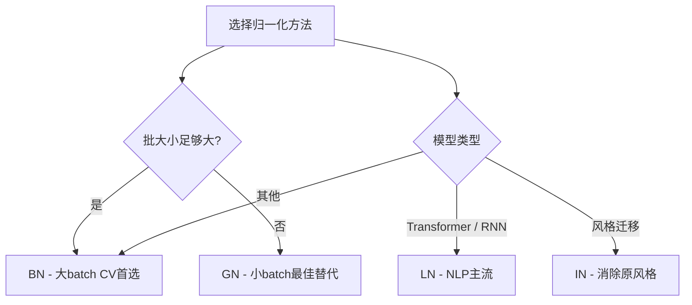
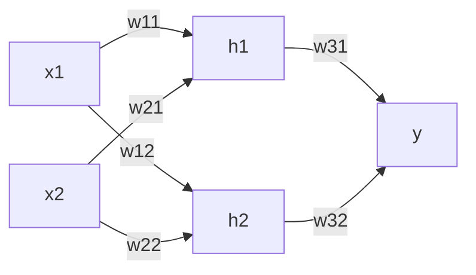
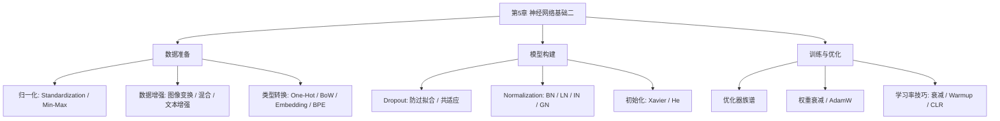

# 第五章 神经网络基础（二）

> 数据准备 → 模型构建 → 训练优化 → 模型评估——深度神经网络训练的完整四阶段

---

## 一、训练流程总览

深度神经网络模型的训练通常包含以下四个阶段，形成闭环：


| 阶段 | 核心任务 |
|------|----------|
| 数据准备 | 归一化、数据增强、类型转换 |
| 模型构建 | 选择网络结构、添加正则化层（Dropout/BN等）、参数初始化 |
| 训练与优化 | 定义损失函数、选择优化器、权重衰减、学习率调度 |
| 模型评估 | 在测试集上评估性能，根据结果调优超参数 |

### Keras MNIST 完整示例

```python
# 1. 数据准备
num_classes = 10
input_shape = (28, 28, 1)
(x_train, y_train), (x_test, y_test) = keras.datasets.mnist.load_data()
x_train = x_train.astype("float32") / 255   # 归一化到 [0,1]
x_test  = x_test.astype("float32") / 255
x_train = np.expand_dims(x_train, -1)       # 增加通道维度
x_test  = np.expand_dims(x_test, -1)
y_train = keras.utils.to_categorical(y_train, num_classes)  # One-Hot
y_test  = keras.utils.to_categorical(y_test, num_classes)

# 2. 模型构建
model = keras.Sequential([
    keras.Input(shape=input_shape),
    layers.Conv2D(32, kernel_size=(3, 3), activation="relu"),
    layers.MaxPooling2D(pool_size=(2, 2)),
    layers.Conv2D(64, kernel_size=(3, 3), activation="relu"),
    layers.MaxPooling2D(pool_size=(2, 2)),
    layers.Flatten(),
    layers.Dropout(0.5),                     # 正则化
    layers.Dense(num_classes, activation="softmax"),
])

# 3. 训练与优化
model.compile(loss="categorical_crossentropy",
              optimizer="adam",
              metrics=["accuracy"])
model.fit(x_train, y_train,
          batch_size=128, epochs=15, validation_split=0.1)

# 4. 模型评估
score = model.evaluate(x_test, y_test, verbose=0)
print("Test loss:", score[0])
print("Test accuracy:", score[1])
```

---

## 二、数据准备

## 2.1 归一化（Normalization）

> [!question] 为什么需要归一化？
> 不同量纲或不同取值范围的特征在梯度下降中会产生 **Zigzag 效应**，导致收敛缓慢。

 直观理解：捐款预测实例

| Name | Age | Salary | Donor? |
|------|-----|--------|--------|
| Nancy | 21 | 37,000 | N |
| Jim | 27 | 41,000 | N |
| Allen | 43 | 61,000 | Y |
| Jane | 38 | 55,000 | N |
| Steve | 44 | 30,000 | N |
| Peter | 51 | 56,000 | Y |
| Sayani | 53 | 70,000 | Y |
| Lata | 56 | 74,000 | Y |
| Mary | 59 | 25,000 | N |
| Victor | 61 | 68,000 | Y |
| Dale | 63 | 51,000 | Y |

- **Age** 范围 21-63（小量纲）
- **Salary** 范围 25,000-74,000（大量纲）
- 未归一化时，Salary 在梯度中占主导 → 等高线呈**椭圆状**，梯度方向 zigzag
- 归一化后 → **圆形**等高线，梯度直指最优解

 逻辑回归梯度公式

$$
\min_{w,b} \sum_{i=1}^{m} \log\left(1 + \exp\left(-y_i(w^\top x_i + b)\right)\right)
$$

对于单个数据 (x, y) 的梯度：

$$
\nabla_w = \frac{-1}{1 + \exp(y(w^\top x + b))} y x
$$

==量纲差异直接影响梯度方向，导致优化路径弯曲==

 常用归一化方法

| 方法          | 公式                                                             | 说明           | 特点         |
| ----------- | -------------------------------------------------------------- | ------------ | ---------- |
| ==标准化==     | $\displaystyle z_i^j = \frac{x_i^j - \mu_j}{\sigma_j}$         | 使特征服从 N(0,1) | 对异常值不敏感    |
| ==Min-Max== | $\displaystyle z_i^j = \frac{x_i^j - \min_j}{\max_j - \min_j}$ | 映射到 [0,1]    | ==对异常值敏感== |

> [!tip] 选择指南
> - 数据近似正态分布或存在异常值 → **标准化**
> - 数据有明确上下界且无异常值 → **Min-Max**
> - 图像像素 [0,255] → **Min-Max 到 [0,1]**（最常用）

---

### 2.2 数据增强（Data Augmentation）

> 通过对原始样本进行旋转、翻转、裁剪、加噪声等变换，构造更多训练样本，扩大数据分布，提升模型泛化能力

#### 图像变换方法

| 方法 | 描述 |
|------|------|
| **翻转** | 水平翻转、垂直翻转或同时翻转 |
| **旋转** | 以某一角度旋转图像 |
| **缩放** | 增大或减小图像尺寸 |
| **噪声注入** | 在图像中加入随机噪声 |
| **颜色空间** | 改变图像颜色通道 |
| **对比度** | 改变图像对比度 |
| **锐化** | 修改图像清晰度 |
| **平移** | 水平移动、垂直移动或同时移动 |
| **裁剪** | 裁剪图像的一个子区域 |

#### 图像擦除（Random Erasing）

> 从训练图像中抹去一部分信息，迫使模型关注其他相关部分，而不仅仅是最具判别力的部分

#### 图像混合方法

| 方法 | 核心思想 | 特点 |
|------|----------|------|
| ==Mixup== | 两张图按比例像素融合，标签也按比例混合 | 简单有效，线性插值 |
| ==CutMix== | 将一张图的一部分贴到另一张图上 | 保留局部信息，矩形区域 |
| ==FMix== | 通过频率空间操作生成形状光滑自然的掩码 | 掩码更自然，非矩形 |
| ==AugMix== | 多种增强操作的加权组合 | 多样性更强 |

#### 文本增强

| 方法 | 描述 | 示例 |
|------|------|------|
| ==回译法== | 语言 A → 语言 B → 语言 A，生成新表达 | "To be or not to be" → "生存还是毁灭" → "Survival or destruction" |
| 随机词替换 | 同义词替换、随机插入、随机交换、随机删除 | "今天天气很好" → "今天天气不错"（同义词替换） |

---

## 2.3 类型转换

> [!important] 神经网络要求输入为 **连续数值型**

 类别型数据

| 类型      | 编码方式                       | 示例                    |
| ------- | -------------------------- | --------------------- |
| 二分类     | \{0,1\} 或 \{-1,+1\}        | M→0, F→1              |
| ==多分类== | ==One-Hot编码==：k 维向量中对应位置为1 | 第2类→$[0,1,0,\dots,0]$ |

$$
\begin{bmatrix}
1 & 0 & 0 \\
0 & 1 & 0 \\
0 & 0 & 1
\end{bmatrix} \xrightarrow{} \begin{array}{ll}
1^{st}  Category \\
2^{nd}  Category \\
3^{rd}  Category
\end{array}
$$

### 2.4 文本数据：NLP 完整流程


| 步骤 | 说明 | 示例 |
|------|------|------|
| ==分词== | 切分成最小语义单位，确定模型处理的最小信息单元 | "John likes to watch movies." → `["John", "likes", "to", "watch", "movies", "."]` |
| 移除停止词 | 删除频率极高但携带语义信息极少的词 | 英文："the", "a", "is", "at"；中文："的", "了", "在" |
| 提取词干 | 归并单词变体 | running/runs/ran → run |
| ==词袋模型== | 统计词频得到向量表示 | "John likes to watch movies." → `[1,1,1,1,1,0,0]`（词典：`{John, likes, to, watch, movies, Mary, too}`） |
| ==Embedding== | 将每个词映射为稠密向量，整合为矩阵 | One-Hot → 可学习嵌入矩阵 |

> [!warning] 词袋模型的重大局限
> **丢失语序信息！**
> - "I love you" 的 BoW 向量与 "You love me" 完全一样 → 语义天差地别

**变长文本的四种处理方式**：

| 方法 | 描述 |
|------|------|
| 填充（Padding） | 设定最大长度，短句后面补 0 或 `[PAD]` |
| 截断（Truncation） | 过长的句子直接裁剪尾部 |
| 池化（Pooling） | 对 Embedding 矩阵做平均/最大池化，压缩为固定长度向量 |
| RNN / Transformer | ==原生支持变长序列==（通过 Masking 技术忽略填充位） |

---

### 2.4 BPE（Byte Pair Encoding）——当前最主流的分词方法

> [!quote] BPE 的核心定位
> **子词（Subword）分词法**，介于 **Word-level** 和 **Character-level** 之间，取两者之长

#### 三种分词粒度对比

| 粒度 | 优点 | 缺点 |
|------|------|------|
| Word-level | 语义完整 | 词表巨大（几十万词）、遇到未登录词（OOV）报 `[UNK]` |
| Character-level | 无 OOV，词表小 | 序列过长、单个字母缺乏语义 |
| ==BPE (Subword)== | ==解决 OOV、词表可控、高效语义压缩== | 实现略复杂 |

#### BPE 核心逻辑

> ==不断合并出现频率最高的相邻字符对==

**举例**：语料库 "hug" 10次, "pug" 5次, "pun" 12次, "bun" 4次

| 步骤 | 操作 | 词表 |
|------|------|------|
| 1 | 拆分为基础字符 | h, u, g, p, n, b |
| 2 | 统计相邻对频率：u+n 出现 12+4=16 次（最高） | h, u, g, p, n, b |
| 3 | **合并** u+n → **un** | h, u, g, p, n, b, **un** |
| 4 | 统计相邻对：u+g 出现 10+5=15 次 | h, u, g, p, n, b, un |
| 5 | 合并 u+g → **ug** | h, u, g, p, n, b, un, **ug** |
| 6 | 继续迭代直到词表大小满足要求 | ... |

==BPE 的核心优势：即使遇到未见过的词（如 "hugish"），也能分解为已知子词 "hug" + "ish"，彻底解决 OOV 问题==

---

## 三、模型构建：正则化与归一化层

## 3.1 Dropout（丢弃层）

> Dropout 是一种缓解神经网络模型**过拟合**的关键技术，其核心思想是在训练过程中随机丢弃神经元及其连接，防止神经元之间产生**过强的共适应**。

 共适应（Co-adaptation）

在深度神经网络中，如果某些神经元总是协同工作，它们可能会产生一种依赖性——一个神经元的权重是为了弥补另一个神经元的错误而存在。这种现象称为 ==共适应==，会导致模型过于依赖训练数据的特定组合，产生严重的过拟合。

 公式推导

**常规隐藏层**（第 $\ell+1$ 层）：

$$
z^{(\ell+1)} = W^{(\ell+1)} x^{(\ell)} + b^{(\ell+1)}, \quad x^{(\ell+1)} = \sigma^{(\ell+1)}(z^{(\ell+1)})
$$

**加入 Dropout 后**（第 $\ell$ 层）：

==训练时==：

$$
\tilde{x}^{(\ell)} = r^{(\ell)} \odot x^{(\ell)}, \quad r_j^{(\ell)} \sim Bernoulli(p)

z^{(\ell+1)} = W^{(\ell+1)} \tilde{x}^{(\ell)} + b^{(\ell+1)}, \quad x^{(\ell+1)} = \sigma^{(\ell+1)}(z^{(\ell+1)})
$$

==测试时==（缩放对齐）：

$$
\tilde{x}^{(\ell)} = p \cdot x^{(\ell)}
$$

> [!tip] 为什么测试时要缩放？
> 训练时只有 p 比例的神经元活跃，期望输出为 $p \cdot x$；测试时**所有神经元都活跃**，输出为 x。
> 乘以 p 使测试时的输出范围与训练时对齐，保证训练和测试的一致性。

 算例说明（p=0.5）

假设隐藏层后接 Dropout 层，保留概率 p=0.5：
- **训练时**：随机丢弃一半神经元，如某神经元输出 14，但以 0.5 概率保留 → 期望输出 7
- **测试时**：所有神经元输出 x，统一乘以 p=0.5 → 输出 0.5x，与训练时期望对齐

 Dropout 的三大作用

1. **降低拟合训练集的模型容量** → 减少过拟合
2. **破坏神经元间的关联性** → 防止共适应
3. **近似于训练大量不同的"子网络"** → 模型集成（Ensemble）效果

 保留概率 p 对 Test Error 的影响

| p | Test Error | Training Error |
|-----|-----------|---------------|
| 0.0 | 3.2 | 2.7 |
| 0.2 | 1.8 | 0.6 |
| 0.3 | 1.2 | 0.0 |
| 0.4 | 1.1 | 0.0 |
| ==0.5== | ==1.1== | ==0.0== |
| 0.6 | 1.1 | 0.0 |
| 0.7 | 1.1 | 0.0 |
| 0.8 | 1.1 | 0.0 |
| 0.9 | 1.3 | 0.0 |
| 1.0 | 1.7 | 0.0 |

> [!note] 观察结论
> - p 过小（丢弃太多）→ 欠拟合，训练误差大
> - p 过大（接近 1.0）→ 接近无 Dropout，过拟合
> - ==p=0.5 附近通常取得最佳泛化效果==

---

### 3.2 批归一化（Batch Normalization, BN）

> 对每层的激活值进行归一化，减小不同维度或不同样本之间的分布差异，稳定训练、加速收敛。

#### 内部协变量偏移（Internal Covariate Shift, ICS）

多层感知机第 $\ell$ 层梯度：

$$
\frac{\partial \ell(\theta, x, y)}{\partial \theta^{(\ell)}} = \frac{\partial \ell(\theta, x, y)}{\partial z^{(\ell)}} \cdot \frac{\partial z^{(\ell)}}{\partial \theta^{(\ell)}}, \qquad z^{(\ell)} = W^{(\ell)} x^{(\ell-1)} + b^{(\ell)}, \quad \theta^{(\ell)} = (W^{(\ell)}, b^{(\ell)})
$$

仅考虑关于 $W^{(\ell)}$ 的部分：

$$
\frac{\partial \ell(\theta, x, y)}{\partial W^{(\ell)}} = \frac{\partial \ell(\theta, x, y)}{\partial z^{(\ell)}} \cdot x^{(\ell-1)}
$$

> [!danger] ICS 的问题
> - **前层参数改变** → 后层神经元输入分布发生变化
> - 后层需不断适应新的输入分布 → 训练速度变慢
> - 网络层数增加会**加剧**这种影响 → 梯度爆炸/消失 → 训练不稳定

#### BN 训练公式

考虑小批量 $\{x_1, \ldots, x_m\}$：

**Step 1**：计算小批量均值和方差

$$
\mu_m = \frac{1}{m} \sum_{i=1}^m x_i, \quad \sigma_m^2 = \frac{1}{m} \sum_{i=1}^m (x_i - \mu_m)^2
$$

**Step 2**：归一化（含 $\epsilon$ 防止除零）

$$
\hat{x}_i = \frac{x_i - \mu_m}{\sqrt{\sigma_m^2 + \epsilon}}
$$

**Step 3**：可学习的线性变换（==恢复表达能力==）

$$
y_i = \gamma \hat{x}_i + \beta \equiv BN_{\gamma,\beta}(x_i)
$$

> [!info]
> - $\gamma, \beta$ 是**可学习参数**
> - 归一化削弱了非线性激活函数的表达能力 → $\gamma, \beta$ 可学习到最佳缩放和偏移

#### BN 反向传播推导

需计算 $\partial \ell / \partial x_i, \partial \ell / \partial \gamma, \partial \ell / \partial \beta$。

链式法则：三条路径影响 $x_i$

1. $x_i \to \hat{x}_i \to \ell(\cdot)$
2. $x_i \to \mu_m \to \ell(\cdot)$
3. $x_i \to \sigma_m^2 \to \ell(\cdot)$

**中间变量梯度**：

$$
\frac{\partial \ell}{\partial \hat{x}_i} = \frac{\partial \ell}{\partial y_i} \cdot \gamma
$$

$$
\frac{\partial \ell}{\partial \sigma_m^2} = \sum_{i=1}^m \frac{\partial \ell}{\partial \hat{x}_i} (x_i - \mu_m) \cdot \frac{-1}{2} (\sigma_m^2 + \epsilon)^{-3/2}
$$

$$
\frac{\partial \ell}{\partial \mu_m} = \sum_{i=1}^m \frac{\partial \ell}{\partial \hat{x}_i} \cdot \frac{-1}{\sqrt{\sigma_m^2 + \epsilon}} + \frac{\partial \ell}{\partial \sigma_m^2} \cdot \frac{\sum_{i=1}^m -2 (x_i - \mu_m)}{m}
$$

**最终梯度**（三条路径求和）：

$$
\frac{\partial \ell}{\partial x_i} = \frac{\partial \ell}{\partial \hat{x}_i} \cdot \frac{1}{\sqrt{\sigma_m^2 + \epsilon}} + \frac{\partial \ell}{\partial \sigma_m^2} \cdot \frac{2(x_i - \mu_m)}{m} + \frac{\partial \ell}{\partial \mu_m} \cdot \frac{1}{m}
$$

**对 $\gamma, \beta$ 的梯度**：

$$
\frac{\partial \ell}{\partial \gamma} = \sum_{i=1}^m \frac{\partial \ell}{\partial y_i} \cdot \hat{x}_i, \qquad \frac{\partial \ell}{\partial \beta} = \sum_{i=1}^m \frac{\partial \ell}{\partial y_i}
$$

#### BN 测试阶段

训练时累积的全局统计量（滑动平均）：

- 均值：$E[x] = \mathbb{E}_m[\mu_m]$
- 方差：$\text{Var}[x] = \frac{m}{m-1} \mathbb{E}_m[\sigma_m^2]$（无偏估计）

**测试时 BN 层输出**（线性变换形式）：

$$
y = \frac{\gamma}{\sqrt{Var[x] + \epsilon}} \cdot x + \left(\beta - \frac{\gamma E[x]}{\sqrt{Var[x] + \epsilon}}\right)
$$

> [!warning] 小批量问题
> 批大小 m 太小时，$\mu_m, \sigma_m^2$ 估计不准确 → BN 效果变差 → 此时应考虑 Group Norm

#### BN 到底在做什么？

> [!question] BN 缓解了 ICS 吗？
> 实验表明：向已使用 BN 的网络**加入随机噪声**（使 ICS 更严重），其性能**依然优于**未使用 BN 的网络。
> → ==BN 和 ICS 的关系并不大==

**更可能的解释——损失面平滑化**：

BN 使损失函数满足 **Lipschitz 平滑**——即函数值和梯度的变化均有上界：

函数 Lipschitz 连续：

$$
\|f(x_1) - f(x_2)\| \leq L \|x_1 - x_2\|
$$

梯度 Lipschitz 连续（$\beta-$平滑）：

$$
\|\nabla f(x_1) - \nabla f(x_2)\| \leq \beta \|x_1 - x_2\|
$$

> [!success] 平滑的意义
> - **平滑的损失面** → 可以使用**更大的学习率**
> - 更大学习率 → **更快收敛**
> - 对比 ResNet：有 Skip Connection 的损失面明显比无 Skip Connection 的平坦

---

## 3.3 层归一化（Layer Normalization, LN）

> 对某层**所有神经元**的输入进行归一化（跨特征维度）

令 $x = (x_1, x_2, \ldots, x_d) \in$ $\mathbb{R}$^d 表示某层加权求和输入：

$$
\mu = \frac{1}{d} \sum_{i=1}^d x_i, \quad \sigma^2 = \frac{1}{d} \sum_{i=1}^d (x_i - \mu)^2

\hat{x}_i = \frac{x_i - \mu}{\sqrt{\sigma^2 + \epsilon}}, \quad y_i = \gamma \hat{x}_i + \beta \equiv LN_{\gamma,\beta}(x_i)
$$

> [!check] LN 的核心优势
> ==适用于任意批大小！==
> - 不依赖 batch 维度，每个样本独立计算均值和方差
> - **Transformer 首选归一化方法**

---

### 3.4 实例归一化（Instance Normalization, IN）

考虑输入 $x \in \mathbb{R}^{N \times C \times H \times W}$（N个图片，C个通道，H×W大小）：

**对每个样本 n、每个通道 c**，在 $H×W$ 上归一化：

$$
\mu_{nc} = \frac{1}{HW} \sum_{w=1}^W \sum_{h=1}^H x_{nchw}
$$

$$
\sigma_{nc}^2 = \frac{1}{HW} \sum_{w=1}^W \sum_{h=1}^H (x_{nchw} - \mu_{nc})^2
$$

$$
\hat{x}_{nchw} = \frac{x_{nchw} - \mu_{nc}}{\sqrt{\sigma_{nc}^2 + \epsilon}}, \quad y_{nchw} = \gamma \hat{x}_{nchw} + \beta \equiv IN_{\gamma,\beta}(x_{nchw})
$$

> [!tip] IN 的典型应用
> ==多用于图像风格迁移==
> - IN 有助于**消除内容图的原风格**，保留语义内容
> - BN 会进一步**混淆不同样本**（跨样本归一化）
> - LN 会进一步**混淆不同通道**（跨通道归一化）

---

## 3.5 组归一化（Group Normalization, GN）

> 介于 LN 和 IN 之间：将特征通道等分为 G 组，对每组通道的 H×W 区域归一化

- 输入 $x \in$ $\mathbb{R} ^{N \times C \times H \times W}$
- 将 C 个通道分为 G 组，每组 $\frac{C}{G}$ 个通道
- 对每个样本 n、每组 g，在 $\frac{C}{G} \times H \times W$ 上归一化

---

### 3.6 四种归一化方法对比

#### 归一化维度对比图

| 方法                | 归一化维度                                | 缩写  |
| ----------------- | ------------------------------------ | --- |
| **Batch Norm**    | 跨 $N \times H \times W$，每个通道独立       | BN  |
| **Layer Norm**    | 跨 $C \times H \times W$，每个样本独立       | LN  |
| **Instance Norm** | 跨 $H \times W$，每个样本每个通道独立            | IN  |
| **Group Norm**    | 跨每组 $C/G \times H \times W$，每个样本每组独立 | GN  |

#### 核心特点对比

| 方法                | 归一化范围                   | 适用场景                     | 对批大小敏感？ |
| ----------------- | ----------------------- | ------------------------ | :-----: |
| ==Batch Norm==    | 每个通道，跨样本N和空间$H\times W$ | 大 batch 训练（CV 主流）        |  ==是==  |
| ==Layer Norm==    | 每个样本，跨通道C和空间$H\times W$ | Transformer, RNN（NLP 主流） |  **否**  |
| ==Instance Norm== | 每个样本每个通道，跨空间$H\times W$ | 图像风格迁移                   |    否    |
| ==Group Norm==    | 每组通道，跨空间 $H \times W$   | 小 batch 替代 BN            |    否    |

#### ImageNet 验证集误差对比（批大小 32）

| Epoch | BN | LN | IN | GN |
|:-----:|:--:|:--:|:--:|:--:|
| 0 | 60.0 | 60.0 | 60.0 | 60.0 |
| 20 | 52.0 | 53.0 | 54.0 | 51.0 |
| 40 | 34.0 | 35.0 | 36.0 | 33.0 |
| 60 | 28.0 | 29.0 | 30.0 | 27.0 |
| 80 | 24.0 | 25.0 | 26.0 | 23.0 |
| 100 | 22.0 | 23.0 | 24.0 | **21.0** |

==批大小 32 时，GN 表现最优！==

#### 不同批大小下 BN vs GN 对比

| Batch Size | BN (Error %) | GN (Error %) |
|:----------:|:-----------:|:-----------:|
| 32 | 23.5 | **24.0** |
| 16 | 23.5 | **24.0** |
| 8 | 25.0 | **24.0** |
| 4 | 27.0 | **24.0** |
| 2 | 35.0 | **24.0** |

> [!success] 关键结论
> - **大 batch** (32) → BN 和 GN 不相上下
> - ==**小 batch** (≤8) → GN 显著优于 BN！==
> - GN 在批大小变化时**性能稳定**，BN 随批大小减小急剧恶化

#### 选择指南



> [!tip] 快捷记忆
> - 大 batch → **B**N
> - Transformer → **L**N
> - 风格迁移 → **I**N
> - 小 batch → **G**N

---

## 3.7 参数初始化

> 一个好的模型参数初始化对于大多数优化算法的收敛起到关键作用，尤其是神经网络模型所面临的**非凸目标函数**。

 为什么不能全 0 初始化？

若初始化 $w_{11}=w_{12}=w_{21}=w_{22}=w_{31}=w_{32}=0$：



> 回传梯度相等：$W_{11}=W_{21}, W_{12}=W_{22}, W_{31}=W_{32}$
> → ==对称权重问题==：同一层神经元参数完全相同，等价于该层只有一个神经元！

 小随机数初始化的方差传播

对于线性层 $z^{(\ell)} = W^{(\ell)} x^{(\ell-1)}$：

假设 $x_j^{(\ell-1)}$ 和 $W_{ij}^{(\ell)}$ 均独立同分布，均值为 0，方差分别为 $\sigma_x^{(\ell-1)2}, \sigma_W^{(\ell)2}$：

$$
Var[z_i^{(\ell)}] = n_{\ell-1} \sigma_W^{(\ell)2} \sigma_x^{(\ell-1)2}
$$

**tanh 激活函数**（近似线性：$\tanh(z) \approx z$）：

$$
\sigma_x^{(\ell)2} \approx n_{\ell-1} \sigma_W^{(\ell)2} \sigma_x^{(\ell-1)2}
$$

**ReLU 激活函数**（$\text{ReLU}(z)=\max(0,z)$，一半梯度被置零）：

$$
\sigma_x^{(\ell)2} \approx \frac{1}{2} n_{\ell-1} \sigma_W^{(\ell)2} \sigma_x^{(\ell-1)2}
$$

> [!warning] 方差失稳
> - 初始化**过大** → 激活值逐层爆炸 → **梯度爆炸**
> - 初始化**过小** → 激活值逐层衰减到 0 → **梯度消失**
> - 50 层网络，$\sigma=0.01$ 高斯初始化 → 层层激活值逐渐趋向 0

 Xavier 初始化（针对 tanh / 对称激活函数）

同时控制前向和反向传播的方差：

$$
\sigma_W^{(\ell)2} = \frac{2}{n_\ell + n_{\ell-1}}
$$

| 分布 | 参数 |
|------|------|
| 均匀分布 $U[-r, r]$ | $\displaystyle r = \sqrt{\frac{6}{n_\ell + n_{\ell-1}}}$ |
| 高斯分布 $\mathcal{N}(0, \sigma^2)$ | $\displaystyle \sigma^2 = \frac{2}{n_\ell + n_{\ell-1}}$ |

考虑 ReLU 使方差减半的特性：

$$
\sigma_W^{(\ell)2} = \frac{2}{n_{\ell-1}}
$$

| 分布 | 参数 |
|------|------|
| 均匀分布 $U[-r, r]$ | $\displaystyle r = \sqrt{\frac{6}{n_{\ell-1}}}$ |
| 高斯分布 $\mathcal{N}(0, \sigma^2)$ | $\displaystyle \sigma^2 = \frac{2}{n_{\ell-1}}$ |

> [!success] He 初始化后的效果
> 合理控制方差后，即使 50 层网络，各层激活值**仍远大于 0**，梯度可正常传播

#### 初始化方法总结

| 方法         | 适用激活函数             | 核心思想                              |
| ---------- | ------------------ | --------------------------------- |
| 小随机数       | 通用                 | 从 $\mathcal{N}(0,0.01)$ 采样，但层深时失效 |
| ==Xavier== | ==tanh / sigmoid== | 保持前向和反向方差一致                       |
| ==He==     | ==ReLU==           | 考虑 ReLU 半波整流特性                    |

---

## 四、训练与优化

### 4.1 优化器族谱

```
SGD → Momentum → AdaGrad → RMSProp → Adam → AdamW
                                    ↓
                                 AMSGrad
```

### 4.2 各优化器详解

#### （1）SGD（随机梯度下降）

$$
g_t = \frac{1}{m} \sum_{(x_i, y_i) \in \mathcal{D}_m} \nabla \ell(\theta, x_i, y_i), \quad \theta_{t+1} = \theta_t - \eta_t g_t
$$

**SGD 的两大问题**：

> [!bug] 问题 1 —— 所有参数共享同一学习率
> - 不同层梯度量级可能差几个数量级 → 统一学习率难以适配
> - 稀疏特征更新次数少 → 学习率太小更新慢，太大易过调

> [!bug] 问题 2 —— 随机梯度方差大
> - mini-batch 梯度是真实梯度的**有噪声估计**
> - 噪声大 → 更新方向不稳定 → 损失曲线震荡严重
> - 往往需用小学习率 → 又减慢收敛

**学习率选择**：
- **非平滑函数**：$\eta_t = O(1/\sqrt{t})$，梯度剧变需衰减以避免震荡
- **平滑函数**：$\eta_t = a$ 常数即可，梯度变化有界

#### （2）Momentum（动量法）

> 保留部分之前的更新方向，平滑梯度，加速收敛

$$
m_t = \beta m_{t-1} + (1-\beta) g_t, \quad \theta_{t+1} = \theta_t - \eta_t m_t
$$

- $\beta > 0$：动量衰减系数
- $m_t \approx \mathbb{E}_t[g_t]$：对历史梯度加权平均，**相对更稳定**
- **仍面临 SGD 的学习率问题**

#### （3）AdaGrad（自适应梯度）

> 针对**不同参数**分配**自适应学习率**

$$
g_t = \frac{1}{m} \sum \nabla \ell(\theta, x_i, y_i)
$$

$$
v_t = v_{t-1} + g_t \odot g_t \quad (累计梯度平方)
$$

$$
\theta_{t+1} = \theta_t - \frac{\eta}{\sqrt{v_t} + \delta} g_t
$$

**核心思想**：

| 参数                    | 历史梯度大（频繁更新） | 历史梯度小（稀疏更新） |
| --------------------- | :---------: | :---------: |
| $v_t$                 |      大      |      小      |
| 学习率 $\eta/\sqrt{v_t}$ | **小**（自动降低） | **大**（快速调整） |

> [!success] AdaGrad 优势
> 无需手动调整每个参数的学习率，对**稀疏数据**（NLP、推荐系统）表现优异

> [!failure] AdaGrad 局限
> ==v_t 单调递增 → 学习率持续单调下降 → 可能过早变为 0，模型停止学习==

#### （4）RMSProp（均方根传递）

> 用**指数移动平均**替代 AdaGrad 的累加，解决学习率单调递减问题

$$
v_t = \beta v_{t-1} + (1-\beta) g_t \odot g_t, \quad \theta_{t+1} = \theta_t - \frac{\eta}{\sqrt{v_t} + \delta} g_t
$$

- $\beta$：衰减系数（通常 0.9）
- 近期梯度影响更大，历史梯度逐渐被遗忘
- ==学习率不再单调递减！==

#### （5）Adam（Adaptive Moment Estimation）—— 最常用优化器

> ==结合 Momentum（一阶动量） + RMSProp（二阶动量） + 去偏修正==

$$
m_t = \beta_{1,t} m_{t-1} + (1-\beta_{1,t}) g_t, \quad \hat{m}_t = m_t / (1-\beta_1^t)
$$

$$
v_t = \beta_2 v_{t-1} + (1-\beta_2) g_t \odot g_t, \quad \hat{v}_t = v_t / (1-\beta_2^t)
$$

$$
\theta_{t+1} = \theta_t - \frac{\eta_t}{\sqrt{\hat{v}_t} + \delta} \hat{m}_t
$$

> [!info] Adam 推荐参数
> - $\beta_1$ = 0.9（一阶动量衰减）
> - $\beta_2$ = 0.999（二阶动量衰减）
> - $\delta$ = 10^{-8}（防除零）

**去偏修正**原因：$m_0=0, v_0=0$ 导致 $m_t, v_t$ 在初始时刻偏向 $0 →$ 除以 $(1-\beta^t)v$修正

#### （6）AMSGrad

> Adam 的改进——解决 \hat{v}_t 不一定单调递增的问题

$$
v_t = \beta_2 v_{t-1} + (1-\beta_2) g_t \odot g_t
$$

$$
\hat{v}_t = \max(\hat{v}_{t-1}, v_t) \quad (历史最大二阶矩)
$$

$$
\theta_{t+1} = \theta_t - \frac{\eta_t}{\sqrt{\hat{v}_t} + \delta} m_t
$$

- 有效学习率 $\eta_t / \sqrt{\hat{v}_t}$ **严格单调递减** → 收敛理论正确
- Kingma & Ba 的 Adam 原文理论分析存在错误（$\hat{v}_t$ 不保证单调）

#### （7）AdamW（Adam + 权重衰减）

**权重衰减（Weight Decay）**：除执行优化器更新外，以 (1-\lambda) 比例调低权重：

$$
\theta_{t+1} = (1-\lambda) \theta_t + \Delta_t
$$

- 与 SGD 结合（$\Delta_t = -\eta_t g_t$）：$\theta_{t+1} = (1-\lambda)\theta_t - \eta_t g_t$
- 当 $\eta_t = \eta$ 常数时，等价于 L2 正则化

**AdamW**：

$$
\theta_{t+1} = (1-\lambda) \theta_t - \frac{\eta_t}{\sqrt{\hat{v}_t} + \delta} \hat{m}_t
$$

> [!check] AdamW vs Adam + L2 正则
> - Adam + L2 正则：权重衰减融入到梯度中，与自适应学习率耦合
> - **AdamW**：==权重衰减与自适应学习率解耦==，实践中更优

#### 优化器总结

| 优化器 | 核心思想 | 去偏 | 适用场景 |
|--------|----------|:----:|----------|
| SGD | 朴素随机梯度下降 | - | 基础 |
| Momentum | 一阶动量（平滑梯度） | - | 加速 SGD |
| AdaGrad | 累计梯度平方 → 自适应 lr | - | 稀疏数据 |
| RMSProp | 指数移动平均梯度平方 | - | 非平稳目标 |
| ==Adam== | Momentum + RMSProp + 去偏 | 是 | **通用首选** |
| AMSGrad | Adam + 最大二阶矩 | 是 | 理论修正 |
| AdamW | Adam + 解耦权重衰减 | 是 | 预训练大模型 |

### 4.3 学习率调度技巧

#### 学习率衰减

| 方法       | 公式                                                                             | 特点          |
| -------- | ------------------------------------------------------------------------------ | ----------- |
| 分段衰减     | 每 N 步减半                                                                        | 简单直观        |
| 逆时衰减     | $\eta_t = \eta_0 / (1 + \beta t)$                                              | 平滑递减        |
| 指数衰减     | $\eta_t = \eta_0 \beta^t$                                                      | 快速下降        |
| 自然指数衰减   | $\eta_t = \eta_0 e^{-\beta t}$                                                 | 连续平滑        |
| ==余弦衰减== | $\displaystyle \eta_t = \frac{1}{2}\eta_0 \left(1 + \cos\frac{t\pi}{T}\right)$ | **大模型训练主流** |

#### 预热（Warmup）

> 训练初期使用逐渐增大的学习率，避免模型参数剧烈震荡

设定预热步数 T，前 $t \in [1, T]$ 步：

$$
\eta_t = \frac{t}{T} \eta_0
$$

预热结束后，再执行正常的学习率衰减策略。

#### 周期性学习率（Cyclical Learning Rate, CLR）

> 周期性地在 $[\eta_{\min}, \eta_{\max}]$ 之间变化，帮助逃离局部最优/鞍点

| 变体 | 描述 |
|------|------|
| Triangular | 线性增减，振幅不变 |
| Triangular2 | 线性增减，振幅逐周期减半 |
| Exp Range | 指数衰减的振幅 |

> [!success] CLR 的优势
> - 普通学习率容易陷入局部极值
> - CLR 通过周期性增大学习率，**有助于逃离局部极值**
> - 结合 Snapshot Ensemble：一个训练过程可得到多个模型

### 4.4 Keras 训练实战

```python
model.compile(
    loss="categorical_crossentropy",   # 损失函数（+正则化项）
    optimizer="adam",                   # 优化器
    metrics=["accuracy"]                # 评估指标
)

model.fit(
    x_train, y_train,
    batch_size=128,
    epochs=15,
    validation_split=0.1                # 验证集比例
)

score = model.evaluate(x_test, y_test, verbose=0)
print("Test loss:", score[0])
print("Test accuracy:", score[1])
```

---

## 五、关键公式速查

| 概念         | 公式                                                                                                                                                       |
| ---------- | -------------------------------------------------------------------------------------------------------------------------------------------------------- |
| 标准化        | $\displaystyle z = \frac{x - \mu}{\sigma}$                                                                                                               |
| Min-Max    | $\displaystyle z = \frac{x - \min}{\max - \min}$                                                                                                         |
| Dropout 训练 | $\tilde{x} = r \odot x,\; r_j \sim \text{Bernoulli}(p)$                                                                                                  |
| Dropout 测试 | $\tilde{x} = p \cdot x$                                                                                                                                  |
| BN 归一化     | $\displaystyle \hat{x} = \frac{x - \mu_m}{\sqrt{\sigma_m^2 + \epsilon}}$                                                                                 |
| BN 线性变换    | $y = \gamma \hat{x} + \beta$                                                                                                                             |
| BN 测试      | $\displaystyle y = \frac{\gamma}{\sqrt{\text{Var}[x]+\epsilon}} \cdot x + \left(\beta - \frac{\gamma E[x]}{\sqrt{\text{Var}[x]+\epsilon}}\right)$        |
| LN         | $\displaystyle \mu = \frac{1}{d}\sum x_i,\; \sigma^2 = \frac{1}{d}\sum (x_i-\mu)^2$                                                                      |
| IN         | $\displaystyle \mu_{nc} = \frac{1}{HW}\sum_h\sum_w x_{nchw}$                                                                                             |
| SGD        | $\theta_{t+1} = \theta_t - \eta_t g_t$                                                                                                                   |
| Momentum   | $m_t = \beta m_{t-1} + (1-\beta)g_t,\; \theta_{t+1} = \theta_t - \eta_t m_t$                                                                             |
| AdaGrad    | $v_t = v_{t-1} + g_t^2,\ ; \theta_{t+1} = \theta_t - \frac{\eta}{\sqrt{v_t}+\delta} g_t$                                                                 |
| RMSProp    | $v_t = \beta v_{t-1} + (1-\beta)g_t^2,\; \theta_{t+1} = \theta_t - \frac{\eta}{\sqrt{v_t}+\delta} g_t$                                                   |
| Adam       | $\hat{m}_t = \frac{m_t}{1-\beta_1^t},\; \hat{v}_t = \frac{v_t}{1-\beta_2^t},\; \theta_{t+1} = \theta_t - \frac{\eta}{\sqrt{\hat{v}_t}+\delta} \hat{m}_t$ |
| 权重衰减       | $\theta_{t+1} = (1-\lambda) \theta_t + \Delta_t$                                                                                                         |
| Warmup     | $\displaystyle \eta_t = \frac{t}{T} \eta_0$                                                                                                              |
| 余弦衰减       | $\displaystyle \eta_t = \frac{1}{2}\eta_0 \left(1 + \cos\frac{t\pi}{T}\right)$                                                                           |
| Xavier     | $\displaystyle \sigma_W^2 = \frac{2}{n_\ell + n_{\ell-1}}$                                                                                               |
| He         | $\displaystyle \sigma_W^2 = \frac{2}{n_{\ell-1}}$                                                                                                        |


---

## 六、总结

### 知识体系总览



### 核心要点

1. **数据准备**：归一化消除量纲差异，数据增强提升泛化，类型转换使数据符合 NN 要求
2. **Dropout**：通过随机丢弃神经元防止共适应，测试时缩放对齐
3. **归一化四剑客**：Batch Norm（大 batch）、Layer Norm（Transformer）、Instance Norm（风格迁移）、Group Norm（小 batch）
4. **BN 的真正作用**：不是缓解 ICS，而是使损失面 **Lipschitz 平滑**
5. **初始化**：Xavier（tanh）和 He（ReLU）通过方差控制保证梯度正常传播
6. **优化器**：从 SGD 到 Adam 的演进，核心在于解决学习率问题和梯度噪声问题
7. **AdamW**：权重衰减与自适应学习率解耦，大模型预训练标配
8. **学习率调度**：余弦衰减 + Warmup 为大模型训练主流方案

---

> 参考来源：深度学习课程第五章课件（王文冠主讲）、Keras MNIST 官方示例、Srivastava et al. Dropout (JMLR 2014)、Kingma & Ba Adam (ICLR 2015)、Wu & He Group Normalization (ECCV 2018)
