# 第九章 生成模型


> [!quote] 核心脉络
> VAE（奠定隐空间基础） → GAN（对抗博弈突破清晰度） → Diffusion（多步去噪成为主流） → Flow Matching（直线路径加速生成）
>
> 四代生成模型层层递进，每一代都在解决前一代的核心痛点。

---

## 目录

- [[第9章#零、背景：图像生成的本质\|零、背景：图像生成的本质]]
- [[第9章#一、变分自编码器 (VAE)\|一、变分自编码器 (VAE)]]
- [[第9章#二、生成对抗网络 (GAN)\|二、生成对抗网络 (GAN)]]
- [[第9章#三、扩散模型 (Diffusion Model)\|三、扩散模型 (Diffusion Model)]]
- [[第9章#四、流匹配模型 (Flow Matching)\|四、流匹配模型 (Flow Matching)]]
- [[第9章#五、总结与对比\|五、总结与对比]]

---

## 零、背景：图像生成的本质

## 0.1 无条件生成 vs 条件生成

图像生成模型分为两大类型：

| 类型 | 输入 | 输出 | 举例 |
|------|------|------|------|
| **无条件生成** (Unconditional) | 随机噪声 | 任意逼真图像 | 随机生成人脸、风景 |
| **条件生成** (Conditional) | 随机噪声 + 文字/标签等条件 | 按条件生成的特定内容图像 | "一只狗趴在草地上" → 狗的图片 |

> [!info] 示意图
> - 无条件生成：随机噪声 → 生成模型 → 清晰逼真图像
> - 条件生成：随机噪声 + "一只猫在雪中" → 生成模型 → 猫在雪中的图像

---

### 0.2 图像的矩阵表示

> [!warning] 计算机眼中的图像 ≠ 人眼中的图像
> 计算机看到的不是颜色和笔触的组合，而是由几十万甚至上百万个数字组成的**高维矩阵**（张量 Tensor）。

一张图像的表示方式：
$$
\text{Image} \in \mathbb{R}^{H \times W \times C}
$$

其中：
- $H$ = 高度 (Height)
- $W$ = 宽度 (Width)
- $C$ = 通道数 (Channel)，RGB图像为3通道

> [!example] 具体数字感受
> - 普通高清图像 $1024 \times 1024$ 分辨率，需要 AI 同时**精确预测超过三百万个像素点**的取值
> - 一张 $256 \times 256$ 的彩色图片，需要使用近 **20万维** 的向量空间表示
>
> 这意味着：图像生成不是像人类一样在画布上涂抹，而是在极高维度的数字空间中**精确捕捉极少量正确的像素组合**。

---

## 0.3 噪声 vs 结构化图像

| 类型 | 采样来源 | 生成结果 |
|------|---------|---------|
| **随机噪声** | $x \sim \mathcal{N}(0, I)$（标准高斯分布） | 无意义的噪声图像，像素间无结构关联 |
| **真实图像** | $x \sim p_{data}$（真实图像分布） | 有结构、有语义、有纹理的有意义图像 |

> [!tip] 关键结论
> 要生成有意义的图像，**必须学习图像中各像素间的复杂关系**。如果不能捕捉到像素的组合规律（例如完全从随机分布中取值），最终得到的图像只能是没有意义的噪声。

---

### 0.4 图像分布 $p_{data}$ 与模型分布 $p_\theta$

存在一个真实图像在高维空间中客观存在的**概率分布 p_{data}**，它刻画了哪些像素组合是"合理的、有结构的图像"。

> [!abstract] p_{data} 求解的三大难题
> 1. **形式未知** — 无法得知图像分布的具体数学公式
> 2. **维度较高** — 动辄上万甚至十万维
> 3. **结构复杂** — 生成的图像像素间高度相关
>
> $\Rightarrow$ 不可直接求解

**解决方案**：训练一个神经网络模型 $p_{\theta}$ 对其进行近似。模型根据大量真实图像优化参数 $\theta$，让模型分布 $p_{\theta}$ 逐步贴近真实的图像分布 $p_{data}$。

$$
p_{\theta}(x) \;\xrightarrow{\text{training}}\; p_{data}(x)
$$

随着训练进行，模型生成的图像也越来越类似于真实图像：

$$
\theta_0 \to \theta_1 \to \theta_2 \to \theta_3 \;\Rightarrow\; \text{noise} \to \cdots \to \text{realistic image}
$$

---

## 0.5 四种生成式模型总览

本次课程将介绍以下四种经典的生成式模型架构：

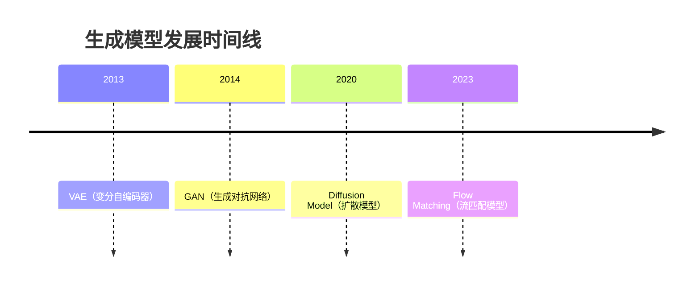

| 模型 | 年代 | 核心思想 | 代表应用 |
|------|------|---------|---------|
| **VAE** | 2013 | 编码到隐空间再重建 | 隐空间生成模型的基础组件 |
| **GAN** | 2014 | 生成器与判别器对抗博弈 | 超分辨率、风格迁移 |
| **Diffusion** | 2020 | 多步迭代去噪 | Stable Diffusion, Sora |
| **Flow Matching** | 2023 | 学习直线传输路径 | SD3, Flux.1, 具身智能 |

---

## 一、变分自编码器 (VAE)

> Variational Autoencoder — 奠定现代隐空间生成模型基础的里程碑

### 1.1 图像生成难点：维度灾难

> [!danger] 核心困境
> 图像生成的难点在于**"维度灾难"**：图像分布在超高维空间中极度稀疏，直接在像素空间采样如同"大海捞针"。

- **目标**：学习图像分布的概率密度函数 p(x)
- **痛点**：维度极高且形式复杂（例如一张 $256 \times 256$ 的彩色图片，需要使用近20万维的向量空间表示）
- **后果**：直接进行求解和随机采样如同大海捞针，大部分像素组合都无意义，且带来庞大计算量

> [!success] 破解之道：降维
> 将高维的像素空间映射到低维的**特征空间**（隐空间 Latent Space），不仅极大地简化了计算，更让模型能够捕捉到数据中最本质、最关键的结构信息。
>
> $$
> \underbrace{20\text{万维图像}}_{\text{Pixel Space}} \xrightarrow{\text{Dimension Reduction}} \underbrace{128\text{维特征}}_{\text{Latent Space}}
> $$

---

## 1.2 模型架构与训练流程

自编码器 (Autoencoder) 是基于降维的**无监督学习模型**，通过神经网络实现图像的压缩和重构。

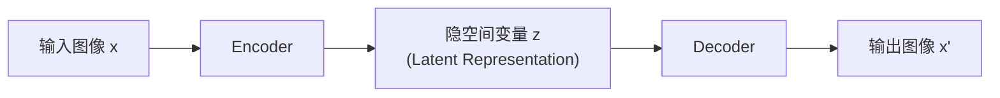

| 模块 | 作用 | 输入 | 输出 |
|------|------|------|------|
| **Encoder** (编码器) | 多层神经网络，将图像数据映射到低维隐空间 | 高维图像矩阵 | 低维特征向量 z |
| **Code layer** (编码层) | 图像编码成的特征，记录图像中的关键特征 | — | 低维特征向量 z |
| **Decoder** (解码器) | 通过上采样实现从隐空间低维特征重建图像数据 | 低维特征向量 z | 重建图像 x' |

**训练目标**：让 Decoder 重构出来的图像尽可能和原图相似

**训练方法**：通过降低生成图像与原图的差距（重建损失），强迫模型记住如何高效地打包和解包图像信息

$$
\mathcal{L}_{\text{recon}} = \|x - x'\|^2 \quad (\text{像素级 MSE 重建损失})
$$

**训练完成后**：仅使用 Decoder 进行图像生成。核心逻辑是 Decoder 在训练过程中已经掌握了从"低维特征"到"高维图像"的解码方式。

---

### 1.3 样本级对应 → 分布级对应

#### 核心缺陷：传统自编码器的"死记硬背"

传统自编码器将输入图像映射为隐空间中的**离散点**（固定向量），这导致了三个致命问题：

> [!bug] 传统自编码器的三大缺陷
>
> 1. **死记硬背**（缺乏泛化）
>    - 模型仅"记住"了特定隐向量与特定训练图像之间的一一对应关系
>    - 对于从未见过的输入，无法进行合理的推理解码
>
> 2. **隐空间断层**（缺乏连续性）
>    - 训练图像在隐空间中被映射为孤立、不连续的离散点
>    - 点与点之间缺乏过渡，存在大量未定义的"断层"（Undefined Gap）
>    - 随机采样到的隐变量大概率落入断层区域 → 生成噪声
>
> 3. **无法创新**（缺乏生成能力）
>    - 只能重建训练集中出现过的图像
>    - 不能生成从未见过的新图像
>    - 不具备真正的"创造力"

#### 破局方法：分布级对应

> [!idea] 核心创新
> **不让 Encoder 输出一个固定向量，而是输出一个概率分布的参数（均值 $\mu$ + 方差 $\sigma^2$）**

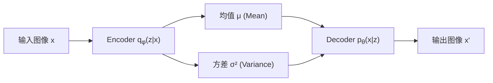

| 映射方式 | 含义 | 隐空间特点 | 泛化能力 |
|----------|------|------------|---------|
| **样本级对应** | 一个点对应一张图像 | 离散、孤立、有断层 | 无泛化能力 |
| **分布级对应** | 一个分布对应一类相似的图像 | 连续、重叠、填满空间 | 可生成新样本 |

> [!info] 分布级对应的效果
> - 点的位置稍微偏移，样本级对应的图像会完全崩溃
> - 点的位置稍微偏移，分布级对应的图像只会发生合理的微小渐变（如背景颜色改变、毛发纹理调整等）
>
> **本质**：通过分布层级的映射，==整个隐空间被连续的概率分布填满，消除了未定义的"断层"==。

---

## 1.4 VAE 的数学原理

> [!abstract] 优化目标：最大似然估计
>
> - **已知**：一批观测数据 $x_1, x_2, \ldots, x_n$（真实图像）
> - **目标**：找到一组最优模型参数 $\theta$，使得观测数据在模型分布 $p_{\theta}$ 中出现的概率最大
>
> $$
> \underset{\theta}{\arg\max} \sum_{i=1}^{n} \log p_{\theta}(x_i)
> $$

$p_{\theta}(x)$ 是一个复杂未知的分布，实际操作中使用**高斯混合模型**进行拟合：

$$
p_{\theta}(x) = \int p(z) \cdot p_{\theta}(x|z) \, dz
$$

其中：
- p(z) — 先验分布 (Prior)，一般取标准正态分布 $\mathcal{N}$(0, I)
$- p_{\theta}(x|z)$ — 待学的 Decoder，根据潜变量 z 生成图像

> [!warning] 积分不可计算
> 积分 $\int p(z) \cdot p_{\theta}(x|z) dz$ 难以直接计算。为了逼近积分，需要从先验分布 p(z) 中大量采样潜向量 z，这在实践中不具备可行性。

 变分推断的引入

VAE 引入一个**编码器网络** $q_{\phi}(z|x)$ 来近似隐变量后验分布 $p_{\theta}(z|x)$，辅助生成器的学习：

- 用隐变量后验分布 $p_{\theta}(z|x)$ 替代先验分布 $p(z)$
- 但 $p_{\theta}(z|x) = \frac{p_{\theta}(x|z) \cdot p(z)}{p_{\theta}(x)}$ 中包含待求的图像分布 $p_{\theta}(x)$，仍无法直接计算
- **核心技巧**：引入 $q_{\phi}(z|x)$（一般取高斯分布）来近似替代隐变量后验分布 $p_{\theta}(z|x)$
  - 这就是 ==变分推断 (Variational Inference)==，也是"变分自编码器"中"变分"的由来

#### 训练目标：合并两个优化目标

我们需要同时优化两个目标：

1. **最大化真实样本的生成似然**（Decoder 的能力）：
   $$
   \arg\max \log p_{\theta}(x) = \arg\max \log \int p(z) \cdot p_{\theta}(x|z) \, dz
   $$

2. **最小化编码器分布与真实后验分布的距离**（Encoder 的准确性）：
   $$
   \arg\min D_{KL}\left(q_{\phi}(z|x) \parallel p_{\theta}(z|x)\right)
   $$

**合并推导**（ELBO 推导过程）：

$$
\begin{aligned}
\underset{\theta, \phi}{\arg\min} &\; D_{KL}\left(q_{\phi}(z|x) \parallel p_{\theta}(z|x)\right) - \log p_{\theta}(x) \\
= \underset{\theta, \phi}{\arg\min} &\; \boxed{D_{KL}\left(q_{\phi}(z|x) \parallel p(z)\right)} - \boxed{\mathbb{E}_{z \sim q_{\phi}(z|x)}[\log p_{\theta}(x|z)]}
\end{aligned}
$$

> [!info] 两项的解释
> - **第一项：KL 散度正则项** — 约束编码器分布 $q_{\phi}(z$|x) 尽量贴近标准正态先验 p(z)，有解析解
> - **第二项：重建误差项** — 约束解码器能从采样中准确还原输入图像（通常为 MSE）
>
> 这就是变分下界 (ELBO, Evidence Lower BOund) 的核心形式。

 KL 散度的解析解

对于两个高斯分布之间的 KL 散度，存在解析解：

$$
$D_{KL}[\mathcal{N}(\mu, \sigma^2) \parallel \mathcal{N}(0, I)] = \frac{1}{2} \sum_{i=1}^{d} (\mu_i^2 + \sigma_i^2 - \log \sigma_i^2 - 1)$
$$

---

### 1.5 正则项损失的博弈

> [!quote] VAE 训练的博弈本质
> VAE 的训练本质上是一场 **==天平博弈==**：
> - 重构约束过强 → 隐空间再次变得离散、**丧失生成多样性**
> - 正则项过强 → 引发 **==后验崩溃==** (Posterior Collapse)，生成图像极度模糊

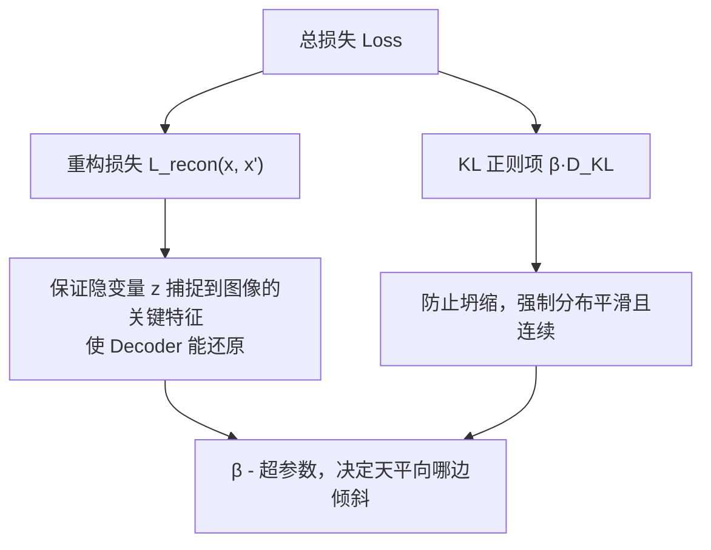

> [!danger] 移除正则项的后果
> 如果去掉 KL 散度项，仅保留重建误差，神经网络会通过让方差 \sigma \to 0 来消除采样带来的不确定性：
> 
> $\sigma \to 0 \quad\Rightarrow\quad \mathcal{N}(\mu, \sigma^2) \to \delta(\mu) \quad$(退化为点)
> 
> 隐空间再次变得破碎，模型退化为传统自编码器，失去在新样本上的泛化能力。

> [!success] KL 正则项的效果
> KL 散度强制每一个 Encoder 输出的分布都向标准正态分布 $\mathcal{N}(0, I)$ 靠近：
> 1. ==防止分布收缩为点== — 保持方差非零
> 2. ==填补隐空间断层== — 分布互相重叠，填满空间
> 3. ==方便 Decoder 采样== — 采样点都在合理范围内

**工程关键**：寻找重构损失与 KL 正则项之间的最佳权重 $\beta$，是训练 VAE 的核心调参工作。

---

## 1.6 训练困境与重参数化技巧

 困境：采样不可导

> [!bug] 梯度断裂
> Decoder 生成阶段需要从编码器输出的分布中**采样**隐变量 $z\sim \mathcal{N}(\mu, \sigma^2)$，但标准随机采样操作是==不可计算梯度==的。这会导致反向传播时，梯度流在采样节点处彻底断裂，使得编码器网络无法进行参数更新。

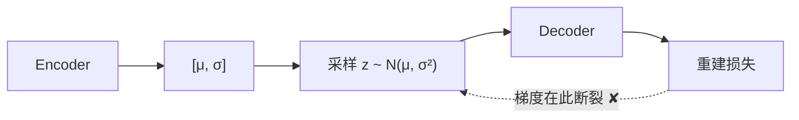

 解决方案：重参数化技巧 (Reparameterization Trick)

> [!idea] 核心思想
> 将隐变量采样过程的随机性成功转移给了**不参与网络更新的外部随机噪声** $\varepsilon$，从而使梯度能够顺畅回传至编码器。

$$
\boxed{z = \mu + \sigma \odot \varepsilon, \quad \varepsilon \sim \mathcal{N}(0, I)}
$$

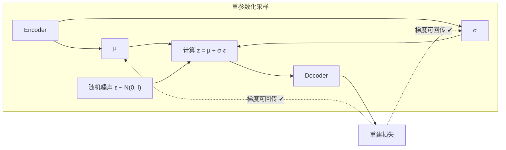

| 方案 | 采样方式 | 梯度流 | 是否可行 |
|------|---------|--------|---------|
| **直接采样** | $z \sim \mathcal{N}(\mu, \sigma^2)$ | 断裂 | ❌ |
| **重参数化** | $z = \mu + \sigma \odot \varepsilon,\; \varepsilon \sim \mathcal{N}(0,I)$ | 连续 | ✅ |

> [!info] 为什么重参数化技巧有效？
> 重参数化技巧将随机性从 z 移到了 $\varepsilon$：
> - $\mu$ 和 $\sigma$ 是可学习的确定参数 → 梯度可回传
> - $\varepsilon$ 是外部的随机性来源 → 不参与梯度计算
>
> 因此，整个计算图变得完全可微，反向传播能够正常进行。

---

### 1.7 VAE 的图像生成流程

**训练完成后，生成新图像的步骤**：

1. 从隐空间中依据先验标准高斯分布 $\mathcal{N}(0, I)$ 随机采样隐变量 z
2. 将 z 输入 Decoder
3. Decoder 利用采样向量生成图像

> [!success] VAE 的优势
> 分布级预测让 VAE 能够学习训练集中不同图像的特征并==生成训练集中未见过的新图像==。
>
> 例如：模型看过猫和狗后，可以生成"既像猫又像狗"的全新图像。

**VAE 的局限性**：
> [!warning] VAE 的核心局限
> VAE 使用 ==像素级 MSE 重建损失== 训练，这只能捕捉图像的大致轮廓，无法有效捕捉边缘、纹理、语义等高层特征。
>
> **生成图像的普遍特征**：
> - 图像模糊、不清晰
> - 图像缺少细节、过于平滑
> - 能够重建结构，但细节模糊
>
> 这为下一代的 GAN 提出了挑战方向。

---

## 二、生成对抗网络 (GAN)

> Generative Adversarial Network — 通过对抗博弈突破 VAE 的模糊瓶颈

## 2.1 VAE 的缺陷：像素级重建函数的局限

> [!question] VAE 为什么生成模糊图像？
> VAE 的像素层级重建损失（MSE）衡量生成质量，但这种损失**不能有效捕捉图像中的层次化特征**（边缘、纹理、语义特征）。

例如，两张都是"猫"的图像，像素层面差异巨大，但语义相似度却很高：

| 比较维度 | 语义相似度 | 像素差异 |
|----------|-----------|---------|
| 两张不同的猫图 | 高（都是猫） | 大（毛色、姿势不同） |
| 猫图 vs 狗图 | 低 | 可能比猫 vs 猫更小 |

> [!bug] 核心矛盾
> MSE 损失在像素级别进行操作，无法理解"两张不同的猫图在语义上很接近"这一事实。模型只能通过平均多个训练样本的方法来降低像素级误差，这导致生成图像天然倾向"模糊"。

**解决方案**：使用表达能力更强的神经网络充当"评判标准"（判别器），来衡量生成图像与真实图像的相似度。

---

### 2.2 GAN 模型架构

生成对抗网络通过**两个网络的对抗训练**来生成逼真的数据：

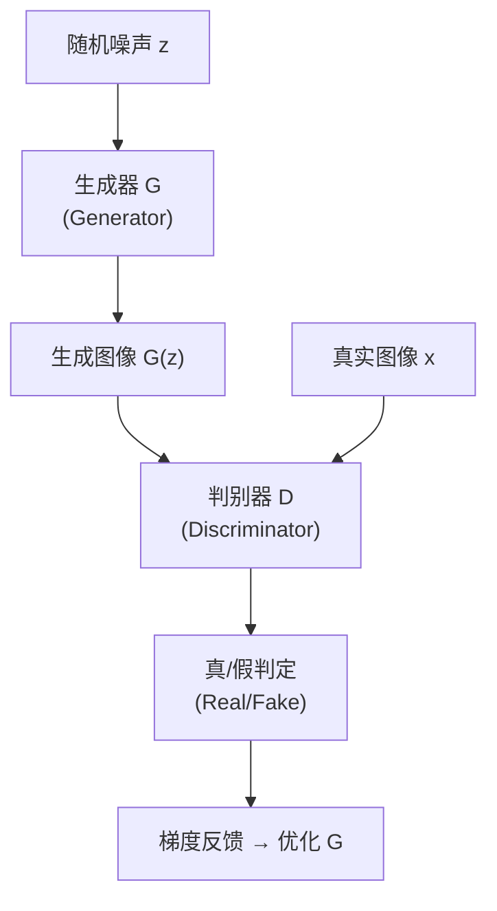

| 角色 | 类比 | 网络 | 目标 |
|------|------|------|------|
| **生成器 G** | 造假者 | 将随机噪声 → 图像 | 制造尽可能逼真的图像欺骗 D |
| **判别器 D** | 警察/鉴定专家 | 图像 → 标量评分 | 准确区分真实图像与生成图像 |

> [!tip] GAN 的精髓
> 判别器不仅负责给出真伪评分，其**反向传播的误差梯度**更是生成器优化自身参数的**唯一指南针**。生成器正是依靠这些梯度反馈，学习如何调整像素以逼近真实数据分布。

#### 2.2.1 判别器 (Discriminator)

- **输入**：图像矩阵（像素张量）
- **输出**：一个**标量评分** (scalar)
  - 真实图像 → 评分趋近 **1.0**
  - 生成图像 → 评分趋近 **0.0**
- **本质**：一个二分类神经网络


$$D(x) \in [0, 1], \quad \begin{cases}
D(x) → 1 D(x) \to 1 & if  x  是真实图像 (x 是真实图像) \\
D(x) → 0 D(x) \to 0 & if  x  是生成图像 (x 是生成图像)
\end{cases}$$


#### 2.2.2 生成器 (Generator)

- **输入**：随机采样的噪声向量 $z \sim p_{\text{noise}}(z)$
- **输出**：视觉上逼真的图像矩阵
- **终极目标**：不断提升生成质量，使 $D(G(z)) \to 1$

---

## 2.3 对抗平衡与梯度消失问题

> [!danger] 梯度消失问题
> 如果判别器能力**远超**生成器（过于完美），它会对所有生成图像给出绝对低分。这将导致生成器面临严重的**梯度消失**问题：
> - 所有生成图像 → 绝对低分（如 0.01）
> - 所有参数的梯度 → 都极其接近于零
> - 生成器无法获知"哪张图比较好" → **彻底失去参数优化方向**

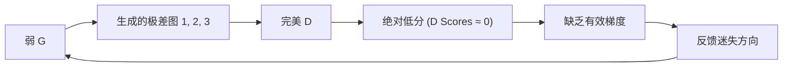

> [!success] 解决之道：交替同步训练
> 为了维持对抗平衡，GAN 必须采用**交替同步的联合训练策略**：
> - 在每一次迭代中，交替冻结一方的参数去训练另一方
> - 促使判别器的"鉴伪能力"与生成器的"造假能力"在博弈中**共同进化**

**训练流程**：

1. **固定 G，训练 D**：G 被看作固定的"伪造工厂"，D 学习真实样本（标签 1）与生成样本（标签 0）的差异
2. **固定 D，训练 G**：固定 D 的判断准则，G 通过 D 传回的梯度学习如何获得更高评分

---

### 2.4 损失函数与优化策略

GAN 的训练目标定义为**极大极小博弈** (Minimax Game)：

$$
\boxed{\min_{G} \max_{D} V(D, G) = \mathbb{E}_{x \sim p_{data}(x)}[\log D(x)] + \mathbb{E}_{z \sim p_{noise}(z)}[\log(1 - D(G(z)))]}
$$

| 角色        | 目标              | 数学含义                                         |
| --------- | --------------- | -------------------------------------------- |
| **判别器 D** | **最大化** V(D, G) | 最大化分类准确率，$D(x)\uparrow,\; D(G(z))\downarrow$ |
| **生成器 G** | **最小化** V(D, G) | 最小化 D 的区分能力，$D(G(z))\uparrow$                |

#### 交替梯度下降策略

```mermaid
graph LR
    subgraph 步骤1：固定G，训练D
        A["真实图像 x (标签: 1)"] --> B["D"]
        C["生成图像 G(z) (标签: 0)"] --> B
        B --> D["D(x) → 1.0, D(G(z)) → 0.0"]
    end
    subgraph 步骤2：固定D，训练G
        E["随机噪声 z"] --> F["G"]
        F --> G["生成图像 G(z)"]
        G --> H["D (固定)"]
        H --> I["D(G(z)) → 1.0 (目标)"]
    end
```

---

## 2.5 理论最优解

> [!abstract] 最优判别器的推导
>
> 固定 G 优化 D，即 $\max_D V(D, G)$：
>
> $$
> \begin{aligned}
> \max_D V(D, G) &= \max_D \mathbb{E}_{x \sim p_{data}}[\log D(x)] + \mathbb{E}_{x \sim p_G}[\log(1 - D(x))] \\
> &= \max_D \int_x p_{data}(x)\log D(x) + p_g(x)\log(1 - D(x)) \, dx
> \end{aligned}
> $$
>
> 逐点最大化被积函数 $f(D) = A\log D + B\log(1-D)$，求导得极值点：
>
> $$
> \boxed{D^*(x) = \frac{p_{data}(x)}{p_{data}(x) + p_g(x)}}
> $$
>
> **意义**：在任意样本点 x，最优判别器的输出完全取决于该样本在真实分布与生成分布中的**相对占比**。

> [!abstract] 最优生成器的推导
>
> 将最优判别器 $D^*$ 代入损失函数优化 G：
>
> $$
> \begin{aligned}
> \min_G V(D^*, G) &= -2\log 2 + 2 \cdot JSD(p_{data} \parallel p_G)
> \end{aligned}
> $$
>
> 其中 JSD (Jensen-Shannon Divergence) 是 JS 散度，衡量两个分布的相似度。
>
> **结论**：当 $p_{data} = p_G$ 时，JSD = 0，生成器达到最优。
>
> **最终状态**：
> - 生成器完全学到图像分布：$p_{data}(x) = p_g(x)$
> - 判别器无法区分真伪：$D^*(x) = 1/2$
> - 生成器与判别器达到 **==纳什均衡==** (Nash Equilibrium)

> [!info] GAN 的优化终点
> ```
> 训练初始 → D强G弱 → 交替对抗 → G越来越强 → D越来越难
> → 最终：p_data = p_g, D(x) = 1/2 → 均衡态
> ```

---

### 2.6 GAN 的训练困境

#### 困境一：对抗训练易崩溃

> [!bug] 模式坍塌 (Mode Collapse)
> 训练初期，生成器产生的样本中大部分质量不高。如果判别器过强，多数生成样本得分过低。为了防止被判别器打低分，生成器学会==将不同噪声映射成类似的高分图像==，导致训练崩溃。
>
> **现象**：生成器只学会生成少数几种（甚至一种）图像，丧失了生成多样性。

```
z₁ → G → 高分图像A
z₂ → G → 高分图像A  ← 多样性丧失！
z₃ → G → 高分图像A
```

#### 困境二：单步生成难度高

> [!bug] 单步映射问题
> 生成器 G 必须在**单次前向传播**中，从低维噪声映射到高维空间。真实数据分布在高维空间中比较复杂，单步生成要求模型一次性学会所有高维特征，学习难度极高。
>
> 进行单步生成时，即使只是一点偏差，最终生成质量也会降低很多。

这个困境直接催生了下一代模型的思想：**单步生成 → 多步生成**。

---

## 三、扩散模型 (Diffusion Model)

> 将生成过程分摊到多个去噪步骤，每一步只解决一个微小的去噪问题，显著降低生成难度

## 3.1 核心思想：化整为零

> [!idea] 核心突破
> **单步生成 → 多步去噪**
>
> 扩散模型通过将生成的过程分摊到多个去噪步骤中，每次只需解决一个微小的去噪问题，使模型学习和生成的难度大幅降低。

**两阶段过程**：

```mermaid
graph LR
    subgraph 前向过程（加噪）
        A["真实图像 x₀"] -->|"逐步加噪"| B["纯噪声 x_T<br/>~ N(0, I)"]
    end
    subgraph 反向过程（去噪）
        C["纯噪声 x_T"] -->|"逐步去噪"| D["生成图像 x₀"]
    end
```

- **前向过程 (Forward/Diffusion)**：从真实图像开始，不断加入噪声，最终得到纯噪声，趋近高斯分布
- **反向过程 (Reverse/Denoising)**：从纯噪声开始，一步步去除噪声，得到真实图像，由高斯分布转化为近似图像分布

---

### 3.2 前向加噪：随机采样

> [!abstract] 加噪公式
>
> 从 t-1 步图像 x_{t-1} 到 t 步图像 x_t 的加噪过程：
>
> 
> $\boxed{x_t = \sqrt{1 - \beta_t} \; x_{t-1} + \sqrt{\beta_t} \; \epsilon}, \quad \epsilon \sim \mathcal{N}(0, I)$
> 
>
> 其中 $\beta_t \in (0,1)$ 为**噪声强度**（Noise Schedule），控制每一步加入噪声的多少。

> [!info] 前向过程的性质
> - 每一步都是随机采样高斯噪声添加到图像上
> - 经过多步加噪后，原图信息被逐渐覆盖
> - 最终状态 $x_T$ 近似于标准高斯分布：$q(x^{(T)}) \approx \mathcal{N}(0, I)$
> - 加噪过程**不需要学习**，完全由数学公式计算得到

---

## 3.3 反向去噪：需要学习

> [!warning] 关键区别
> - **加噪**：直接随机采样，有确定公式
> - **去噪**：==需要模型学习每一步如何去除噪声==
>
> 因此，我们通过学习去噪模型 $\epsilon_\theta(x_t, t)$ 来学会生成图像。

 去噪模型设计的两种思路

| 思路        | 方法                      | 学习难度              | 可行性 |
| --------- | ----------------------- | ----------------- | --- |
| **思路一**   | 神经网络直接预测加噪前的图像 x_{t-1}  | 高（图像分布复杂）         | ❌   |
| **思路二** ✅ | 神经网络预测噪声 $\epsilon$ 再去除 | ==低（噪声始终服从高斯分布）== | ✅   |

> [!success] 为什么思路二更好？
> 虽然图像多种多样（猫、狗、风景各不相同），但**噪声始终遵循简单的高斯分布** $\epsilon \sim \mathcal{N}(0, I)$。预测噪声的任务比直接预测图像简单得多！
>
> 这也是扩散模型能够成功的关键设计之一。

---

### 3.4 去噪模型训练

#### 朴素想法及缺陷

**朴素想法**：加噪过程中，按顺序加入每步噪声时，模型同时学习预测该步噪声。

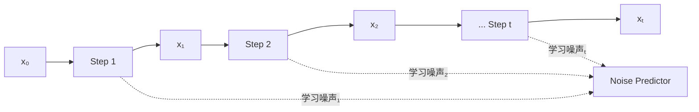

**缺陷**：按顺序学习加噪过程，导致训练任务固定，模型优化不稳。深度学习模型训练需要样本数据**随机打乱**，确保梯度下降具有全局性，避免模型产生**灾难性遗忘**（Catastrophic Forgetting）。

#### 改进一：随机时间步采样

> [!improve] 打乱训练顺序
> - 干净样本：$x_0 \sim q(x_0)$
> - 随机时间步数：$t \sim \text{Uniform}(\{1, \ldots, T\})$
> - 学习 t 时刻加入的随机噪声

这样避免了按固定顺序导致的灾难性遗忘。

#### 改进二：单步加噪（重参数化推导）

**新问题**：每次加噪 t 次才能得到 x_{t-1} 和 x_t 进行训练，计算成本太高。

> [!abstract] 单步加噪的推导
>
> 将多步加噪合并为单步，利用 $\alpha_t = 1 - \beta_t，\bar{\alpha}_t = \prod_{i=1}^{t} \alpha_i$：
>
> 递归展开：
> $$
> \begin{aligned}
> x_1 &= \sqrt{\alpha_1} x_0 + \sqrt{1-\alpha_1} \epsilon_1 \\
> x_2 &= \sqrt{\alpha_2} x_1 + \sqrt{1-\alpha_2} \epsilon_2 \\
> &= \sqrt{\alpha_1\alpha_2} x_0 + \sqrt{\alpha_2(1-\alpha_1)}\epsilon_1 + \sqrt{1-\alpha_2}\epsilon_2 \\
> &\vdots \\
> x_t &= \sqrt{\bar{\alpha}_t} \; x_0 + \sum_{i=1}^{t} c_i \epsilon_i
> \end{aligned}
> $$
>
> 由于独立高斯的线性组合仍然是高斯，且 $\sum c_i^2 = 1 - \bar{\alpha}_t$，可以合并为单一噪声：
>
> $$
> \boxed{x_t = \sqrt{\bar{\alpha}_t} \; x_0 + \sqrt{1 - \bar{\alpha}_t} \; \epsilon}, \quad \epsilon \sim \mathcal{N}(0, I)
> $$

> [!success] 单步加噪的优势
> 通过单步加噪公式，我们可以 **直接从 $x_0$ 一步得到任意 t 时刻的含噪图像 $x_t$**，无需逐步加噪 t 次！
>
> 这使得随机采样时间步 t 的训练方案变得可行高效。

#### 损失函数

训练目标：最小化**预测噪声**与**真实噪声**之间的偏差（L2 损失）：

$$
\boxed{\mathcal{L} = \left\| \epsilon_\theta(x_t, t) - \epsilon \right\|^2}
$$

其中 $\epsilon_\theta(x_t, t)$ 是噪声预测网络，$\epsilon$ 是真实加入的噪声。

#### 训练流程总结

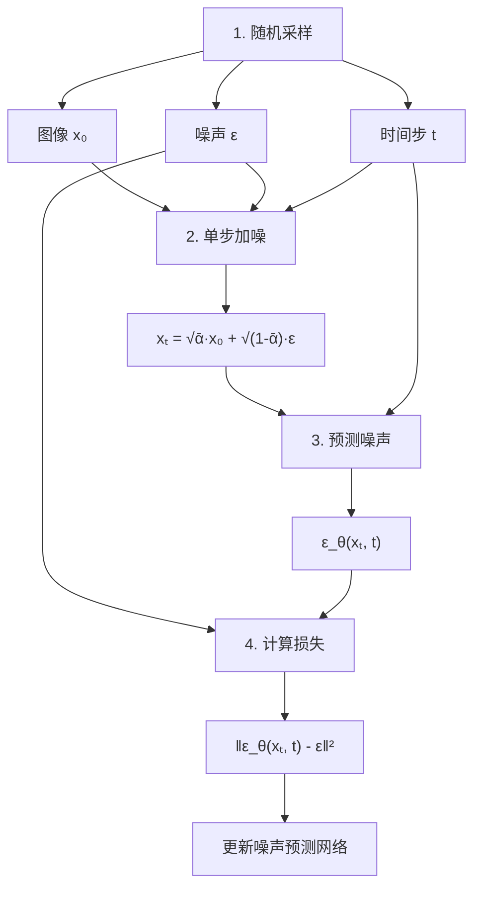

> [!summary] 三步训练法
> 1. **随机采样**：采样图像 $x_0$、噪声 $\epsilon$、时间步 t
> 2. **单步加噪**：计算 $x_t = \sqrt{\bar{\alpha}_t} x_0 + \sqrt{1 - \bar{\alpha}_t} \epsilon$
> 3. **学习预测噪声**：最小化 $\|\epsilon_\theta(x_t, t) - \epsilon\|^2$

---

## 3.5 去噪模型推理

> [!info] 推理（生成）过程与训练相反
>
> **第一步**：给定时间 t 以及含噪图 $x_t$，神经网络预测并减去噪声
>
> **第二步**：给去噪后的结果加入==随机采样噪声==，生成 t-1 时刻含噪图 $x_{t-1}$
>
> > [!question] 为什么要加入随机噪声？
> > 1. **增加生成的多样性**，否则直接回去就成了原图
> > 2. **打破预测噪声的误差累积**，防止单步误差不断放大

**推理过程公式**：
$$
$x_{t-1} = \frac{1}{\sqrt{\alpha_t}} \left( x_t - \frac{1 - \alpha_t}{\sqrt{1 - \bar{\alpha}_t}} \epsilon_\theta(x_t, t) \right) + \sigma_t z, \quad z \sim \mathcal{N}(0, I)$
$$

---

### 3.6 扩散模型的两大不足及改进

> [!bug] 两大不足
>
> 1. **无法实现可控的图像生成**
>    - 随机采样噪声 → 随机生成一张图像，模型没有"听话"
>    - 用户无法指定要生成的内容
>
> 2. **图像生成速度慢**
>    - 去噪步数多（通常 50~1000 步）
>    - 每步都在高分辨率像素空间操作（如 512 $\times$ 512 $\times$ 3）
>    - 若 H $\times$ W = 512 $\times$ 512，像素总量为 262,144

---

## 3.7 条件生成 (Conditional Generation)

> [!idea] 解决方案：文本作为模型输入
> 将文本编码后的特征向量作为噪声预测网络的额外输入，引导每步去噪过程，使生成结果可控。

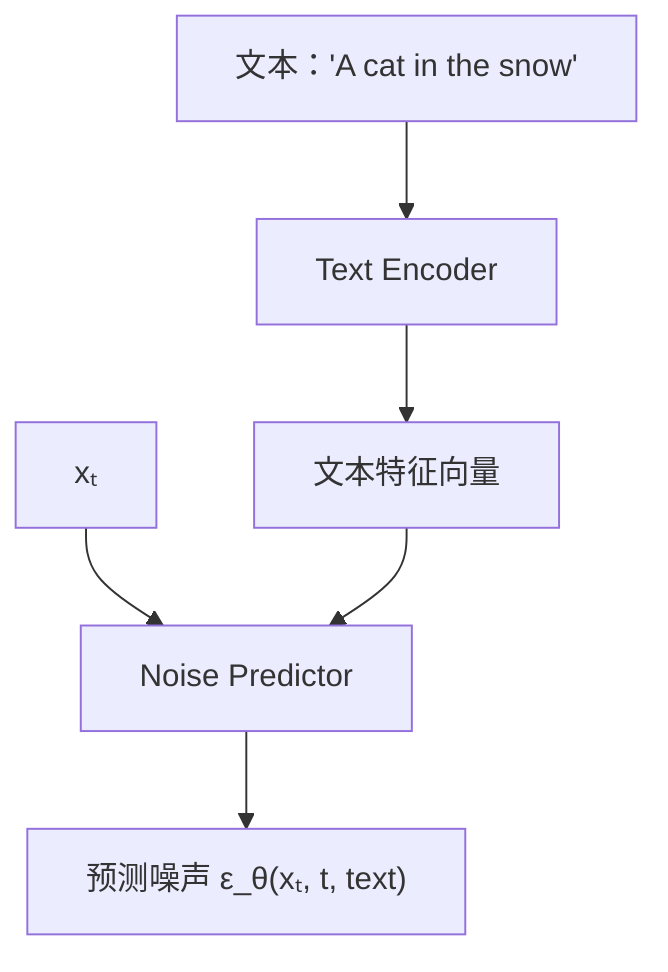

> [!info] Cross Attention 机制
> 编码后的文本特征向量在噪声预测网络内部与图像进行 **Cross Attention**（交叉注意力），从而==将文本语义注入去噪过程==，使去噪结果受文本控制。

---

### 3.8 隐空间扩散 (Latent Diffusion / Stable Diffusion)

> [!question] 能否通过减少像素总量降低计算复杂度？
>
> **思路**：回顾 VAE 的降维思想，将扩散过程从像素空间迁移到隐空间！

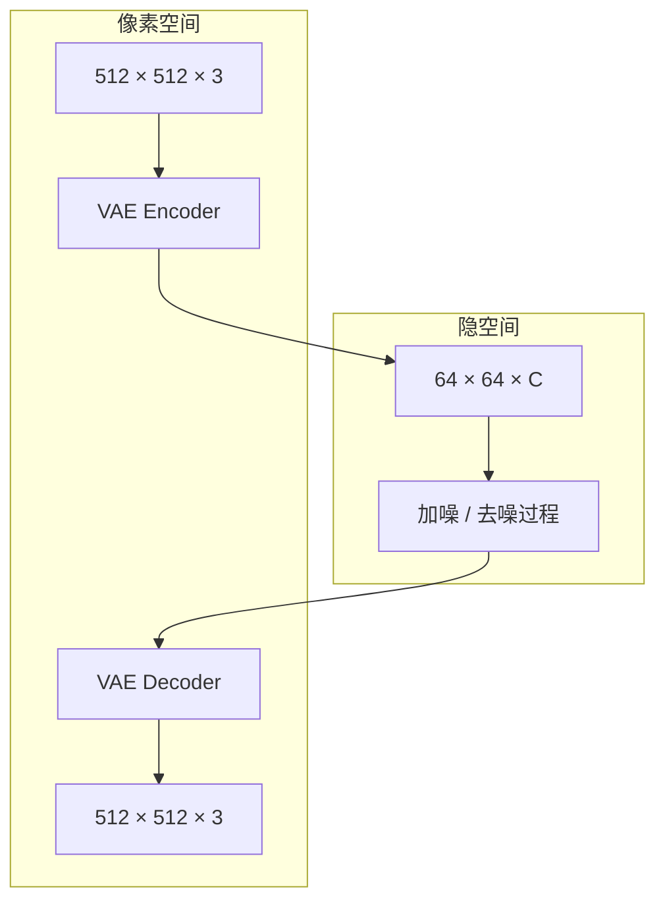

| 对比维度  | 普通扩散模型                           | 隐空间扩散 (Latent Diffusion)      |
| ----- | -------------------------------- | ----------------------------- |
| 操作空间  | 像素空间 512 $\times$ 512 $\times$ 3 | 隐空间 64 $\times$ 64 $\times$ C |
| 像素总量  | 262,144                          | 约 4,096 × C（大幅降低）             |
| 计算复杂度 | 高                                | ==大幅降低==                      |
| 显存占用  | 高                                | ==大幅降低==                      |
| 条件控制  | 可加入文本                            | 可加入文本                         |

#### Stable Diffusion 的核心组件

> [!success] Stable Diffusion 为何成功？
>
> 1. **文本能够控制生成过程** — 便于用户进行创作
> 2. **模型运行速度变快、占用资源减小** — 可供大量用户使用
> 3. **开源社区生态** — 大众可参与、可定制

**Stable Diffusion 的工作流程**：

1. **加噪**：图像 → VAE Encoder → 隐空间 → 在隐空间内加噪
2. **去噪**：结合文本特征等信息，在隐空间内进行去噪
3. **训练**：在隐空间内学习预测噪声
4. **推理**：输入编码后的文本 + 隐空间随机噪声 → 在隐空间去噪 → VAE Decoder 解码生成图像

---

## 四、流匹配模型 (Flow Matching, FM)

> 2023年提出的新范式，学习直线传输路径，在保持高质量的同时大幅加速生成

## 4.1 刻画映射的新思路

> [!question] 扩散模型的路径有什么问题？
> 扩散模型通过逐步加噪，刻画图像与噪声分布之间的映射路径。但由于加噪过程的噪声是**随机采样**的，因此刻画的映射路径是**弯曲、随机**的：
>
> $$
> \underbrace{x_0}_{\text{noise}} \xrightarrow{\text{curved random path}} \underbrace{x_1}_{\text{image}}
> $$


> [!idea] 新的思路
> 能否将映射路径拆成若干条==线段之和==？
>
> - 从"每步去除噪声"变成 **"每步前进一条线段"**
> - 与扩散模型相比，路径模拟直线，不是随机弯曲 → **速度更快**

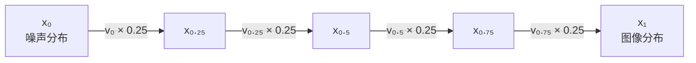

**关键前置概念**：如果对于任意时刻 t，知道样本此时速度 v_t，则：
$$
$x_1 - x_0 = \int_{0}^{1} v_t \, dt \approx \sum (\text{sum of segments})$
$$

---

### 4.2 向量场 (Vector Field)

> [!info] 定义
> **向量场**：已知状态和时间，样本在此时此处的**速度向量**，包括速度大小与方向。

同一时刻 t，向量场为空间中每一个坐标点都预设了一个专属的速度向量。如 x_{0.5} 对应速度向量为 v_{0.5}。

**流匹配模型的核心**：对于当前步的状态和时间，==预测向量场，进而得出路径和下一步状态==。

---

## 4.3 流匹配模型原理

> [!abstract] 核心公式
>
> 假设将路径分为 N 段（以 4 段为例）：
> $$
> x_1 - x_0 \approx v_0 \times 0.25 + v_{0.25} \times 0.25 + v_{0.5} \times 0.25 + v_{0.75} \times 0.25
> $$
>
> 流匹配模型的目标是从 $x_0$ 出发，逐步预测每个时刻的速度 $v_t$，从而生成 $x_1$。

**推理过程**：
```
x₀ → FM model → v₀ → x₀.₂₅ = x₀ + v₀ × 0.25
x₀.₂₅ → FM model → v₀.₂₅ → x₀.₅ = x₀.₂₅ + v₀.₂₅ × 0.25
... (重复) → x₁
```

---

### 4.4 流匹配训练过程

> [!info] 四步训练法

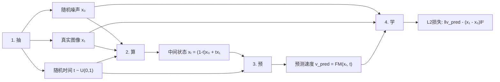

| 步骤                  | 操作                            | 公式                                                              |
| ------------------- | ----------------------------- | --------------------------------------------------------------- |
| **抽** (Sample)      | 随机采样噪声 $x_0$、真实图像 $x_1$、时间 t  | $x_0 \sim $\mathcal{N}$(0,I), x_1 \sim p_{data}, t \sim U(0,1)$ |
| **算** (Interpolate) | 线性加权计算中间状态 $x_t$              | $x_t = (1-t)x_0 + t x_1$                                        |
| **预** (Predict)     | 模型输入 $x_t, t$，预测速度 $v_{pred}$ | $v_{pred} = \text{FM}_{\theta}(x_t, t)$                         |
| **学** (Learn)       | L2 损失拟合真实速度                   | $v = x_1 - x_0, \mathcal{L} = \|v_{pred} - v\|^2$               |

---

## 4.5 三个关键细节问答

> [!question] Q1：为什么用随机时间步？
>
> **A**：和扩散模型逻辑一致。打乱训练顺序，避免模型按固定步骤学习导致优化不稳、灾难性遗忘。

> [!question] Q2：为什么真实速度是 v = $x_1 - x_0$？
>
> **A**：流匹配假设生成路径是**匀速直线**。因此从 $x_0 到 x_1$ 的直线路径上，速度全程不变，直接用终点减起点即可得到真实速度。

> [!question] Q3：为什么训练模型而非直接用 $v = x_1 - x_0$？
>
> **A**：两个原因：
> 1. **训练时的 $x_0, x_1$ 是有限的** — 无法覆盖整个空间，大量状态的速度未知
> 2. **推理时只有 $x_0$，没有 $x_1$** — $x_1$ 是最终要生成的目标，推理时不可知，无法直接计算真实速度，必须靠模型预测

---

### 4.6 与扩散模型的对比总结

| 对比维度     | 扩散模型 (Diffusion)                                                     | 流匹配模型 (Flow Matching)    |
| -------- | -------------------------------------------------------------------- | ------------------------ |
| **生成方式** | 去除噪声                                                                 | 样本位移                     |
| **路径形状** | 弯曲、随机                                                                | 直线、确定                    |
| **中间状态** | $x_t = \sqrt{\bar{\alpha}_t} x_0 + \sqrt{1-\bar{\alpha}_t} \epsilon$ | $x_t = (1-t)x_0 + t x_1$ |
| **训练目标** | 预测噪声 $\epsilon$                                                      | 预测速度 $v$                 |
| **路径速度** | 步数多，路径长                                                              | 步数少，路径直                  |
| **采样速度** | 较慢（通常50-1000步）                                                       | ==更快（步数更少）==             |
| **代表应用** | Stable Diffusion, Sora                                               | SD3, Flux.1              |

> [!example] 直观理解
> - **扩散模型**：像一个醉汉走路，路径弯曲但最终到达（加噪去噪）
> - **流匹配**：像走直线，从起点直达终点（直接位移）

---

## 五、总结与对比

## 5.1 四代模型速览

| 模型 | 年代 | 核心思想 | 生成质量 | 优点 | 缺点 |
|------|------|---------|---------|------|------|
| **VAE** | 2013 | 编码到隐空间并重建 | 模糊 | 隐空间基础，结构简单 | 像素级损失→模糊平滑 |
| **GAN** | 2014 | 生成器与判别器对抗 | ==清晰== | 细节丰富，高保真 | 训练不稳定，模式坍塌 |
| **Diffusion** | 2020 | 多步迭代去噪 | ==非常逼真== | 质量极高，稳定训练 | 生成速度慢 |
| **FM** | 2023 | 学习直线传输路径 | ==高质量+快速== | 路径直接，采样快 | 较新，仍在发展 |

## 5.2 发展脉络与影响力

> [!summary] VAE (2013)
> - **原理**：将输入数据编码到隐空间并重建
> - **影响力**：现在的隐空间生成模型都在使用 VAE 构建的潜在特征空间
> - **生成能力**：能够大致生成图像轮廓，但细节比较模糊
>
> **代表性生成效果**：能生成数字/简单轮廓的模糊图像

> [!summary] GAN (2014)
> - **原理**：生成器与判别器对抗博弈
> - **影响力**：广泛用于超分辨率和风格迁移等视觉任务
> - **生成能力**：能够生成比 VAE 更清晰的图像
>
> **代表性生成效果**：清晰人脸、高分辨率图像

> [!summary] Diffusion Model (2020)
> - **原理**：将噪声通过多步迭代去噪生成图像
> - **影响力**：在学术、商业界的多个领域均已成为主流技术路线
> - **生成能力**：==能够生成极其逼真的图像==
>
> **代表性应用**：Stable Diffusion、Sora 等主流图像/视频生成模型均建立在扩散模型框架之上

> [!summary] Flow Matching (2023)
> - **原理**：学习从噪声到数据的传输路径
> - **影响力**：已成为新的研究热点并应用到多个领域前沿
> - **生成能力**：在保持高质量的同时，生成路径更直接、采样更快
>
> **代表性应用**：Stable Diffusion 3, Flux.1 等先进生成模型，以及具身智能领域

## 5.3 核心哲学：从难到易

从 VAE 到 FM，生成模型的演进本质上是一个==逐步降低生成难度的过程==：

```
VAE:      单步生成 ← 像素级直接映射（最难）
    ↓ GAN: 单步生成 ← 借助对抗信号（但易崩溃）
    ↓ Diffusion: 多步去噪 ← 每一步只解决微小去噪问题
    ↓ FM: 多步位移 ← 每一步沿直线前进（最简单、最快）
```

> [!quote] 结尾思考
> 生成模型的未来方向:
> - **更快的采样** → 减少步数，提高效率
> - **更强的可控性** → 精细控制生成内容的各个方面
> - **更多模态支持** → 图像、视频、3D、音频统一框架
> - **更高的分辨率** → 从 1024×1024 走向 8K 甚至更高
>
> 四种基础模型的思想仍在持续演进和交叉融合中。
